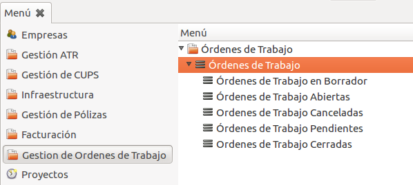
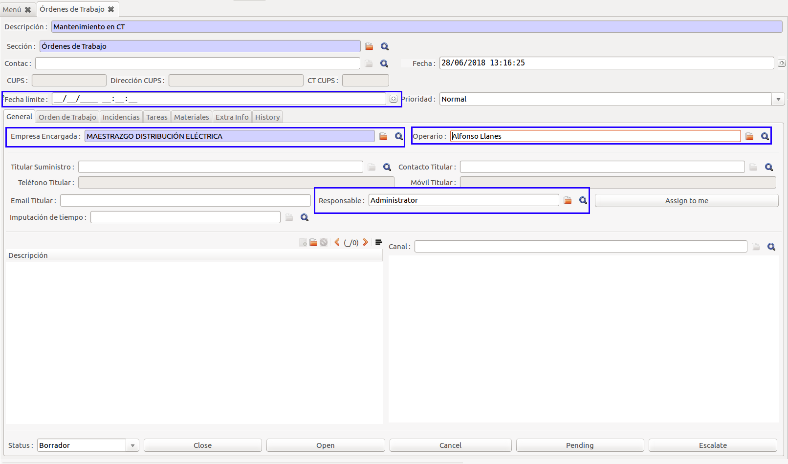
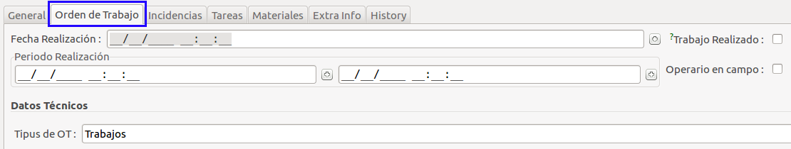

# Gestió d'Ordres de Treball

Podem gestionar ordres de treball per als diferents operaris de la nostra empresa.

Les Ordres de Treball es troben al menú:
"**_OpenERP Menú > Gestion de Ordenes de Trabajo_**"

Es basa amb casos CRM, amb la ventatge de comptar amb camps relacionats amb OTs:

- **Data límit** de realització de la tasca
- **Empresa encarregada** de realitzar el treball
- **Operari** encarregat de realitzar la tasca
- **Responsable**: usuari encarregat de la Ordre de Treball

A més a més, s'afegeix la pestanya "**Ordre de Treball**", on hi podem trobar
més camps:

- **Data de realització**: On indiquem en quin dia vam realitzar la tasca.
- **Periode de realització**: On indiquem un periode de realització de la tasca.
- **Treball realitzat**: Indicant si la tasca s'ha realitzat.
- **Operari en camp**: Si volem indicar que l'operari va a realitzar la tasca.
- **Tipus de OT**: On s'indica un subtipus de OT.

!!! Tip "Tipus de OT"
    Aquest camp per defecte pendrà el valor de: "**Treballs**"
    Si tenim tipus específics instal·lats (i.e. comptadors), podem canviar la OT
    que creem com unes d'aquestes
