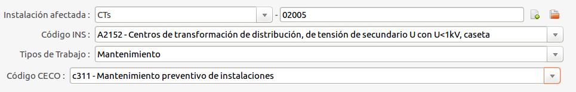

# Gestió de Ordres de Treball en Instalacions

Es pot configurar una Ordre de Treball per a Instalacions, afegint els camps
corresponents a les instalacions que ens permetràn extreure dades per la
realització de circulars,

- **Instalació**: Element de la Xarxa on realitzarem la OT
- **Codi INS**: Codi i descripció del tipus d'instalació
  (procedent de les taules 4a i 4b del
  [BOE núm 182 de 31/07/2015](https://www.boe.es/boe/dias/2015/07/31/pdfs/BOE-A-2015-8624.pdf),
  pàg. 66215-66217)
- **Tipus de Treball**: A diferenciar entre:
  - **Inversió**
  - **Manteniment**
- **Codi CECO**: Especificat (procedent del apartat 3.2.2 del
[BOE núm 182 de 31/07/2015](https://www.boe.es/boe/dias/2015/07/31/pdfs/BOE-A-2015-8624.pdf),
pàg. 66201)
