# Documentació del mòdul de perfils

## Mòdul de Perfilació

Aquest mòdul serveix per la generació de fitxers d'intercanvi de mesures amb
REE, ja siguin generats a partir del procés de perfilació com de la importació
de corbes.

## Menú de perfilació

En el menú de perfilació s'hi poden trobar els apartats indicats en la imatge
següent inferior. L'apartat lots de perfilació mostra l'estat, i el progrés,
dels lots de perfilació. En l'apartat Accions/Importar corba hi ha la
funcionalitat per importar els fitxers de corbes de càrrega. En l'apartat de
configuració es mostren els horaris de les tarifes i els perfils de REE.

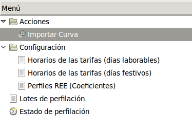

## Procés de perfilació

Per començar el procés de perfilació s'ha de clicar a '**Lots de Perfilació**',
on apareixerà una finestra on podrem realitzar el procés de perfilat. Abans
d'això caldrà realitzar unes comprovacions bàsiques de les pòlisses a perfilar
que a continuació expliquem.

### Comprovació de les pòlisses a perfilar

Primer de tot haurem de realitzar una comprovació del número de pòlissa
a perfilar.

En el menú del lot de perfilació podem observar de quin lot es tracta a
'**Lot**' i de les dates inici i final que comprèn aquest lot. A sota d'aquests
camps hi trobem dues pestanyes, on a la de "**Pòlisses**" podem veure una barra
en el procés de perfilat (que ara estarà a 0%) i del número de pòlisses que hi
ha en aquest lot.

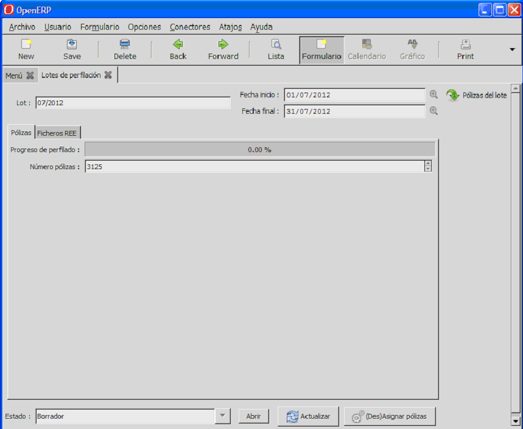

En aquesta imatge d'exemple podem veure que hi han 3125 pòlisses a perfilar.

La primera comprovació que farem serà la següent:

1. Clicarem el botó '**(Des)Assignar pòlisses**'
   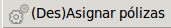 i ens apareixerà
   el quadre de diàleg següent amb dos apartats, les pòlisses a assignar i
   les pòlisses a treure:

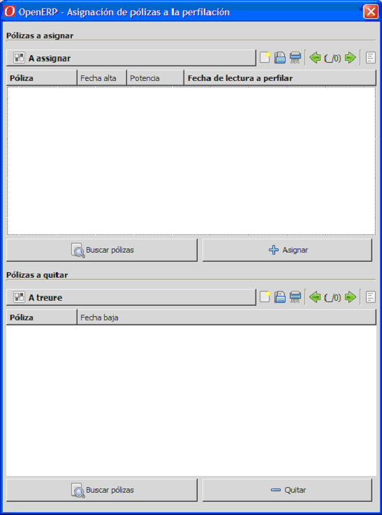

#### Pòlisses a assignar

A la finestra de la part superior on esta escrit "**Pòlisses a assignar**",
si cliquem el botó  apareixeran les
pòlisses facturades en aquest període de perfilació i que no estan incloses
en el lot de perfilació. Al cap d'uns segons es mostraran totes les pòlisses
que s'han donat d'alta en el període de perfilació, més les que tenen
una potència superior a 450kW.

De la llista de pòlisses que apareixen en la finestra superior s'han de
seleccionar les que no tinguin una potència superior a 450kW.

Un cop tinguem seleccionades les pòlisses s'ha de clicar el botó
 perquè s'afegeixin al lot de perfilació.
El botó  pot clicar-se tantes vegades com
es cregui necessari, i finalment només han d'aparèixer sense assignar les
pòlisses que tinguin la potència contractada superior a 450kW.

#### Pòlisses a treure

A la finestra de la part inferior amb el títol "**Pòlisses a treure**",
al clicar el botó  s'ens mostraran
les pòlisses que es troben al lot de perfilació però no tenen factures
en el període. Es mostraran totes les pòlisses que s'han donat de baixa al
final del període anterior. La majoria de vegades apareixerà en blanc.

De la llista de pòlisses que apareixen a la finestra inferior tenim de
comprovar que efectivament no s'han de perfilar en aquest lot, i després
clicar el botó  perquè s'eliminin
del lot de perfilació.

El botó  s'ha de clicar tantes vegades
com es cregui necessari, i finalment no ha d'aparèixer cap pòlissa
a la finestra inferior.

Una vegada realitzada aquesta sincronització tanquem la finestra actual
prement la tecla *ESC*.

La següent comprovació que tenim de fer és:

Al lot de perfilació hi ha d'haver les pòlisses que tenen una factura
dins del període del lot de perfilació excepte aquelles pòlisses de
més de 450kW.

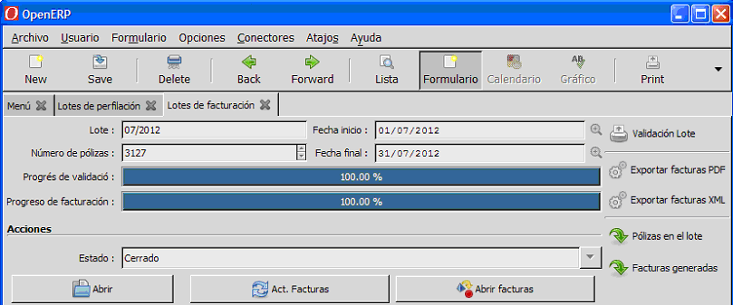

Si aquest número de pòlisses en el lot de facturació menys les de més de 450kW
que no s'han de perfilar és correcte no fa falta realitzar cap comprovació
addicional.

En el cas que el número obtingut no sigui correcte pot ser degut a que s'han
realitzat factures amb la opció "**Factura manual**", que no apareixen en el
lot de facturació (contractes eventuals, fires, etc.).
Llavors s'ha de fer una segona comprovació en base a les factures generades
en el període corresponent.

#### Comprovació per factures:

S'ha de comprovar que el número de factures del període sigui igual al número
de pòlisses a perfilar. Tinguen en compte de que les pòlisses que tenen més
de una factura en el període només s'han de tenir en compte una.

Cal buscar les factures des del menú "**Facturació**" > "**General**" >
"**Factures Client**" i filtrar aquelles factures que comencen abans de
l'últim dia del període de perfilació, que acaben després del primer
dia del període de perfilació i amb potència menor o igual a 450Kw.

A la figura següent s'indica el filtre que s'ha de posar segons
el període que es desitja:

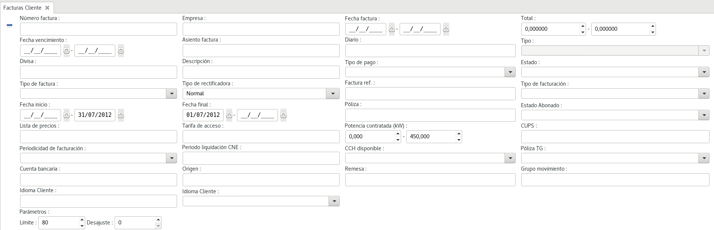

!!! note
    S'ha de tenir en compte les pòlisses que tenen més d'una factura en
    el període i restar-les.

#### Comprovar lectures

Tenim de comprovar per cada lot de perfilació que les dates de alta i de baixa
dels comptadors coincideixin amb les dates de les lectures preses. Per això
tenim de anar al menú de comptadors, que es troba a **Menú > Infraestructura >
Comptadors**, i comencem filtrant tots els comptadors amb la data d'alta entre
les dates del període a perfilar segons la figura següent:

Com a la imatge anterior tenim de omplir els camps "**Data alta**" amb els
valors 01/05/2012 - 31/05/2012. El comptador amb el "**Nº de sèrie**" 3298676
es va donar d'alta el 01/05/2012, així que haurem de comprovar que la data de
la primera lectura de aquest comptador coincideix amb la data d'alta.

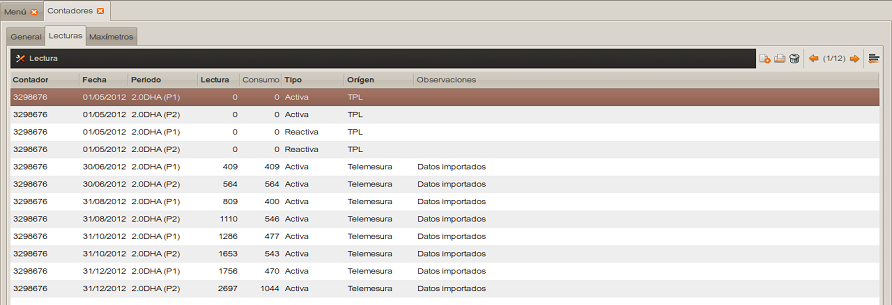

Observem a la imatge com les dates de les primeres lectures son del 01/05/2012,
si fossin diferents hauríem de modificar-les perquè coincideixin amb
la data d'alta del comptador.

I després de comprovar les dates d'alta, comprovarem les de baixa
dels comptadors.

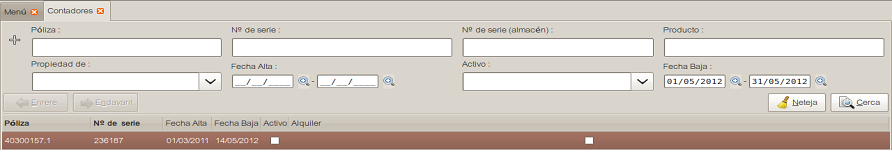

Com amb la imatge anterior dels filtres, tenim de omplir els camps
"**Data baixa**" amb els valors 01/05/2012 - 31/05/2012 i clicar buscar. En
aquest exemple apareix un sol comptador amb un "**Nº de sèrie**" 236187 que
es va donar de baixa el 14/05/2012, per tant tenim de comprovar que la data
de la última lectura d'aquest comptador coincideix amb la data de baixa.

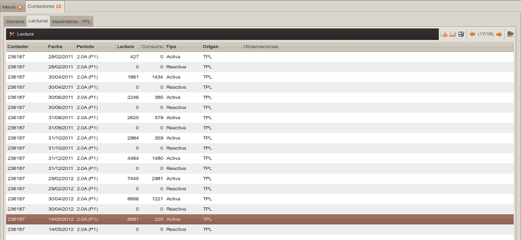

En aquesta imatge les dates de les últimes lectures son del 14/05/2012,
si fossin diferents hauríem de modificar-les perquè coincidissin amb
la data de baixa del comptador.

Per períodes de facturació bimestrals tenim de repetir el procés per el mes
posterior, en aquest exemple seria el juny.

Arribat aquest punt ja podem tornar al menú de lots de perfilació i canviar
l'estat del lot, per això clicarem sobre el botó de obrir. El pas següent
serà importar les corbes, si en tenim.

### Procés d'importació de corbes

El procés de importació ens permet carregar fitxers de corba un per un, o varis
al mateix temps si tenim fitxers amb les corbes comprimides en format 'zip'.

Per accedir a la importació de corbes tenim de clicar sobre la carpeta de
"**Accions**" i fer doble-clic a "**Importar Corba**". S'obrirà una
finestra com la imatge següent:

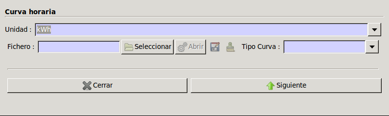

Es pot observar que conté tres camps, el de dalt serveix per indicar les
unitats de potència que utilitza el fitxer, per defecte esta en '**kWh**'.
També hi ha el camp '**Fitxer**' on hi ha un botó que ens permetrà seleccionar
el fitxer de corba a importar i el tercer camp serveix per a seleccionar
de quin tipus és el fitxer.

Per importar un fitxer de corba clicarem sobre el boto de '**Fitxer**'
i seleccionarem la corba que vulguem i després seleccionarem el tipus de corba.
Tal i com hem dit podrem escollir tant fitxers individuals com comprimits.

El programa actualment permet dos tipus de formats, el **TPL** i el **ZIV**.
**TPL** es el format de fitxer generat des del programa de lectura de
comptadors amb GISCE-TPL **ZIV** es el format de les corbes obtingudes
amb el programa de ZIV.

Així un cop seleccionats els tres camps ens hauria de quedar com la imatge:

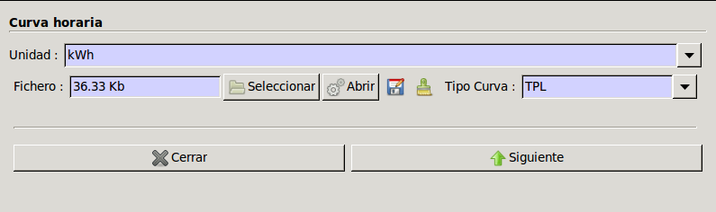

!!! note
    Es pot observar com en el camp de 'Fitxer' hi apareix la mida del
    fitxer que es vol importar.

Per continuar amb la importació haurem de clicar '**Següent**' i apareixerà
una finestra on ens mostrarà si s'ha produït algun error en la importació,
si n'hi han, al clicar '**Importar Corbes**'.

Poden aparèixer varis errors, la majoria estan associats a problemes en el
format del fitxer, si es mostren es recomana comprovar que el fitxer
no hagi estat modificat.

Si no hi han errors, al clicar '**Importar Corbes**' la corba s'haurà
importat correctament, i apareixerà un missatge indicant que la corba
ha estat importada correctament tal i com apareix en la imatge següent
en una nova finestra.

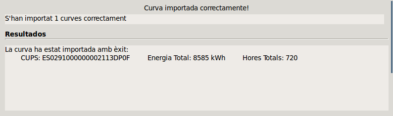

!!! note
    A la nova finestra podem observar que en el camp de 'Resultats' ens
    mostra informació complementària dels fitxers ja importats, que és el CUPS,
    l'energia total i les hores totals. En el cas que estiguem important varies
    corbes s'ens mostraran tantes línies com fitxers hi ha dins del
    fitxer comprimit.

Ara només falta tancar la finestra amb el botó de '**Tancar**' i haurem
completat el procés d'importació. Repetirem el procés per cadascun dels
fitxers de corbes que es vulgui importar.

#### Comprovar corbes importades

Un cop s'han importat les corbes s'accedirà al lot de perfilació en el que es
vol treballar. Polsant el botó '**Pòlisses del lot**' es podran veure totes
les pòlisses incloses en el lot. Ens fixarem especialment en el camp
* '**Estat**', ja sigui *esborrany*, que significa que encara no ha estat
  perfilada o *finalitzada*.
* '**Origen teòric**' aquest camp indica *corba*, en el cas de les pòlisses
  que tenen una potència major que 50kW o *perfil* per la resta.
* '**Origen real**' aquest camp mostrarà l'origen a partir de que s'ha obtingut
  el perfil de càrrega de la pòlissa. *corba*, en el cas que s'hagi importat la
  corba de càrrega, o *perfil* en el cas que s'hagi perfilat.

!!! note
    És important comprovar la llista i localitzar casos atípics (Estat: obert,
    Origen teòric: corba , indica que està pendent de importar la corba).
    Primer s'han de importar totes les corbes de les que es disposi.
    Una vegada s'inicii la perfilació del lot s'entén que totes les polisses
    del lot en *obert* s'han de perfilar. Si hi han pòlisses que tenen
    '**Origen teòric**' *corba* es perfilaran igualment
    amb el procés de perfilació.

## Perfilat

!!! note
    Abans de perfilar és important tenir totes les corbes importades
    ja que el procés perfilarà totes les pòlisses en *Obert*.

Un cop haguem realitzat les comprovacions corresponents ja es pot executar
el procés de perfilació.

Dins del menú de "**Lots de perfilació**", just sota de les pestanyes de
'**Pòlisses**' i '**Fitxers REE**' trobarem el botó de '**Perfilar**',
que el clicarem per inicialitzar la perfilació.

!!! note
    Cal tenir en compte de que aquest botó només està disponible si el lot
    en que ens trobem es troba en l'estat 'Obert'.

El procés de perfilat pot tardar varis minuts, i automàticament s'executarà
en segon plà. Amb el botó '**Actualitzar**' podrem anar comprovant com la barra
'**Progrés de perfilat**' es va completant fins que arriba al 100%. A la
següent imatge podem veure un procés al 100%.

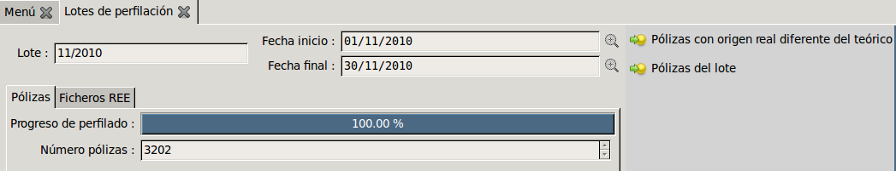

### Llistat de pòlisses

A la dreta del perfilat hi trobarem dos accessos directes a la llista de
pòlisses que conté el lot, tal i com podem observar a la imatge anterior.

La '**Pòlissa del lot**' ens mostra el llistat de pòlisses on cada pòlissa
te sis camps: La id de la pòlissa, l'estat en que es troba del procés,
l'**Origen real** que ens mostra si la pòlissa ha estat importada a partir
de un fitxer de corba o d'un procés de perfilació, **Origen teòric** que
serà '**corba**' si és major de 50kW, i la tarifa de la pòlissa definida.
La imatge de continuació ens mostra un exemple de llistat de pòlisses.

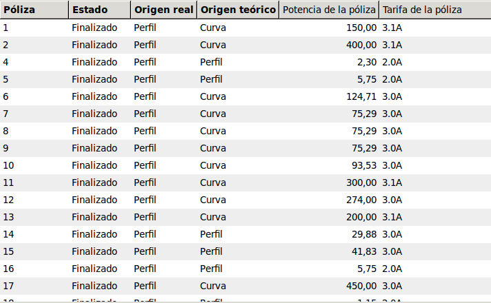

En l'accés directe de '**Pòlisses amb l'origen real diferent del teòric**'
ens mostra un llistat amb els mateixos camps que l'altre llista però amb
tant sols les pòlisses que origen real i teòric son diferents.

## Reperfilat

Una vegada ja haguem generat un perfil per una pòlissa i un lot, podem
reajustar-lo en cas de ser necessari utilitzant l'acció de reperfilar.

Aquesta opció la podem trobar:

* Dins la carpeta de "**Accions**", situat en el menú principal d'aquest mòdul.
  Just a sota de la carpeta de configuració.
* Dins d'un lot concret en el menú de "**Lots de perfilació**"
* Dins d'una pòlissa concreta dins el menú de "**pòlisses d'un lot**"

Per realitzar el reperfilat, independentment de que els camps es sel·leccionin
automàticament, en el cas de que ja estem dins un lot o una pòlissa, o no,
caldrà sel·leccionar tant un lot com una pòlissa. Per fer-ho, podem escriure el
nom d'aquest camp, o fent click a la lupa ens mostrarà una llista amb un
formulari per poder filtrar els resultats. Amb un simple doble click en un dels
valors llistats, aquest es situarà en el camp corresponent.

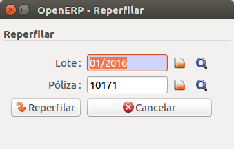

Una vegada tinguem seleccionats els dos camps, podrem polsar el botó
**Reperfilar**, que ens adaptarà el nostre perfil. En uns instants, quan acaba
l'operació, es mostraran els nous resultats en la mateixa finestra,
indicant-nos que ja ha finalitzat.

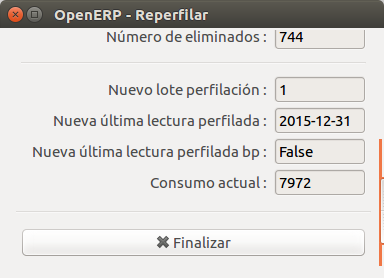

## Menú de generació de fitxers de la REE

El fitxer F1 de la REE es genera a partir del fitxer de corba obtingut
directament des del comptador.

Formats d'origen suportats:

* Fitxer de corba obtingut a través del TPL de GISCE-ERP
* Fitxer de corba en format ZIVERCOM

En el menú de generació de fitxers de la Red Eléctrica Española (REE)
es troben els apartats indicats a la imatge inferior. Dins de l'apartat
d'**Agregacions de Règim Especial** es generen els fitxers **MAGRE**
(Dades horaries d'energia d'agregacions d'instal·lacions de producció
d'energia elèctrica a partir de fonts d'energia renovables, cogeneració
i residus tipus 3 i 5) i **INMERE** (Acumulat mensual d'energia de punts
frontera d'instal·lacions de producció d'energia elèctrica a partir de
fonts d'energia renovables, cogeneració de residus tipus 3 i 5 desagregats).
Per a més informació, consultar apartats 4.2.12 (MAGRE) i 4.2.13
(INMERE) del document de REE.

A l'apartat de REE es generen els següents fitxers:

* **Fitxer POTAGR:** aquesta opció genera el fitxer POTAGR (Potència
  contractada per agregació de clients tipus 3, 4 i 5) segons
  el document de REE, pàgina 3.
* **Fitxer ENEFAC:** aquesta opció genera el fitxer ENEFAC (Energia de
  facturació de les tarifes d'accés) segons el document de REE, pàgina 3.
* **Fitxer F1:** aquesta opció genera el fitxer F1 (Dades horàries
  d'energia de punts frontera de clients tipus 1 i 3) segons
  el document de REE, apartat 4.2.1.

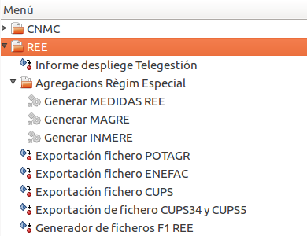

## Generació de fitxers F1

Aquesta opció genera el fitxer F1 (Dades horàries d'energia de punts
frontera de clients tipus 1 i 3) segons el document de REE, apartat 4.2.1.

Al seleccionar-la des del menú de generació de fitxers de la REE
s'obre l'assistent de generació:

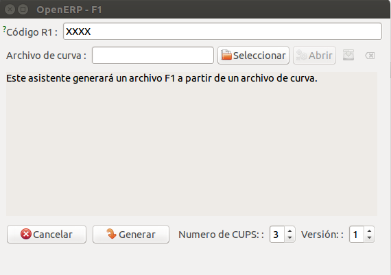

Els camps que el formen són els següents:

* **Codi R1:** Aquest camp l'obté automàticament l'assistent del mòdul
  de companyies, a la informació d'empresa, camp Ref2. Si convé es pot
  editar manualment.
* **Arxiu de corba:** Aquest camp ha de contenir un fitxer de corba a partir
  del qual es generarà el fitxer F1.
* **Informació:** És un requadre on apareix constantment informació sobre
  la generació del fitxer.
* **Número de CUPS:** Aquest camp indica el número de fitxers de corba
  a processar.
* **Versió** Aquest camp indica el número de versió dels fitxers F1.

Per cada CUPS indicat en el camp **Número de CUPS** es realitza el
següent procediment:

1. Selecció del fitxer de corba origen des del botó **'Seleccionar'**.
2. Click al botó 

Seguits aquests passos l'assistent mostra la següent informació:

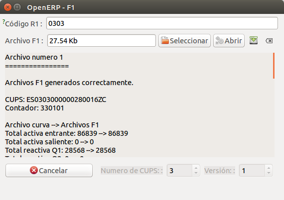

!!! note
    El número de CUPS només es pot editar abans de generar el fitxer.

### Descàrrega del fitxer F1

Per descarregar el fitxer F1 (en format .zip) s'ha de fer click al botó
**'Abrir'** del camp **'Archivo F1'**.

El camp d'informació mostra el resultat de la operació: mostra els resultats
dels valors dels fitxers de corba (origen) i dels fitxers F1 (destí).

Si l'arxiu no es genera correctament l'assistent ho informa al panell
d'informació i no deixa descarregar-lo·

#### Conversió del fitxer de corba a F1

Els fitxers origen suportats són:

* Fitxer de corba obtingut a través del TPL de GISCE-ERP
* Fitxer de corba en format ZIVERCOM

**Fitxer TPL de GISCE-ERP**

Per generar el fitxer F1 es fan servir les següents dades:

**Nom de l'arxiu:**

Fitxer: **F1_YYYY_AAAAMMDD_aaaammdd.v**

* **YYYY:** Codi de participant, valor indicat en el camp **Còdigo R1**.
* **AAAAMMDD:** Data a la que es corresponen les dades (Columna 1 arxiu TPL).
* **aaaammdd:** Data de generació del fitxer (data actual).
* **v:** Versió del fitxer. Sempre es genera amb el valor 1. Si l'usuari ha
  d'enviar una versió diferent ha de modificar el camp **versió** de l'assistent.

**Camps de l'arxiu:**

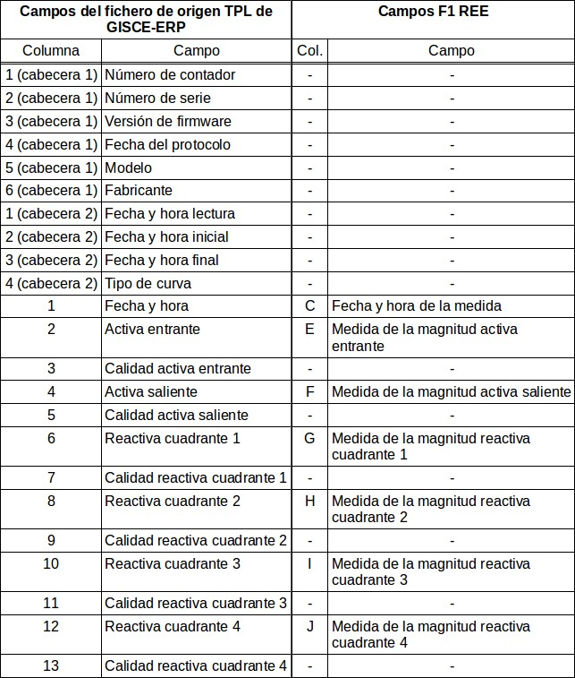

Els camps de la esquerra es corresponen als del fitxer de corba
i els de la dreta són els que han de tenir els fitxers F1.

* **CUPS:** s'obté a partir del número de comptador (camp 1 de
  la primera capçalera).
* **Tipus de mesura:** conté un valor fixe, "11". Camp B del fitxer F1.
* **Flag d'estiu/hivern:** s'obté automàticament a partir de les dates
  del fitxer de corba. Camp D del fitxer F1.
* **Mesura de la magnitud de reserva 1:** aquest valor s'informa buit.
  Camp K del fitxer F1.
* **Mesura de la magnitud de reserva 2:** aquest valor s'informa buit.
  Camp L del fitxer F1.
* **Mètode d'obtenció:** aquest valor s'informa a 1, «Medidas firmes
  en configuración principal». Camp M del fitxer F1.
* **Indicador de firmesa:** aquest valor s'informa a 1, «Firme».
  Camp N del fitxer F1.

**Fitxer ZIVERCOM**

Per generar el fitxer F1 es fan servir les següents dades:

**Nom de l'arxiu:**

Fitxer: **F1_YYYY_AAAAMMDD_aaaammdd.v**

* **YYYY:** Codi de participant, valor indicat en el camp **Còdigo R1**.
* **AAAAMMDD:** Data a la que es corresponen les dades.
* **aaaammdd:** Data de generació del fitxer (data actual).
* **v:** Versió del fitxer. Sempre es genera amb el valor 1. Si l'usuari
  ha d'enviar una versió diferent ha de ha de modificar el camp
  **versió** de l'assistent.

**Camps de l'arxiu:**

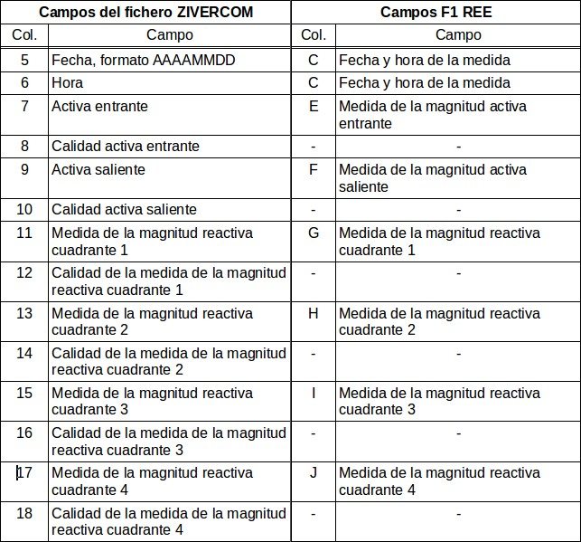

Els camps de la esquerra es corresponen als del fitxer de corba ZIVERCOM
i els de la dreta són els que han de tenir els fitxers F1.

* **CUPS:** s'obté a partir del nom del fitxer (20 primers caràcters).
  Camp A del fitxer F1.
* **Tipus de mesura:** conté un valor fixe, "11". Camp B del fitxer F1.
* **Flag d'estiu/hivern:** s'obté automàticament a partir de les dates
  del fitxer de corba. Camp D del fitxer F1.
* **Mesura de la magnitud de reserva 1:** aquest valor s'informa buit.
  Camp K del fitxer F1.
* **Mesura de la magnitud de reserva 2:** aquest valor s'informa buit.
  Camp L del fitxer F1.
* **Mètode d'obtenció:** aquest valor s'informa a 1, «Medidas firmes en
  configuración principal». Camp M del fitxer F1.
* **Indicador de firmesa:** aquest valor s'informa a 1, «Firme».
  Camp N del fitxer F1.
