# Documentació del mòdul de pólissa

## Canvi data firma contracte

En un contracte podem actualitzar la data de firma de contracte sense la
necessitat de fer una modificació contractual mitjançant un assistent creat
expressament

Des de una pólissa o des del botó acció del llistat de pólisses podem prèmer
sobre el botó **Actualitzar data firma contracte**. Ens apareixerà el formulari
[següent](#assistent-per-canviar-la-data-de-firma-de-contracte)
on podrem veure la pólissa seleccionada i la data de firma de contracte actual
(si en té). Prement en el botó continuar, actualitzarà la data de firma de
contracte de la **pólissa** i la **modificació contractual activa**.

!!! Warning "Atenció"
    No es farà cap tipus de validació sobre la data introduïda. Si és una data
    vàlida es modificarà la data actual sense tenir en compte cap altra
    consideració com la data d'alta i de baixa de la pòlissa o la data actual

##### Assistent per canviar la data de firma de contracte

## Assistent canvi dates modificació contractual

### Funcionament

Aquest assistent permet modificar la data d'alta, baixa i firma d'una pòlissa.
Per accedir al assistent s'ha d'obrir la modificació contractual a modificar.
Alla apareix el botó **Canviar dates**:

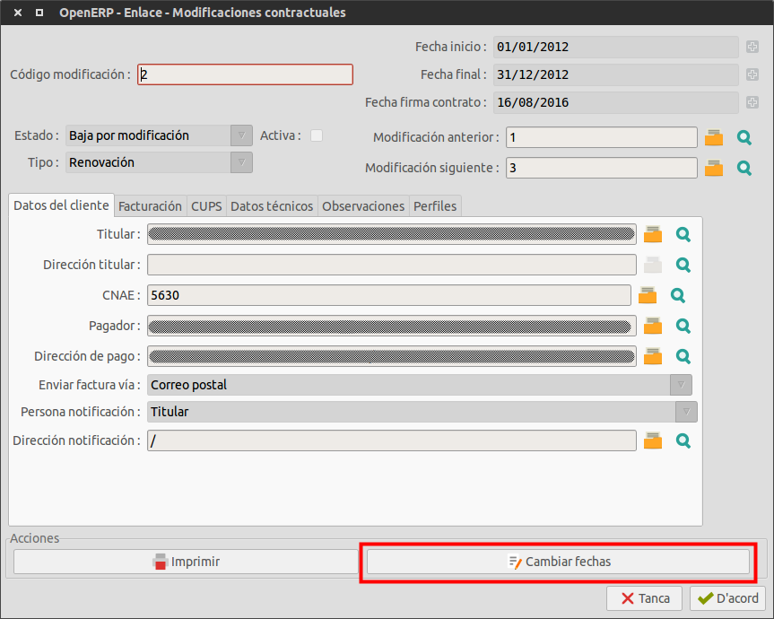

Al fer click al botó apareix l'assistent.

### Sense mòdul de facturació:

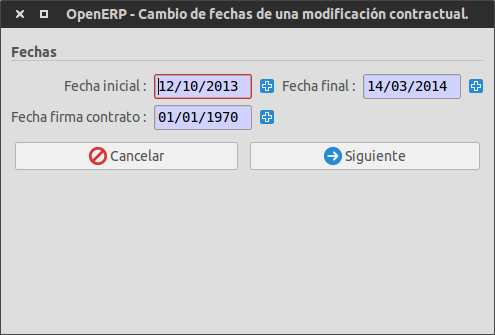

### Amb mòdul de facturació:

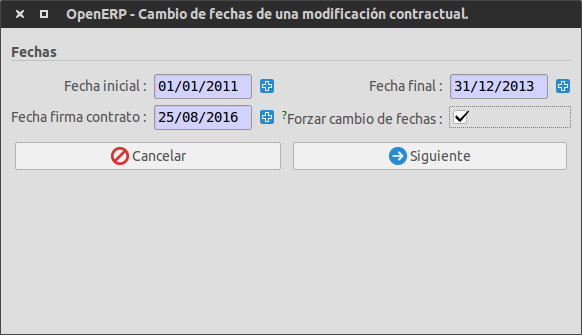

!!! Info "Nota"
    Si el mòdul de facturació **està instal·lat**, apareixerà a l'assistent
    l'opció **forçar canvi de data**.
    Amb el mòdul de facturació instal·lat l'assistent fa unes comprovacions
    extres abans d'aplicar les noves dates.

### Camps de l'assistent

L'assistent disposa de varis camps que han de ser emplenats per tal de poder
dur a terme la modificació de dates. Són els següents:

* **Data inicial:** Camp on hi consta la nova data inicial de la modificació
  contractual a modificar. Per defecte apareix la data inicial actual. La data
  inicial **ha de ser superior** a la **data inicial** de la modificació
  contractual anterior (en cas d'existir). Altrament, es mostrarà un error.
  **Aquest camp és obligatori.**

* **Data final:** Camp on hi consta la nova data final de la modificació
  contractual a modificar. Per defecte apareix la data final actual. La data
  final **ha de ser inferior** a la **data final** de la modificació
  contractual següent (en cas d'existir). Altrament, es mostrarà un error.
  **Aquest camp és obligatori.**

* **Data firma contracte:** Camp on hi consta la nova data de firma del
  contracte. Per defecte apareix la data de firma del contracte actual.
  **Aquest camp és obligatori.**

* **Forçar canvi de dates (només mòdul facturació):** Aquesta casella permet
  el canvi de les dates anteriorment esmentades encara que existeixin factures
  compreses en el nou període de dates entrat. Si **existeixen** factures i
  aquesta casella **no** **està marcada**, es mostrarà un error. Si es
  procedeix a canviar les dates forçant el canvi, al final del procés es
  mostrarà un resum informant quines són les factures afectades pel canvi.

Al fer click al botó **següent** es mostra la pantalla de resultats.
La informació mostrada dependrà de si el mòdul de facturació està instal·lat
o no.

### Sense mòdul de facturació:

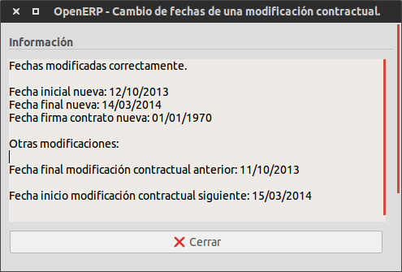

Sense el mòdul de facturació, la informació mostrada és la següent:

* **Data inicial nova:** la nova data inicial que l'assistent ha assignat a
  la modificació contractual.

* **Data final nova:** la nova data final que l'assistent ha assignat a la
  modificació contractual.

* **Data firma contracte nova:** la nova data de firma del contracte que
  l'assistent ha assignat a la modificació contractual.

* **Data final modificació contractual anterior:** nova data final assignada a
  la modificació contractual anterior (si existeix).

* **Data inici modificació contractual següent:** nova data inicial assignada a
  la modificació contractual següent (si existeix).

!!! Info "Nota"
    La modificació de les dates d'inici i final de les modificacions
    contractuals anteriors i / o següents es realitzen **automàticament** per
    evitar solapaments entre les modificacions contractuals de la pòlissa.

### Amb mòdul de facturació:

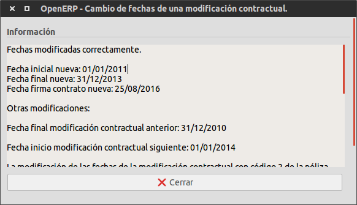

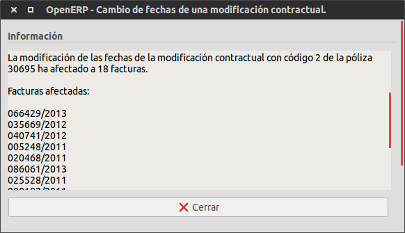

**Si es disposa del mòdul de facturació**, es mostra la mateixa informació
anteriorment citada incloent també la següent:

* **Factures afectades:** llistat amb el número de
  les factures incloses en el nou rang de dates (data inicial i final
  **noves**) i que formen part de la mateixa pòlissa de la modificació
  contractual modificada.

### Errors

Durant la modificació de les dates d'una modificació contractual mitjançant
aquest assistent es poden produïr errors. Aquests són notificats immediatament
i l'assistent permet tornar al pas anterior per rectificar les dades que el
provoquen. Els errors poden ser els següents:

* **Camps obligatoris buits:** si manca algún dels camps obligatoris
  l'assistent mostra un missatge informatiu i evita la modificació.

* **Data inicial incorrecte:** si la data inicial entrada és **anterior** a la
  data d'inici de la modificació contractual **anterior**, aquesta última
  desapareixeria, per tant mostra un error i no es fa cap modificació.

* **Data final incorrecte:** si la data final entrada és **posterior** a la
  data final de la modificació contractual **següent**, aquesta última
  desapareixeria, per tant mostra un error i no es fa cap modificació.

* **Canvis sense forçar (només mòdul facturació):** si al canviar les dates
  existeixen factures que es vegin afectades al estar dins del nou rang de
  dates i no s'ha marcat la casella **forçar canvi de dates**, es mostra un
  error i no es fa cap modificació.

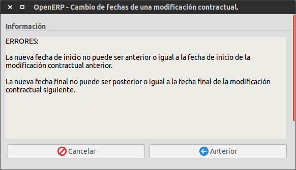

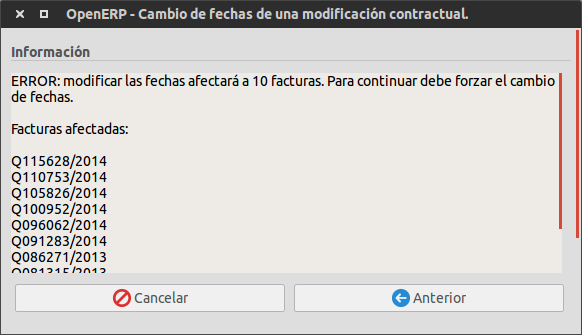

## Assistent de canvi a Operativa amb CCH

Aquest assistent realitza els canvis necessaris a un contracte per passar dels
estats de telegestió _No operativa_ o _Operativa sense CCH_ a **Operativa
amb CCH**.
L'assistent crearà una nova modificació contractual al contracte seleccionat amb
aquest únic canvi.

!!! Warning "Atenció"
    Cal tenir present que per tal que un contracte passi a un estat de telegestió
    **Operativa amb CCH** ha de tenir una periodicitat de **facturació mensual**. Per tant
    si s'ha seleccionat un contracte amb facturació bimestral, l'assistent també
    realitzarà el canvi a mensual. Si es dóna el cas, és necessari assegurar-se que
    es té **facturat tot el període anterior**.

!!! Info "Nota"
    És possible utilitzar l'assistent per **múltiples contractes** al mateix temps. Per
    fer-ho haurem de seleccionar de llistat de contractes tots els que ens interessa
    modificar i executar l'assistent.

#### Pas 1

**Opcions**

* **Canvi de lot:** Disposem de la casella **Mantenir el lot de facturació** la qual ens
  permet decidir si el contracte es mourà de lot al fer la modificació o no. Si marquem
  la casella, el contracte es mantindrà al lot actual, si no la marquem el contracte
  passarà al lot de facturació actual segons la data d'activació.
* **Data activació:** Tenim un seleccionable **Mes** en el qual podem seleccionar quin
  mes ens interessa que es configuri com a data inicial de la nova modificació contractual.

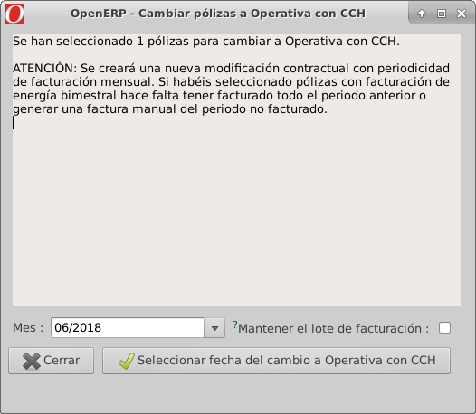

Una vegada tenim seleccionades aquestes opcions podem passar al següent pas amb el
botó **Seleccionar data del canvi a Operativa amb CCH**. Aquesta acció revisarà l'estat
de tots els comptadors seleccionats assegurant-se que tots són vàlids per passar per la
modificació. Si hi ha algun comptador que no compleix els requisits s'informarà a la
següent finestra.

**Requisits**

* **Inactiu:** És necessari que el comptador estigui actiu.
* **Comptador de TG:** És necessari que el comptador sigui de telegestió.
* **Connectat:** És necessari que el comptador estigui connectat.
* **Contracte no telegestionat:** És necessari que el contracte **no** estigui en Operativa
  amb CCH.
* **Potència:** És necessari que la potència contractada sigui inferior a 15 KW.
* **Tall:** És necessari que el contracte **no** estigui en estat de tall.

#### Pas 2

Caldrà revisar la informació que ens dóna l'assistent sobre els comptadors en els quals
es portarà a terme el canvi i els que no. Podem executar finalment el canvi amb el botó
**Canviar polisses a Operativa amb CCH**

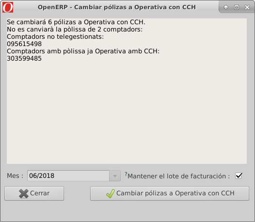

#### Pas 3

Al fer el canvi a cada comptador, es crea un **cas D1** d'ATR informant del pas a telegestió
Operativa amb CCH el qual s'haurà de tractar i processar com un cas ATR normal.

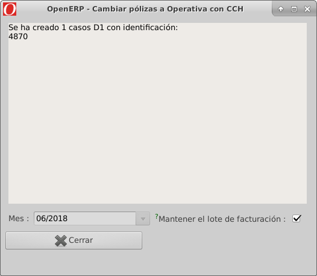
