# Termes i Definicions

En la descripció del procés d'obtenció dels indicadors de continuitat de
subministre aparèixen alguns termes amb les següents definicions:

* _Red de Transporte_: La definida en l'article **5 del Reial Decret 1955/2000
  de 1 de desembre** per el que es regulen les activitats de transport,
  distribució, comercialització, subministre i procediments d'autorització
  d'instal·lacions d'energia eléctrica.
* _Red de Distribución_: La definida en l'article **38 del Reial Decret
  1955/2000**
* _Alta Tensión de Distribución (AT)_: Conjunt d'instal·lacions de distribució
  de tensió nominal superior a 36kV.
* _Media Tensión (MT)_: Conjunt d'instal·lacions de distribució amb tensió
  nominal compresa entre 1kV i 36kV.
* _Baja Tensión (BT)_: Conjunt d'instal·lacions de distribució amb tensió
  nominal de fins a 1kV.
* _Subestación de Transformación_: Conjunt d'instal·lacions ubicades en un
  emplaçament comú aprovisionat amb un o diversos transformadors amb MT en el
  secundari, amb l'aparamenta i obra complementaria precises.
* _Centro de Maniobra_: Conjunt d'instal·lacions MT situades en un mateix lloc,
  de l'aparamenta eléctrica i dels edificis necessaris per realitzar, al menys,
  la funció de connexió de dos o més línies i la seva maniobra.
* _Centro de Transformación (CT)_: Instal·lació aprovisionada d'un o diversos
  transformadors reductors a BT, amb aparamenta i obra complementaria precises.
* _Línea MT_: Conjunt d'instal·lacions (fundamentalment, circuits constituïts
  per segments de conductor) connectats eléctricament i amb la mateixa tensió
  nominal, que es troben darrera d'un interruptor automàtic equipat amb
  proteccions, o compreses entre dos interruptors automàtics equipats amb
  proteccions
* _Interrupcin de Alimentación_: Condició en la que el valor eficaç de la tensió
  en els punts de subministre no supera el 10% de la tensió declarada. ([Article 100 del Reial Decret 1955/2000](http://noticias.juridicas.com/base_datos/Admin/rd1955-2000.t6.html#a100))
* _Continuidad de Suministro_: Contingut de la qualitat de servei relatiu al
  número i duració de les interrupcions de duració superior a tres minuts.
* _Incidéncia_: Tots els events, i les seves conseqüéncies associades, originat
  en els sistemes de Generació, Transport o Distribució, que sigui causa d'una o
  varies interrupcions imprevistes de subministre amb instal·lacions afectades
  relacionades temporal i eléctricament.
* _Interrupción Programada_: Una interrupció es considera programada quan s'han
  complert els requisits d'informació, notificació i autorització previstos en
  la legislació vigent, degudament justificats.
* _Interrupción Imprevista_: Tota interrupció que no s'ajusta a la definició
  d'interrupció Programada
* _Indicadores de Continuidad de subministro_: Índex numérics definits al efecte
  de medir el número i/o duració de les interrupcions de duració major de tres
  minuts que afecten als clients.
* _TIEPI_: Es el temps de interrupció equivalent a la poténcia instalada a mitja
  tensió (1kV i 36kV). Aquest índex es defineix mitjançant la següent expressió:

    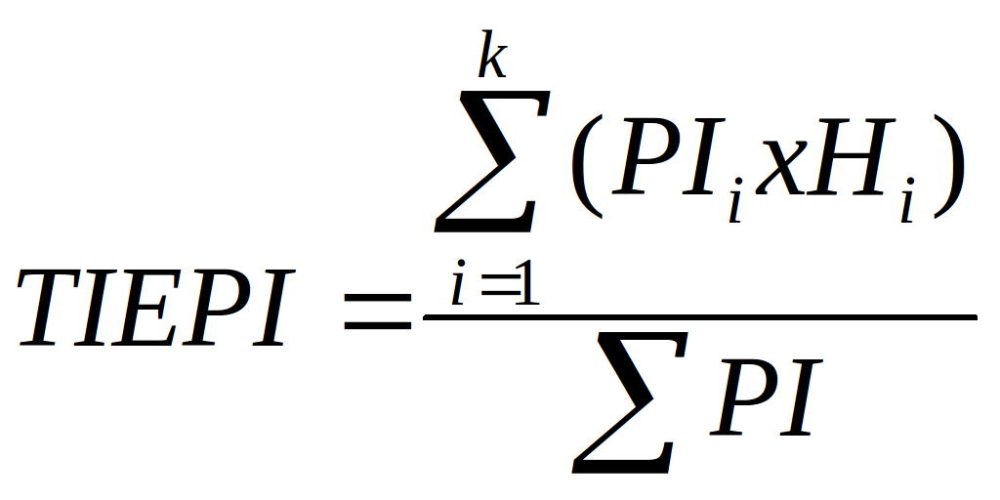

    On:

      * **PI** = Suma de la poténcia
        instal·lada dels centres de transformació MT/BT del distribuïdor més la
        poténcia contractada a MT (en kVA).
      * **PIi** = Poténcia instal·lada en els centres de transformació MT/BT del
        distribuidor més la poténcia contractada en MT, afectada per la
        interrupció _i_ de duració _Hi_ (en kVA).
      * **Hi** = Temps d'interrupció del subministre que afecta a la poténcia
        _Pi_, (en hores).
      * **K** = Número total d'interrupcions durant el període considerat.
      * Les interrupcions que es consideraràn en el càlcul del _TIEPI_ seran les
        de duració superior a tres minuts.

* _Percentil 80 del TIEPI_: Es el valor del _TIEPI_ que no es superat pel 80%
  dels municipis d'àmbit provincial, dins de cada tipus de zona.
* _NIEPI_: Es el número d'interrupcions equivalent de la potència instal·lada en
  MT (1kV < V <= 36kV). Aquest índex es defineix mitjançant la següent
  expressió:

    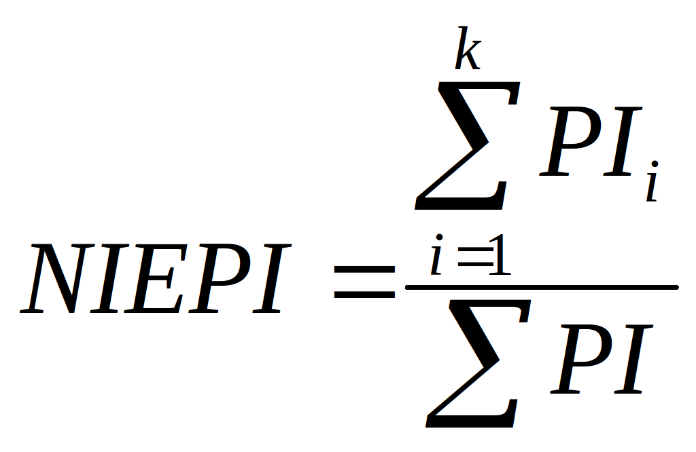

    On:

      * **PI** = Suma de la potència
        instal·lada dels centres de transformació MT/BT del distribuïdor més la
        potència contractada a MT (en kVA).
      * **PIi** = Potència instal·lada dels centres de transformació MT/BT del
        distribuidor més la potència contractada en MT, afectada per la
        interrupció _i_ (en kVA).
      * **K** = Número total d'interrupcións durant el periode considerat.
      * Les interrupcions que es consideraràn en el càlcul del _NIEPI_ seran les
        de duració superior a tres minuts. A efectes de _NIEPI_, es computarà
        una interrupció per cada incidència.

* _Punto de Connexión de Red (PCR)_: Es el punt físic en el que es sitúa la
  frontera de responsabilitat del distribuïdor: la entrada de la caixa general
  de proteccions per clients de BT i el dispositiu de maniobra frontera per
  clients de AT i MT.
* _Relación cliente-red_: Es el víncle que es pot establir entre el client i les
  instal·lacions des de les que es subministra. Consta de dos parts, la relació
  client-PCR, soportada i mantinguda per la organització comercial i la
  regulació entre el PCR, les instal·lacions de xarxa soportada i mantinguda per
  la part tècnica. Segons el grau d'informació de la xarxa en els sistemes, la
  relació client-xarxa podrà establir-se a nivell de diferents elements de la
  xarxa (Centre de Transformació, de Transformador, de Quadre de BT o
  d'escomesa).
* _Punto de agregación_: Element de la xarxa en el que s'estableix la relació
  client-xarxa.

## Definició de zones

Als efectes de qualitat de subministrament, el Real Decreto 1955/2000 estableix
la següent clasificació de zones:

* **Zona Urbana**: Conjunt de municipis d’una província amb més de 20.000
  subministraments, incloent capitals de província, encara que no arribin a la
  xifra anterior.
* **Zona Semi-urbana**: Conjunt de municipis d’una província amb un número de
  subministraments comprès entre 2.000 y 20.000, excloent capitals de província.
* **Zona Rural**:
  * **_Zona Rural Concentrada_**: Conjunt de municipis d’una província amb un
    nombre de subministraments comprès entre 200 y 2.000.
  * **_Zona Rural Dispersa_**: Conjunt de municipis d’una província amb menys de
    200 subministraments així como els subministraments ubicats fora dels nuclis
    de població que no siguin polígons industrials o residencials.

La definició de zones està en l’apartat “_Centres Transformadors → Manteniment →
CT’S → Zona_”, que s’indica en la figura següent:

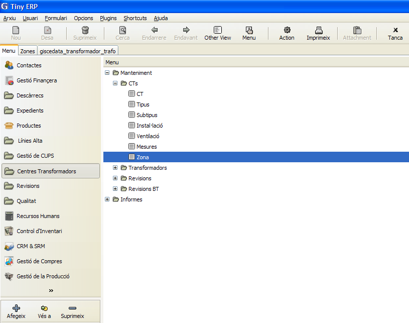

Al accedir apareixen les 4 zones definides.

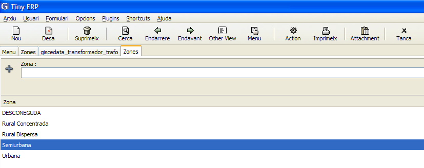

Al seleccionar-ne una d’elles apareixerà la seva fitxa en la que definirem les
següents dades. Es important veure que els valors admissibles es poden anar
afegint a mesura que aquests vagin variant. Es important així mateix definir
correctament les dates en que son vigents els valors indicats.

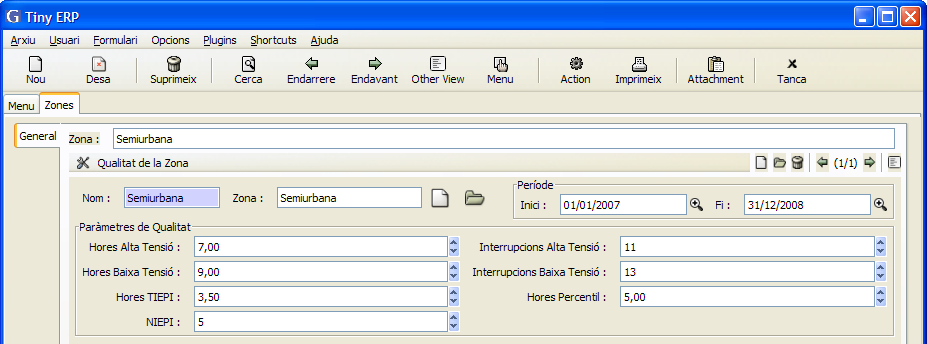

En la fitxa de cada zona es defineix.

**Paràmetres de Qualitat**:
* **Hores Alta tensió**: Nombre d’hores màxim d’interrupció en MT ( de 1 a 36
  kV.)
* **Interrupcions Alta tensió**: Nombre d’interrupcions màxim en MT ( de 1 a 36
  kV.)
* **Hores Baixa Tensió**: Nombre d’hores màxim d’interrupció en BT
* **Interrupcions Baixa tensió**: Nombre d’interrupcions màxim en BT
* **Hores TIEPI**: Valor màxim de l’índex TIEPI
* **Hores percentil**:  Valor màxim de l’índex percentil 80
* **NIEPI**: Valor màxim de l’índex NIEPI

**Període**:

* **Inici**: Data d’inici de la vigència dels valors  dels paràmetres de
  qualitat
* **Fi**: Data de fi de vigència dels valors dels paràmetres de qualitat

Els valors límits estan definits en l’article **104.2 del “Real Decreto
1955/2000”**.  “_REAL DECRETO 1634/2006, de 29 de diciembre, por el que se
establece la tarifa eléctrica a partir de 1 de enero de 2007._ (BOE
30-12-2006)”, que modifica els límits establerts

Quan es modifiquen els valors dels paràmetres de qualitat individual i zonal amb
un nou  RD es crea un nou període polsant el botó “nou registre”.

Una vegada creat s’introdueixen els valors dels paràmetres de qualitat i les
dates d’inici i fi del període de vigència dels valors.

## Recollida d'informació

La recollida d’informació procedeix de 3 fonts diferents:

* Sistema de telecontrol (SCADA)
* Actuació manual.
* Centre d’atenció al client.

L’origen de les incidències està definit en l’apartat “_Qualitat → Configuració
→ Origen d’incidències_".

En aquest apartat hi ha definits els 3 origen de les incidències:

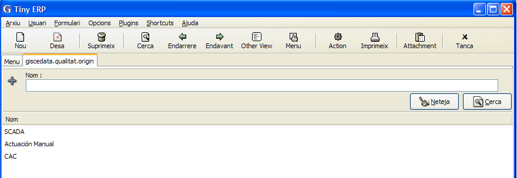

## Obtenció de la potencia total

Mensualment s’obté la potencia total instal·lada de la base de dades de
GISCE-ERP, de transformadors i dels clients en alta tensió, i es el denominador
pel càlcul dels índex TIEPI, NIEPI.    
Per generar la potencia instal·lada del mes corresponent s’hi accedeix des del
menú, “_Qualitat → traçabilitat → Generar potència instal·lada_".

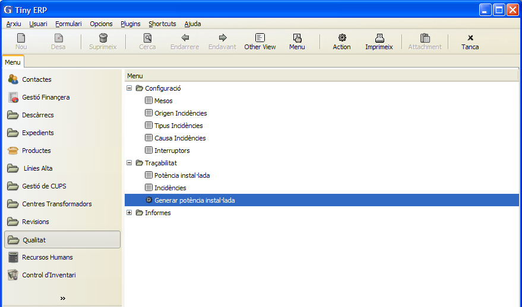

Al fer doble clic s’accedeix a l’assistent que ens guia per obtenir la potencia
instal·lada.

S’ha de seleccionar el mes i l’any que desitgem guardar la potencia instal·lada.

A continuació s’indicarà el valor del cos fi. Aquest valor s’utilitzarà per
convertir les potencies contractades en AT ( kW ) en kVA.

Per comprovar lles potencies instal·lades en cada mes es pot accedir a l’apartat
“_Qualitat → traçabilitat → Potència instal·lada_” tal com es veu a la imatge
següent.

Al fer doble clic apareixen les potencies instal·lades en els diferents mesos, i
podem veure-les per realitzar les comprovacions necessàries.

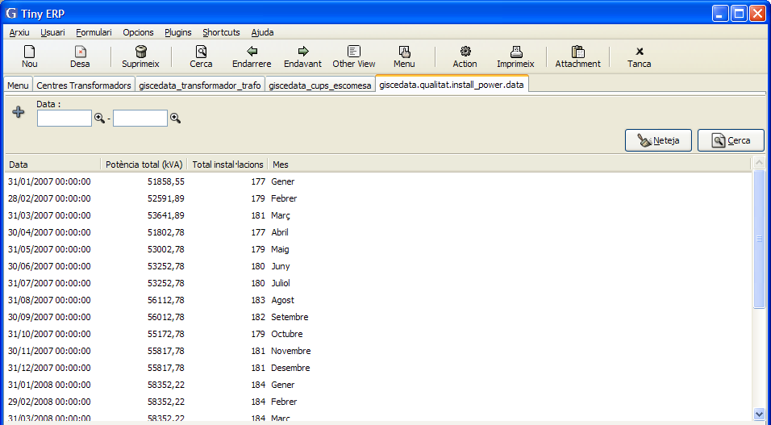

Al seleccionar un mes determinat apareix la potencia instal·lada amb una llista
de tots els transformadors i tots els subministraments en AT. Així com la
potencia total en kVA, i el nombre total d’instal·lacions.

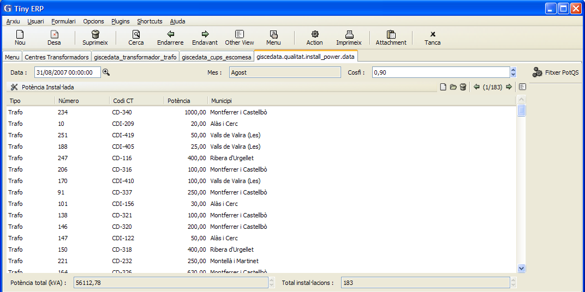

On:
* **Data**: es la data en que es va guardar la potencia instal·lada.
  Aquesta data indica a quin mes i any correspon potencia instal·lada. Per
  defecte el programa posa la data de l’últim dia del mes pel qual es genera la
  potencia instal·lada.

* **Cosfi**: Es el valor del cosinus de fi utilitzat per calcular la potència
  total instal·lada en kVA, convertint la potencia contractada en AT que es en
  kW.    
  Si es desitja canviar el cos fi, al canviar-lo i guardar es recalcula la
  potencia total (kVA).
* **Mes**: Mes al que afecta la potencia instal·lada

Fent doble clic a sobre d’una instal·lació apareix la seva fitxa resumida.

A continuació  es descriu com es determina la potencia total instal·lada.
Si es va a la fitxa dels transformadors al GISCE-ERP, "_Menú → Centres
Transformadors → Manteniment → Transformadors → Transformador_” i s’obre la
fitxa d’un transformador apareixen les seves dades.    
Al generar la potencia instal·lada del mes, selecciona només els transformadors
que:

* Estan marcats com a **TIEPI = SI**
* Estan en la **localització = CTS**
* Estan en **estat = Funcionament**

Com que amb el programa GISCE-ERP es porta el manteniment de les instal·lacions
de centres transformadors i de les màquines que hi tenen instal·lades, només
caldrà fer algun llistat de comprovació per veure si les dades estan
actualitzades. ( per exemple des de “_Centres transformadors →
Manteniment → transformadors_”) i filtrar els transformadors que estan en
funcionament, estan a la **localització CTS** i **TIEPI = SI**.

Per obtenir la potencia contractada en AT, es busquen les escomeses que son del
tipus _CONTA-AT_, es comprova el CUPS que te associat i la potencia de la
pòlissa associada. Per poder fer comprovacions es pot accedir al menú “_Gestió
de CUPS → Manteniment → CUPS → Escomesa_”, i buscar les escomeses del tipus
_CONTA-AT_, i accedir a la fitxa de l’escomesa tal com es veu a la imatge
següent:

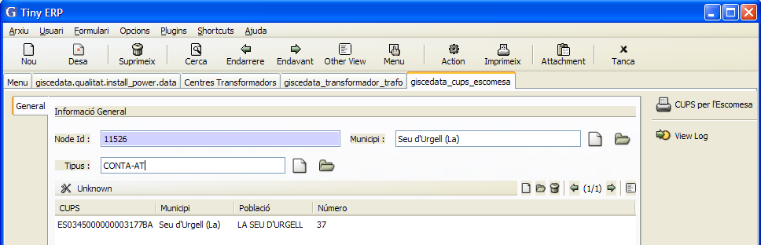

Si es fa doble click sobre el CUPS associat a l’escomesa es pot veure la fitxa
del CUPS tal com s’observa en la imatge següent.

La Pòlissa associada a aquest CUPS es la que indica la potencia contractada en
AT que es tindrà en compte a l’hora d’obtenir la potencia instal·lada.
Fent  clic sobre la fitxa de la pòlissa associada al CUPS apareixen les dades de
la tarifa i potència contractada.

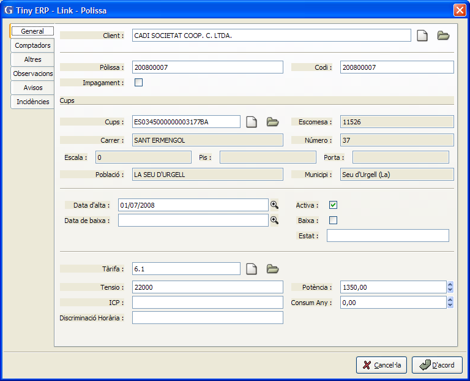

Totes les escomeses del tipus _CONTA-AT_ son las que es tindran en compte com a
potència instal·lada.

## Emmagatzematge de dades

## Informació associada a una incidència

## Criteris per la determinació del nombre i duració de les interrupcions

## Desagregació de les dades de la interrupció

## Informació associada a instal·lacions i clients

## Metodologia pel càlcul de l'indicador percentil 80 de TIEPI

## Metodologia per la obtenció d'informació zonal d'interrupcions en BT

## Avaluació de la qualitat individual

## Documentació Suport

### Generació d'avisos d'incidències

### Dades introduïdes en el sistema de forma manual

### Modificació de dades

### Classificació de la interrupció com a programada

### Classificació de la interrupció com originada per tercers

### Classificació de la interrupció com originada per forca Major

## Sistemes Informàtics

## Model d'informe
