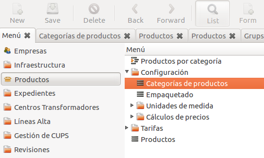
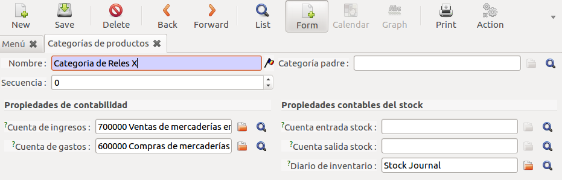
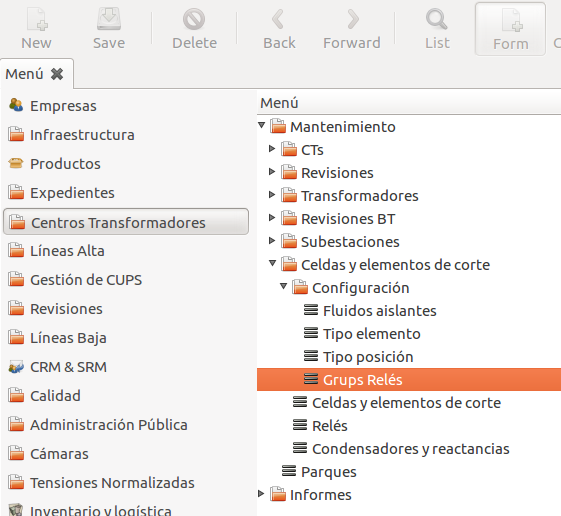
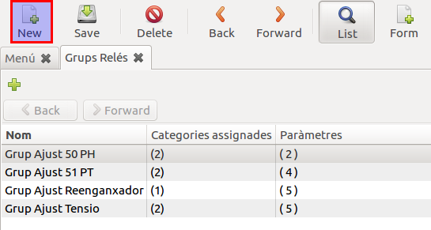
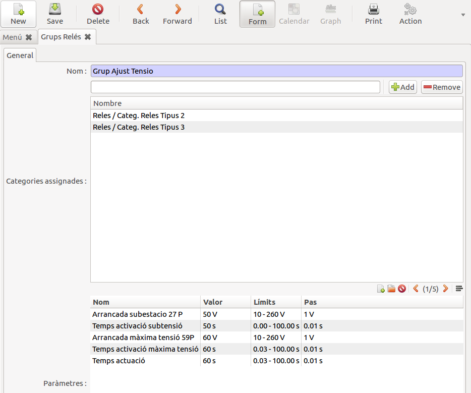
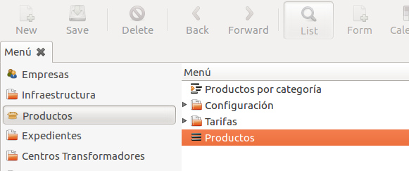
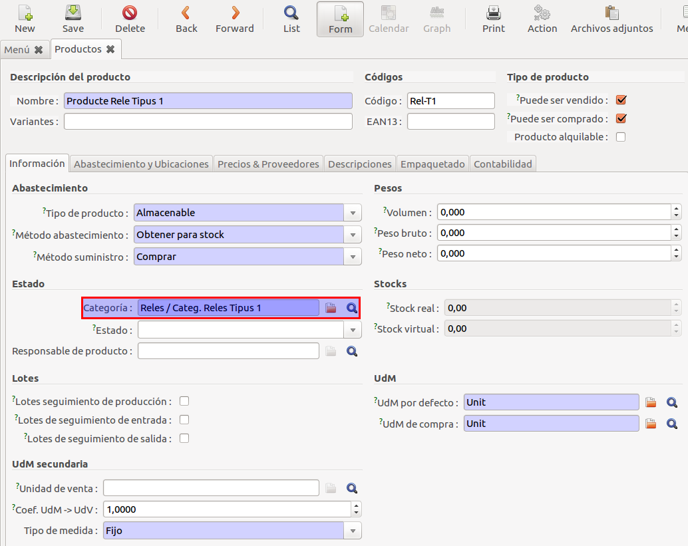
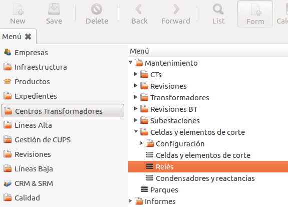
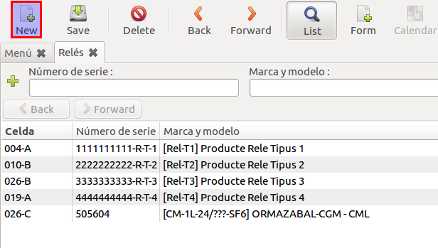
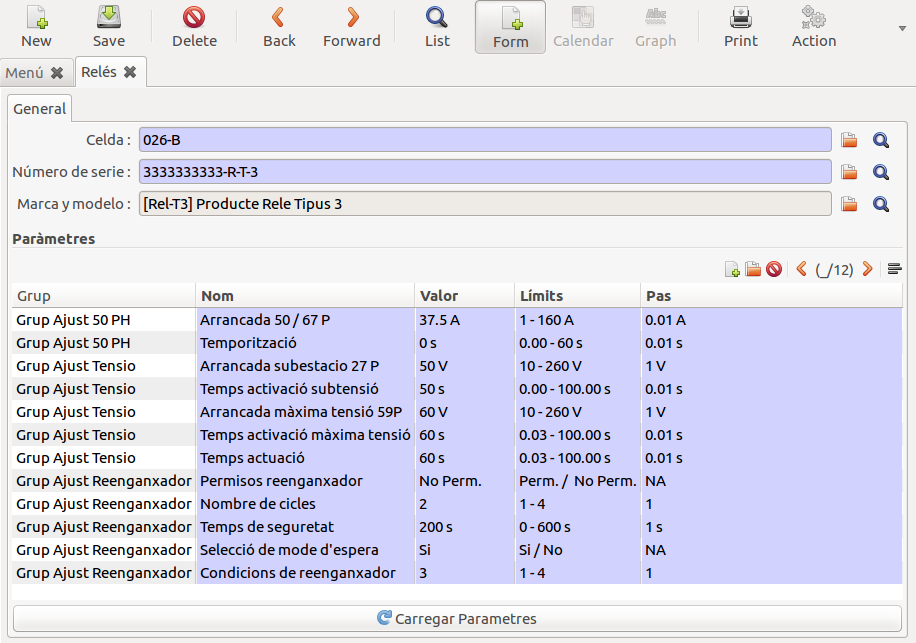

# Documentació del mòdul de Relés

## Configuració dels grups de paràmetres dels Relés

Els **Grups de Paràmetres dels Relés** estan relacionats amb una o més categories
de productes. En l'ERP Tot producte, en aquest cas ens centrarem en els **Relés**,
ha de tenir assignada una categoria de producte obligatòriament.

A partir d'aquesta característica s'ha afegit una nova funcionalitat que ens permet,
havent configurat prèviament unes categories de productes de relés i uns grups de
paràmetres de relé, poder crear productes relé i **assignar automàticament** a
aquests elements els paràmetres que li corresponguin en comptes de fer-ho un a
un per a cada element.

A continuació s'explicarà **pas a pas** com es realitza aquesta configuració
i les possibilitats que ofereix.

### 1.- Definir les categories de Relés

Primer de tot haurem de definir les **categories de productes relés**,
on per categories entendrem que seran l'agrupació d'aquells productes
relés que **compartiran els mateixos paràmetres**. Per a fer-ho ens
haurem de dirigir al menú de l'ERP i obrir l'apartat
"_**Productes>Configuració>Categories de productes**_".

Un cop dins la vista **Categories de productes** haurem de crear les
**categories de relés** que, com ja s'ha comentat en aquest apartat,
seran l'agrupació d'aquells relés que comparteixin els mateixos grups
de paràmetres. Per a fer-ho haurem de prémer el botó **New**, que ens
obrirà l'assistent on haurem d'especificar el nom del grup. Per a
finalitzar haurem de prémer el botó **Save**.

### 2.- Definir els Grups de Paràmetres de reles

El següent pas és definir els **Grups de paràmetres** i assigna'ls-hi
les categories de productes de relés que compartiran aquests paràmetres.
Per accedir a aquesta vista haurem d'anar al menú de l'ERP i obrir
l'apartat "_**Centres Transformadors>Manteniment>Cel·les i elements de
tall>Configuració>Grups Relés**_"

Dins la vista de **Grups Relés** podrem veure un llistat dels grups
ja existents. Per a crear-ne un de nou haurem de prémer el botó **New**.

Aquesta acció ens obrira l'assistent de creació de grups. Dins l'assistent
haurem de definir el **Nom del Grup**, afegir les **Categories de Relé**
que compartiran paràmetres i definir els **Parametres del Grup** amb els
seus conseqüents valors.

### 3.- Definir productes Relé

Un cop definides les **Categories de Relés** i els **Grups de Paràmetres**
podrem definir **Productes Relé** per a poder crear posteriorment **Relés**
i assigna'ls-hi automàticament els paràmetres que tinguin configurats a
partir de la **Categoria del Relé**. Per accedir a la vista ens haurem
de dirigir al menú de l'ERP i obrir els següents apartats: "_**Productes>Productes**_".

Per a definir un **Producte** haurem de prémer el botó **New** i omplir
els camps obligatoris tot especificant la **Categoria de Producte** a
la qual pertany el **Relé**.

!!! Warning "Atenció"
    Cal remarcar que la Categoria de Producte definirà els paràmetres que
    tindran els relés creats del tipus acabat de definir.

### 4.- Crear productes Relé

L'últim pas ja és **crear Relés** dels tipus definits en el pas anterior.
Per accedir a la **Vista de Relés** ens haurem de dirigir al menú de l'ERP
i obrir l'apartat "_**Centres Transformadors>Manteniment>Cel·les i elements de tall>Relés**_"

Dins la vista de **Relés** podrem veure un llistat dels Relés creats.
Per a crear-ne un de nou haurem de prémer el botó **New**.

Un cop obert l'assistent de **Creació de Relés** procedirem a omplir els
camps necessaris i prement el botó **Carregar Paràmetres** carregara els
paràmetres definits per a la categoria a la qual pertany el producte.

Queda dir que si en el futur **es realitza algun canvi sobre la categoria
del producte o sobre el grup**, tornant a premer el botó **Carregar
Paràmetres**, aquests s'actualitzarien acord amb els parametres actualitzats.
