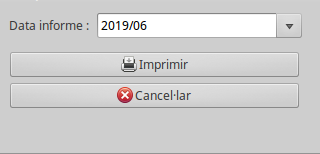

# Saturacions de transformadors

## Saturació d'un transformador

L'Anàlisi de les saturació d'un transformador ens permet detectar-ne les
sobrecàrregues preventivament i evitar problemes de sumministrament.
Per poder detectar la saturació d'un comptador, ens cal comparar la seva
potència nominal en kVA amb la potència demandada en un moment determinat
a les seves sortides.
Les sortides d'un transformadors es coneixen per les seves sigles, 
B1, B2 o B3 en funció de la seva tensió de sortida.
Així doncs, si en un moment determinat podem mesurar la potència màxima 
demandada a cadascuna de les sortides podrem saber la saturació del 
transformador.
Aquesta saturació s'informa en % segons la relació:

```
    Saturació =  kVA trafo / Potència Màxima demandada
```

## Model de saturació

El ERP inclou el mòdul `giscedata_transformadors_saturacio` per 
emmagatzemar i historitzar la saturació dels transformadors i permetre'n 
un anàlisi posterior. Aquest mòdul crea un model per emmagatzemar la 
 saturació de cadascuna de les sortides B1 i B2 del transformador i
 la saturació conjunta en un moment determinat. Es relaciona també amb 
 el Centre transformador en el qual està instal·lat el transformador
 en el moment de calcular-ne la saturació.
 
 
 
* **Data**: Data de la mesura de saturació
* **Nº. TRF**: Número de transformador
* **CT**: Nom del Centre transformador en el qual estava instal·lata el
  transformador en el moment de la mesura
* **K**: Rel·lació de transformació entre la sortida B1 i B2.
* **B1+B2**: Saturació agregada de les dues sortides en %
* **Mesurada Bn**: Màxima potència mesurada a la sortida [n] en kW
* **Màxima Bn**: Potència del transformador en aquesta sortida [n]en kVA
* **Saturació Bn**: Saturació de la sortida [n] en %
* **Observacions**: Comentaris sobre el càlcul realitzat que es vulguin 
  guardar 
 
Podem llistar i filtrar les saturacions en el llistat disponible a
**Centres Transformadors > Manteniment > Transformadors> Saturacions Transformadors**

Des d'aquest llistat es poden cercar les saturacions segons diferents
 criteris:
 
* **Saturacions d'un CT**: Es pot utilitzar camp **CT** per mostrar 
  l'historic de saturacions d'un CT
* **Saturacions d'un Transformador**: Es pot utilitzar el camp 
  **Nº. TRF** per mostrar l'històric de saturacions d'un Transformador
* **Saturacions per data**: Es pot utilitzar el camp **Data** per mostrar
  totes les saturacions disponiblesbles en un interval de temps
* **Saturacions Altes**: Es pot utilitzar el camp **B1+B2** per mostrar
  totes les saturacions que superen un llindar. p.e. 90%. 
  
Qualsevol d'aquestes cerques es poden combinar.

El resultat es pot exportar en un fitxers *Excel (xlsx)* mitjançant la 
opció imprimir pantalla disponible en qualsevol llistat
  
També a la pestanya *Saturacions* del **Transformador** i del **Centre 
Transformador** es poden llistar les saturacions que els afecten


## Informe de Saturacions

Es pot generar un informe de les saturacions en un interval de temps 
concret mitjançant l'assistent **Centres Transformadors > Manteniment > Transformadors >Informe saturació Transformadors**



* **Data informe**: Escull les saturacions segons el mes de les mesures 
  (Camp **Data** de la saturació)
* **Imprimir**: Genera un PDF amb tots Transformadors dels Centres 
  transformadors actius. Encara que no tinguin saturació disponible, 
  surten en l'informe

# Saturacions de transformadors a partir de mesures de Telegestió

## Registradors i concentradors de Telegestió


 
Els sistemes de telegestió PLC, com per exemple PRIME, utilitzen la 
propia xarxa elèctrica de baixa tensió per comunicar-se amb els 
registradors dels punts de mesura, normalment instal·lats a l'escomesa 
de cada client. Un gruip de registradors es centralitza en un 
concentrador que recull totes les dades i les fa accessibles al sistema 
de telegestió (STG) que emmagtzema les dades i gestiona el sistema.
Aquests concentradors s'instal·len habitualment en els centres 
transformadors, concretament a les sortides de baixa dels transformadors.
Si s'aprofita el comptador intern del concentrador per mesurar tota la 
energía que passa per la línia, ens donen la informació suficient per 
calcular, entre altres coses, la saturació de la sortida dels 
transformador que mesuren i per extensió, la saturació del transformador
mateix.
Aquests registradors es caracterítzen en el ERP per no estar vinculats a
cap contracte. 

Ens interessen especialment els supervisors i els repetidors:

* **Supervisors**: Registradors instal·lats en punts de la xarxa que 
  permeten mesures en el punt en el qual estan instal·lats per 
  monitoritzar zones, linies, etc... Molts concentradors disposen de un
  registrador intern que es pot utilitzar per a aquesta finalitat.
* **Repetidors**: S'utilitzen per millorar la comunicació amb els 
  registradors que no tenen bona comunicació, per exemple per la 
  distància amb el concentrador. En alguns casos, incorporen un 
  registrador que es pot utilitzar com a supervisor del punt en el qual 
  està instal·lat
  
Com qualsevol registrador, s'emmagatzemen tancaments mensuals, diaris i 
corbes horàries que podrem utilitzar per calcular les saturacions

## Configuració dels registradors i els transformadors
 
Per calcular correctament la saturación de un transformador, caldrà 
relacionar el transformador i les seves sortides amb els concentradors 
i els registradors.

Es poden establir les següents relacions:

* **Concentrador** Un transformador està instal·lat en un Centre 
  Transformador on, en una instal·lació típica, hi ha un o varis 
  concentradors de telegestió instal·lats. El concentrador relacionat 
  amb un transformador es pot configurar a la pestanya *Telegestió* de 
  la fitxa del transformador. Amb aquesta relació, podrem trobar més 
  fàcilment el registrador vinculat al transformador, ja que només podrà
  ser un dels registradors , normalment de tipus supervisor, que ens 
  arriba pel concentrador.
    


* **Registrador** Un registrador supervisor es pot configurar amb el 
  les dades del transformador i la sortida que mesura. La sortida pot 
  se la B1 o la B2. Aquesta configuració es fa des de la pestanya 
  *Infraestructura* del registrador corresponent. 
  


Per tant, per poder calcular correctament la saturación d'un 
transformador a partir de les dades de telegestió, caldrà:

1. Buscar el registrador instal·lat a la sortida del tranformador 
   (*Infraestructura > Registradors*)
2. Configurar-lo amb el transformador i la soritda corresponent
3. Configurar el transformador amb el concentrador de telegestió 
   vinculat
   
## Càlcul de la saturació del transformador

Per calcular la saturació del transformador, un cop configurada 
correctament la relació cal executar el assistent *Calcular Saturació 
de transformadors* des del transformador del qual es desitgi calcular la
saturació.

També es pot calcular per més d'un transformador si es fa des del 
llistat


En el asistent que es mostra es pot escollir la data per la qual es vol
calcular la saturació i prèmer el botó *Calcular*. S'utilitzaran els 
tancaments entre el mateix dia del mes anterior i la data seleccionada. 
Un cop finalitzat el procés, es mostrarà un text amb el procés de càlcul
de la saturació i si tot és correcte, es generarà el registre 
corresponent.
  


## Càlcul de la saturació de tots els transformador

Es diposa de un enllaç prepara per calcular la saturació de tots els 
transformadors per un mes en concret. 

* Centres Transformadors > Manteniment > Transformadors > Calcular la saturació de tots els transformadors actius *

En aquest cas, es calcularà la saturació de tots els transformadors 
vinculats als Centres de Transformació actius en el moment de fer el 
càlcul.

## Algoritme de càlcul de la Saturació dels transformadors

Per calcular la saturació dels comptadors s'utilitzen les següents 
dades del registrador de cada sortida:

* **Tancaments mensuals (S04)** Tancaments mensuals del registrador, 
  p.e. del dia 01/06 al dia 01/07. Necessitem concretament el Maxímetre
* **Corba de Càrrega (S02)** Corba de càrrega durant el mateix període
  dels tancaments
* **Potència del Transformador** Potència nominal del transformador en 
  kVA's

### Saturació de la sortida Bn

La saturació de la sortida Bn es calcula comparant el Maxímetre del 
tancament mensual del registrador (*B<sub>n</sub>Max*) amb la potència 
nominal del transformador (*kVA*):

*B<sub>n</sub>Saturation =  B<sub>n</sub>Max / kVA*
     
Si només tenim una sortida habilitada, la saturació del transformador 
(*B1+B2*) és la saturació de la sortida activa

*B1+B2 = B<sub>n</sub>Saturation*

### Saturació amb dues sortides

S'utilitzen les corbes per buscar el punt amb la màxima demanda. Com que 
el Maxímetre no coincideix necessàriament amb el punt de màxima demanda,
es calcula un coeficient (*k<sub>n</sub>*) per ponderar cada corba segons
el maxímetre i el punt de màxima demanda (*B<sub>n</sub>CurveMax*):
 
*k<sub>n</sub> = B<sub>n</sub>Max / B<sub>n</sub>CurveMax*

Sumem les corbes (*C<sub>n</sub>*) de les dues sortides ponderades pel 
seu factor *k<sub>n</sub>* per obtenir la corba agregada 
(*C<sub>T</sub>*):

*C<sub>T</sub> = C<sub>1</sub>·k<sub>1</sub> + C<sub>2</sub>·k<sub>2</sub>*

Per calcular la saturació total (*B1+B2*), s'agafa el màxim de la 
corba agregada (*C<sub>T</sub>CurveMax*) i es compara amb la potència del 
transformador (*kVA*)

*B1+B2 = C<sub>T</sub>CurveMax / kVA*

