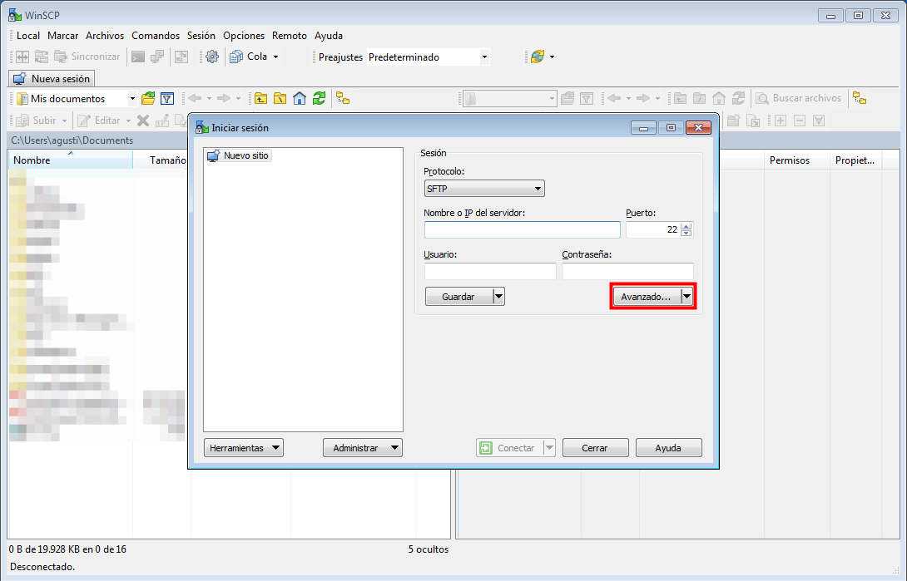
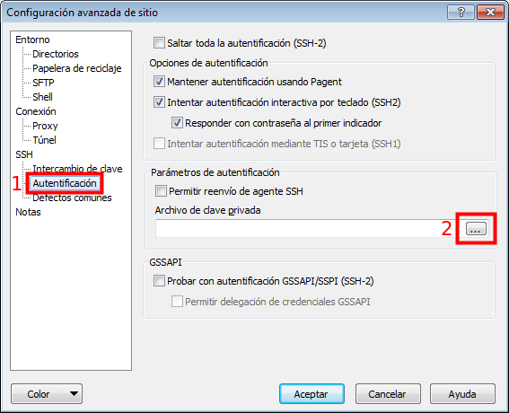
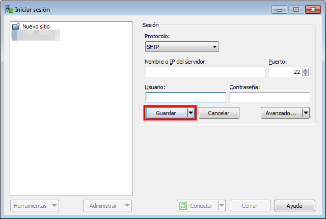

# Sincronització de CUPS

Per tal de poder efectuar la sincronització de CUPS cal descarregar
el client WinSCP, el qual estableix una connexió segura amb el servidor
i permet la càrrega i descàrrega de fitxers.

## 1. Instal·lació de WinSCP

El primer pas és descarregar el software **WinSCP**. Per fer-ho cal
accedir a l'apartat de [descàrregues](winscp.net/eng/download.php) del
portal web del WinSCP.

Llavors s'ha de fer click a l'opció **Installation package**, la qual
descarregarà a l'ordinador un fitxer executable que permetrà la 
instal·lació del software.

Un cop descarregat ja es pot fer click al fitxer executable. Apareixerà
una finestra amb les condicions d'ús d'aquest software. Un cop llegides
les condicions cal fer click a **Aceptar**.

La següent finestra que apareix per pantalla permet escollir el tipus
d'instal·lació a fer. La opció per defecte és la de **instal·lació tipica**,
la qual instal·la tots els paquets i característiques necessàries per
el funcionament del WinSCP. 

Cal deixar aquesta opció marcada i fer click a **següent**.

Les següents pantalles informen del tipus d'interfície a utilitzar
i també ofereixen un resum dels continguts a instal·lar. Es pot 
continuar amb les opcions que venen marcades per defecte.

## 2. Configuració de WinSCP

Un cop instal·lat i obert apareix una finestra per configurar una nova
connexió. El primer pas és configurar la **clau privada** per tal de 
poder establir una connexió SFTP segura amb el servidor. Per fer-ho, s'ha
de fer click a **Avançat**:

A continuació apareix una finestra de configuració de varis paràmetres.
S'ha de fer click a **Autentificació** (dins l'apartat SSH) i llavors
s'ha d'importar el fitxer de **clau privada** (subministrat per GISCE).

Un cop carregada la clau es pot fer click a **Acceptar**. Llavors, torna
a aparèixer la finestra de configuració de la connexió. Cal entrar la
direcció IP del servidor, juntament amb l'usuari i la contrassenya. Un
cop les dades estiguin completes cal fer click a **Guardar**. D'aquesta
manera no caldrà tornar a configurar el WinSCP cada cop que s'executi.

Un cop guardats els paràmetres de connexió ja es pot fer click al botó 
**connectar**. Si la configuració s'ha realitzat correctament es podrà
establir una connexió segura amb el servidor.