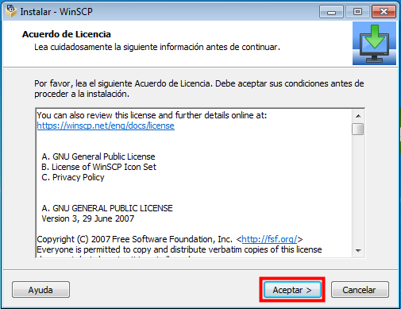
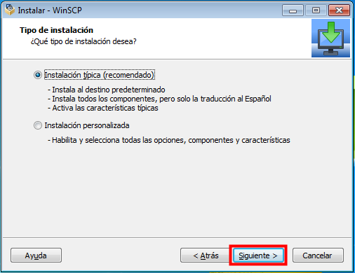

# Sincronització de CUPS

## 1. Instal·lació de WinSCP
``
El primer pas és descarregar el software **WinSCP**. Per fer-ho cal
accedir a l'apartat de [descàrregues](winscp.net/eng/download.php) del
portal web del WinSCP.

Llavors s'ha de fer click a l'opció **Installation package**, la qual
descarregarà a l'ordinador un fitxer executable que permetrà la 
instal·lació del software.

Un cop descarregat ja es pot fer click al fitxer executable. Apareixerà
una finestra amb les condicions d'ús d'aquest software. Un cop llegides
les condicions cal fer click a **Aceptar**.

La següent finestra que apareix per pantalla permet escollir el tipus
d'instal·lació a fer. La opció per defecte és la de **instal·lació tipica**,
la qual instal·la tots els paquets i característiques necessàries per
el funcionament del WinSCP. 

Cal deixar aquesta opció marcada i fer click a **següent**.

Les següents pantalles informen del tipus d'interfície a utilitzar
i també ofereixen un resum dels continguts a instal·lar. Es pot 
continuar amb les opcions que venen marcades per defecte. Un cop 
instal·lat 

