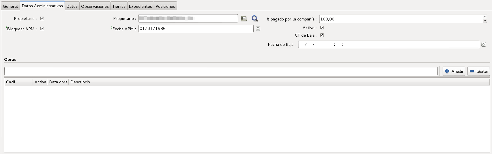
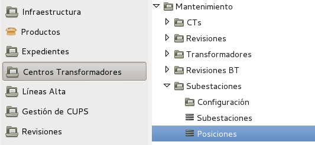
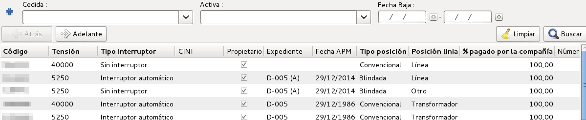
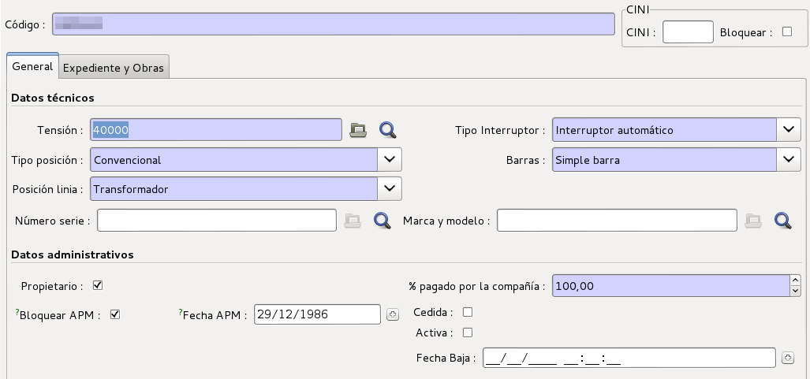
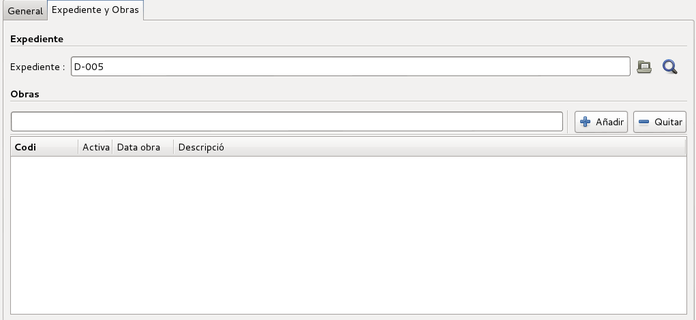

# Subestacións

## Introducció

El mòdul de subestacions ens permet inventariar aquells Centres Transformadors
que contenten un *Transformador Reductor* i que per tant tenen característiques
específiques com les *Posicions*.

Comparteixen moltes característiques amb els Centres Transformadors
convencionals i per això moltes de les seves vistes són semblants si no
idèntiques.

Les Posicions són equivalents a un interruptor de la cabina de la subestació

## Crear una nova Subestació

Per crear una nova Subestació ho podem fer a través del llistat de
totes les Subestacions i després apretar el botó de **Nou**, igual que es fa amb
la resta de registres de l'ERP.

Ens apareixerà un formulari on podem visualitzar una capçalera i diferents
parts:

  * General
  * Dades Administratives
  * Dades
  * Observacions
  * Terres
  * Expedients
  * Sortides BT
  * Posicions

En l'apartat de **Dades Administratives** tenim els camps:

  

  * **Propietari (check)**: Per indicar si som propietaris o no.
  * **Propietari**: Qui és el propietari de la Subestacio, habitualment
    nosaltres mateixos.
  * **% pagat per la compañia**: Per indicar quin percentatge ha pagat l'empresa
    per aquest element.
  * **Bloquejar APM**: Permet fixar a una data concreta la *Data APM*. D'aquesta
    forma es permet posar-hi una data fixa i que no es sobreescrigui
    automàticament tal com s'explica a *Data APM*
  * **Data APM**: En quina data es va posar en marxa. Aquest camp
    s'actualitza sol segons la data d'autorització més gran dels expedients
    associats si no es marca el camp *Bloquejar APM*. En aquest cas es pot posar
    una data arbritària.
  * **Actiu**: Per marcar si aquesta Subestació està activa o no. En el cas que
    no estigui activa, no ens apareixerà al llistat a no ser que li diguem
    explícitament que volem veure les Subestacions no actives.
  * **CT de Baixa**: Indica si la Subestació està de baixa.
  * **Data de baixa**: Per indicar en quina data es va donar de baixa la
    Subestació. Aquest camp només és visible quan el camp *CT de Baixa* actiu
    està activat.
  * **Obres**: Amb quines obres relacionem aquesta Subestació.

## Llistat de totes les Posicions

Podem trobar un llistat de totes les posicions al **Menú >
Centres Transformadors > Manteniment > Subestacions > Posicions**

Quan fem doble clic al llistat de totes les posicions, podem veure un llistat on
es mostraran totes les posicions que tinguem actives en aquests moments.

## Crear una nova Posició

Per crear una nova POsició ho podem fer a través del llistat de totes les
Posicions i després apretar el botó de **Nou**, igual que es fa amb
la resta de registres de l'ERP.

Ens apareixerà un formulari on podem visualitzar una capçalera i diferents
parts:

  * General
  * Expedients i Obres

La capçalera és visibles des de qualsevol apartat:

  * **Codi**: Codi de la posició que ens permet identificar-la.
  * **CINI**: Codi CINI de la posició.
  * **Bloquejar**: Marca aquest CINI de forma que l'automatisme d'actualització
    de CINI's no el modifiqui.

En l'apartat de **General** dos seccions amb els camps:

*Dades tècniques*

  * **Tensió**: Tensió de la posició
  * **Tipus d'interruptor**: Tipus d'interruptor segons els valors
    seleccionables
  * **Tipus de posició**: Tipus de posició segons els valors seleccionables
  * **Barres**: Tipus de barres segons els valors seleccionables
  * **Posició Linia**: Transformador, Línia o altres.
  * **Número sèrie**: Número de serie de la Posició o cabina instal·lada
  * **Marca i Model**: Marca i model de la Posició o cabina instal·lada

*Dades administratives*

  * **Propietari**: Per indicar si som propietaris o no.
  * **% pagat per la compañia**: Per indicar quin percentatge ha pagat l'empresa
    per aquest element.
  * **Bloquejar APM**: Permet fixar a una data concreta la *Data APM*. D'aquesta
    forma es permet posar-hi una data fixa i que no es sobreescrigui
    automàticament tal com s'explica a *Data APM*
  * **Data APM**: En quina data es va posar en marxa. Aquest camp
    s'actualitza sol segons la data d'autorització de l'expedient
    (camp *Expedient*) associat si no es marca el camp *Bloquejar APM*. En
    aquest cas es pot posar una data arbritària.
  * **Cedida**: Si la Posició està cedida per el propietari de la instal·lació
  * **Activa**: Per marcar si aquesta Posició està activa o no. En el cas que
    no estigui activa, no ens apareixerà al llistat a no ser que li diguem
    explícitament que volem veure les Posicions no actives.
  * **Data de baixa**: Per indicar en quina data es va donar de baixa la
    Posició. Aquest camp només és visible quan el camp *Activa* no està activat.

En l'apartat de **Expedient i Obres** tenim els camps:

  

  * **Expedient**: Expedient relacionat amb aquesta posició
  * **Obres**: Amb quines obres relacionem aquesta Posició.
