# Documentació del mòdul de comptadors i lectures de telegestió

## Comptadors de telegestió

El modul de telegestió gestiona la lectura dels fitxers de tancament diaris i
mensuals de comptadors PRIME, la seva validació i posterior inserció de les
lectures de facturació

Les lectures que es recullen de telegestió es troben separades de les de
facturació. Només es carregaràn a facturació les lectures necessaries.

El módul de telegestió afegeix opcions a la fitxa de comptadors, inclosa una
nova pestanya Telegestió si el comptador es marca que es de telegestió.

En aquesta pestanya hi ha una casella de checkbox la qual indica si el comptador
té actualment alguna excepció.

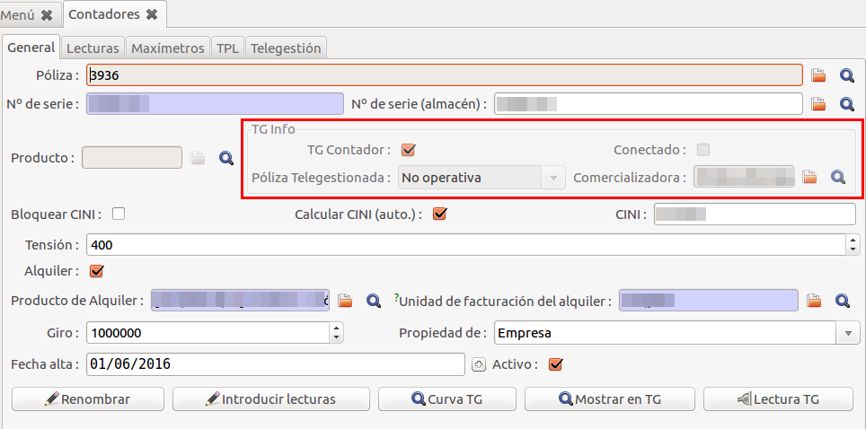

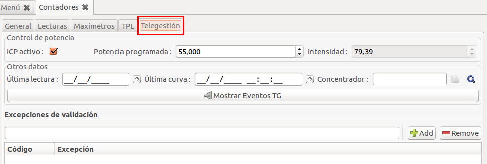

## Procediment de càrrega de lectures

La gestió de lectures de consum de comptadors mitjançant telegestió es realitza
habitualment seguint tres passos:

1.  **Càrrega de dades**: Els concentradors deixen les dades de lectures,
    corbes i esdeveniments en un servidor FTP en format XML. GISCE-ERP recull
    aquests fitxers, els processa i els carrega a la base de dades. Aquesta
    operació la podem realitzar manualment des de la configuracio d'els FTP
    prement el [boto de connexió ftp](#configuracio-connexions-ftp). Si es
    produeix un error, es registra al
    [llistat d'errors de lectura](#registre-de-lectura-tg-reader-errors)

2.  **Validació de lectures**: Per preparar les lectures abans d'ésser passades
    a la facturació, cal validar-les. Per fer-ho podem anar a la opció del menú
    [Validar Tancaments](#validar-tg-tancaments) o fer-ho des d'un comptador
    en concret. Si hi ha algun error es genera un cas en el CRM,
    secció [Telegestió i CRM](#telegestio-i-crm)

3.  **Lectura TG**: Per poder facturar, necessitem carregar les lectures al
    sistema de facturació, igual que si ho haguéssim llegit manualment o amb
    TPL. Per fer-ho anem al comptador en qüestió i premem al botó de lectures de
    la fitxa o directament des del botó
    [Lectura des de TG](#lectura-des-de-tg-boto). Per entrar totes les lectures
    de tots els comptadors d'un lot de facturació podem prémer en el botó
    [importar lectures del lot](#importar-lectures-des-del-lot-de-facturacio).

!!! note
    Es pot configurar el sistema de telegestió per no carregar les lectures de
    reactiva i així no facturar-la. No obstant, si la potència contractada és
    superior a 15 kW, s'insertaran **sempre** les lectures de reactiva.

blockdiag {
    ftp -> carga -> validación -> lectura
    carga -> "TG Errores de lectura" [label = "errores", textcolor="#FF0000"]
    validación -> "CRM (Telegestión)" [label = "errores", textcolor="#FF0000"]
}

Actualment, GISCE-ERP és capaç de llegir els seguents fitxers XML
estandaritzats:

* **S02**: Perfils
* **S04**: Tancaments mensuals
* **S05**: Tancaments diaris
* **S09**: Esdeveniments de comptador
* **S12**: Configuració del concentrador
* **S13**: Esdeveniments de comptador espontanis

## Ampliació Pestanya General

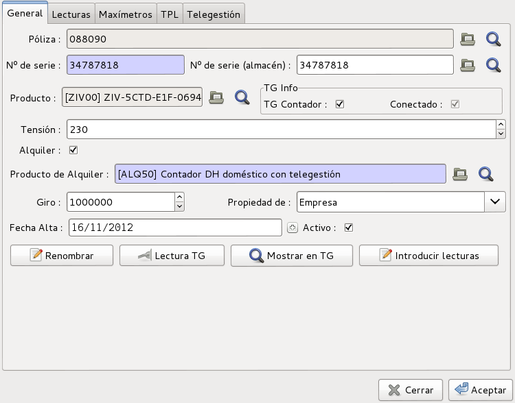

   Pestanya General amb telegestió

Amb el módul de telegestió, s'afegeixen els següents camps a l'apartat ``TG
info``:

* **TG Comptador**: Si aquest camp està marcat, inidica que l'equip és
  telegestionat. Es marca automàticament quan es validen lectures d'aquest
  comptador.
* **Connectat**: Indica si l'equip està connectat al concentrador i està
  preparat per enviar informació. (Només lectura)
* **Mostrar TG**: Botó que ens permet mostrar el llistat de les lectures de
  telegestió rebudes per el comptador. No són les de facturació.
* **Lectura des de TG**: Aquest botó permet crear una lectura de facturació a
  partir de les lectures validades de telegestió que s'hagin obtingut. Es
  demana la data en la qual es vol generar la lectura. Si d'aquest dia no n'hi
  ha cap de vàlida, anirà buscant lectures en dies **anteriors** fins a trobar
  una lectura de telegestió vàlida o una lectura de facturació. En aquest
  darrer cas, voldrà dir que no tenim cap lectura de telegestió vàlida més
  nova.

!!! note
    El nom del producte del comptador de telegestió és important. Per facilitar
    el switching va bé que la marca i el model estiguin separats per un espai

!!! note
    Els productes comptadors de telegestió han de tenir un prefix al camp Codi.
    Aquest prefix ha de ser el mateix que afegeix el comptador als números de
    sèrie. (veure `nota prefix`_ )

##### Fitxa producte d'un comptador de telegestió

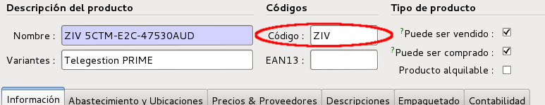

Pestanya Telegestió
-------------------

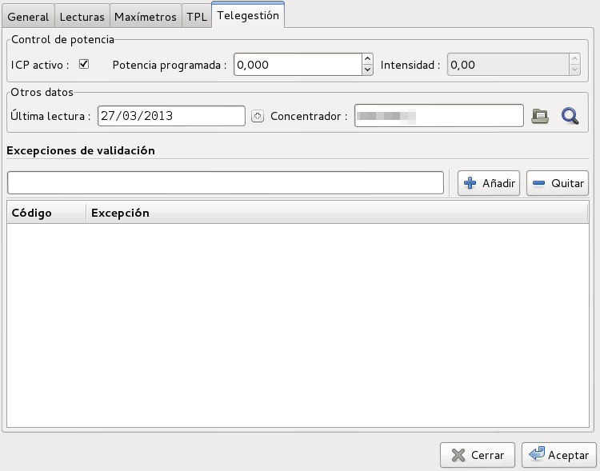

   Pestanya Telegestió de comptador

La pestanya de telegestió només es mostra en aquells comptadors que tenen la
opció ``TG Comptador`` marcada

* **ICP actiu**: Si la casella està activada, indica que l'ICP de l'equip de
  mesura està activat. Si s'activa apareixeràn 2 camps més a l'apartat de
  ``Control de potència``

  * **Potència programada**: Potència màxima que permet l'ICP del comptador
  * **Intensitat**: Indica la intensitat máxima a la qual està programat el
    ICP. Aquest es llegeix automàticament del comptador (Només lectura)

* **Darrera lectura**: Data de la última lectura de telegestió validada per
  aquest comptador
* **Concentrador**: Concentrador al qual està assignat aquest comptador. Un
  comptador s'assigna a un concentrador en el moment que se li validen lectures
  enviades des d'aquest concentrador.
* **Mostrar events TG**: Aquest botó ens obrirà un llistat dels esdeveniments
  del comptador.
* **Excepcions de validació**: En aquesta llista es poden afegis les excepcions
  de validació que no es tindran en compte. Al validar una lectura de
  telegestió, es poden generar un seguit d'excepcions que provocarà que la
  lectura no sigui vàlida. Si l'excepció és dins la llista, no es tindrà en
  compte i validarà la lectura. Podem veure la llista de les
  [possibles excepcions](#configuracio-excepcions)

## Gestió i configuració de Telegestió

Tots els menús d'accés a telegestió es troben centralitzats dins el menú
infraestructura.

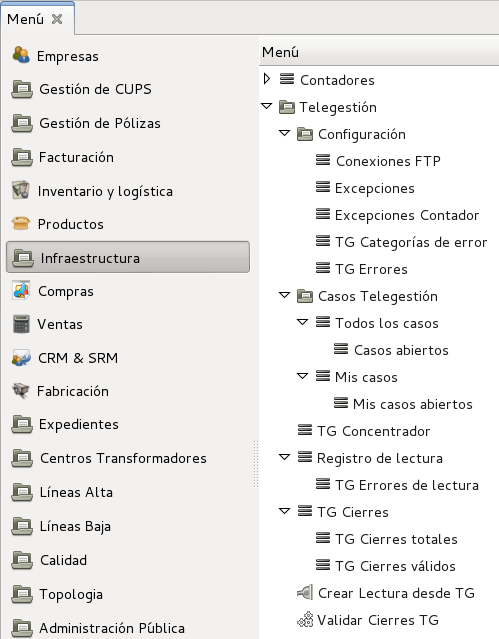

   El menú Infraestructura amb les opcions de telegestió

### Configuració > Connexions FTP

Els concentradors de telegestió deixen les dades en format XML en un servidor
FTP. GISCE-ERP accedeix a aquest FTP per accedir a les dades i importar-les.
Des d'aquesta opció de menú podem gestionar més d'un FTP.

GISCE-ERP mai esborra els fitxers importats, només els mourà per evitar
tornar-los a carregar.

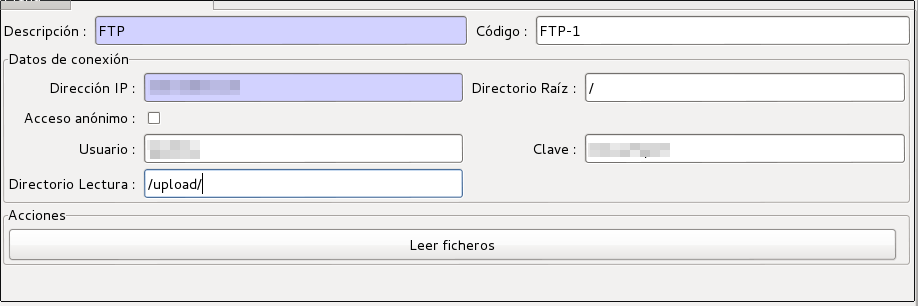

   Fitxa de configuració servidor FTP de telegestió

* **Descripció**: Descripció de l'FTP
* **Codi**: Codi de l'FTP per si es volen tenir codificats
* **Direcció IP**: Direcció IP del servidor FTP des del servidor ERP
* **Directori Arrel**: Directori en el qual es crearan les carpetes amb els
  fitxers ja processats.
* **Accés anònim**: Si el servidor s'accedeix amb l'usuari anònim
* **Usuari i Clau**: Usuari i clau d'accés al servidor FTP. Ha de permetre
  llegir, escriure i crear carpetes
* **Directori(s) Lectura**: Directori o directoris en els quals es buscaran
  fitxers per carregar, Els directoris han d'anar separats per punt i coma (;).
* **Llegir fitxers (Botó)**: Mitjançant aquest botó, es provoca una lectura
  dels fitxers de l'FTP. Carregarà tots els fitxers que trobi i inserirà les
  lectures i errors que vagi trobant. Si un fitxer no el processa, podrem veure
  l'error corresponent al registre de lectura.

!!! tip
    Els directoris han de començar i acabar sempre amb la barra de directori
    ("/"), p.e. **/root/upload/**
!!! tip
    Els caracters ``,``, ``*``, ``?``, ``<``, ``>``, ``:``, ``\``, ``'``, ``"``
    i ``|`` no estan permesos en el nom d'un directori

El procediment de lectura va de la següent forma:

* Els concentradors han de deixar els fitxers a les carpetes de l'FTP
  configurades a ``Directori Lectura`` per a que GISCE-ERP els trobi.
* Tots els fitxers que processi, els mourà a la carpeta configurada a
  ``Directori Arrel`` del propi FTP dins una carpeta amb el nom ``YYYYMM`` on
  YYYY és l'any i ``MM`` el mes de la data del fitxer importat.
* Els fitxers que no pugui importar **no** els mourà. Si ningú els treu,
  donaran error el següent cop que es llegeixin

### Configuració > Excepcions

Quan es validen les lectures es fan tot un seguit de comprovacions per
assegurar-se que les lectures són correctes. En alguns casos, es vol que certes
validacions no es facin perquè es sap a priori que un comptador en concret té
alguna particularitat. P.e. Alguns comptadors poden tenir el totalitzador (P0)
malament perquè es tenen en compte períodes que per la tarifa actual no
s'utilitzen. En aquest cas sempre donarà error de totalitzador, però podem
marcar-lo per a què no tingui en compte aquesta validació i validarà
correctament.

Les excepcions que es gestionen actualment són:

* **(OL) Over Limit**: Consum excessiu. En una lectura *diària* s'ha consumit
  més que si s'hagués consumit la potència contractada durant 24 hores
  seguides.
* **(NR) Negative Read**: Lectura negativa.
* **(EE) Export Energy**: Exportació d'energia. Les lectures indiquen que
  aquest comptador està exportant energia. Es pot donar si el comptador ha
  estat instal·lat amb la polaritat invertida.
* **(ER) Export reactive**: Exportació de reactiva. Les lectures indiquen que
  aquest comptador està generant reactiva en els quadrants 2 i 3
* **(NC) No Communication**: No hi ha comunicació amb el comptador. Fa més de 2
  dies que no tenim lectura d'aquest comptador.
* **(BT) Bad Totalizer**: Totalitzador incorrecte. El període ``P0``
  (totalitzador) no és la suma dels altres períodes.
* **(CC) Comparison Month vs Day**: La lectura mensual absoluta no coincideix
  amb la lectura diaria del mateix dia.

!!! tip
    L'excepció **(NC) No Communication** depèn del paràmetre de configuració
    **tg_last_read_advice** que per defecte és de 2 dies. Es pot configurar per
    a què utilitzi un altre període.

### Configuració > Excepcions Comptador

En aquest llistat podem indicar els comptadors que validen sempre les seves
lectures, encara que tinguin errors. Això ens serveix per comptadors de proves,
comptadors no associats a cap polissa, comptadors de supervisió, comptadors no
donats d'alta a l'ERP, etc...

* **Nº de Sèrie**: Número de sèrie del comptador tal com el veu el concentrador
  (amb prefix)
* **Notes**: Ens permet posar una nota explicativa amb la raó de la seva
  inclussió en aquesta llista

### Configuració > TG Categories Error i Configuració > Errors

Els concentradors de telegestió inclouen en els fitxers XML els errors que
troben al comunicar-se amb els comptadors i relacionats amb la seva própia
operació. Aquests errors estandaritzats es classifiquen amb codis de categoria
i codis d'error.

GISCE-ERP només emmagatzema els errors que estan donats d'alta en aquestes
taules. Si el fitxer XML conté un error que no està donat d'alta, no es
registrarà.

Aquestes taules les gestiona el propi ERP. Els futurs errors que apareguin en
la norma s'aniran afegint en aquestes llistes en properes actualitzacions.

* **Codi**: Codi numèric de l'error.
* **Descripció**: Descripció de l'error.
* **Categoria**: Si es tracta d'un error, a quina categoria pertany.

!!! note
    Aquests errors són específics del concentrador i no estan relacionats amb
    l'ERP. S'ha de tenir en compte que l'error es genera en el moment de generar
    el fitxer. Es podria donar el cas que el problema ja estigui solucionat
    actualment. Consulti el manual de l'equipament o contacti amb el fabricant.

### Casos Telegestió

Permet un accés directe als casos generats pel sistema de telegestió (veure
[Telegestió i CRM](telegestion.md#telegestio-i-crm)). Replica la mateixa
estructura dels casos del CRM , creant accessos directes als casos oberts i
als casos propis per facilitar-ne la gestió.

### TG Concentrador

Concentradors instal·lats. Es donen d'alta automàticament quan es llegeix el
primer fitxer enviat per ells i s'associen als comptadors instal·lats de forma
automàtica.

En el llistat de contadors es pot veure el número de comptadors connectats a
cada concentrador.

La fitxa del concentrador s'omple quan arriba un fitxer amb forma S12. Des de
la fitxa també es pot accedir al llistat de comptadors associats a ell
mitjançant el botó comptadors.

### Registre de lectura

En el registre de lectures dels fitxers es mostren els fitxers que s'han intentat
carregar i ens informa del resultat de la lectura. Si s'ha llegit correctament
tot el fitxer, si s'ha llegit parcialment amb algun error o si ha sigut totalment
erroni.

Els fitxers erronis poden ser fitxers en un format no soportat o directoris
a l'arrel del nostre FTP.
Els fitxers que tenen l'estat d'error parcial és perquè contenen valors
incorrectes en un o més camps. En aquest cas s'ignoren els grups
d'informació amb errors i es llegeix la resta.

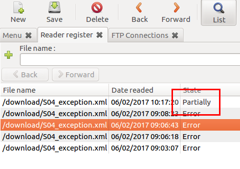

Si entrem a veure l'error parcial que resulta de la càrrega del fitxer
trobarem quin model de informe és el que dòna l'error, a quin o quins comptadors
passa, el missatge d'error i la línia o línies conflictives del fitxer.

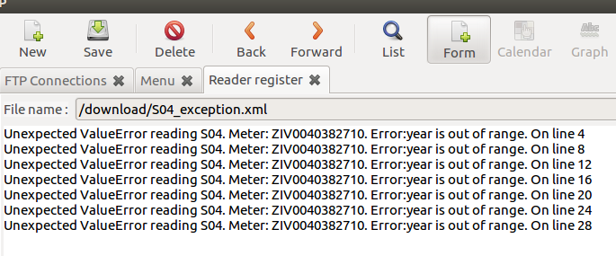

### Registre de lectura > TG reader Errors

Llista els errors de lectura trobats per comptador. Aquests errors venen del
propi fitxer enviat pel concentrador, p.e. comptador no trobat

### TG Cierres

Registre dels tancaments diaris i mensuals amb accessos directes a:

* **TG cierres totals**: Tancaments només del període P0 (totalitzadors)
* **TG cierres vàlids**: Només tancaments validats

Les lectures que encara no han estat validades es llisten de color **blau** i
les validades de color **negre**

!!! note
    El comptador de registres d'aquests llistats no s'actualitzen, ja que el
    càlcul d'aquest valor és molt lent. Per tant, encara que hi hagi milers de
    lectures, sempre sortirà com 1/80

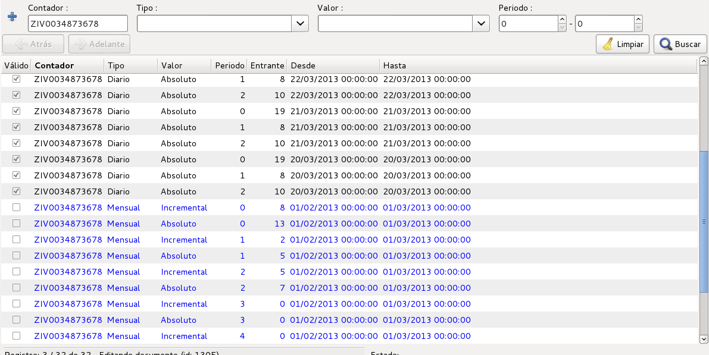

#### Llista de lectures de Telegestió

Des del llistat podem seleccionar un conjunt lectures i validar-les prement el
botó **Acció**. S'ens obrirà un formulari on podrem escollir validar o
invalidar els tancaments o lectures de telegestió. Cal tenir present que validar
mitjançant aquest procediment no realitza cap de les comprovacions descrites en
l'apartat [Validar TG Tancaments](#validar-tg-tancaments). Únicament marca el
tancament com a vàlid o el desmarca.

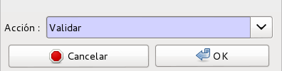

#### Formulari de validació d'un tancament

Podem veure la informació completa en el detall d'un tancament:

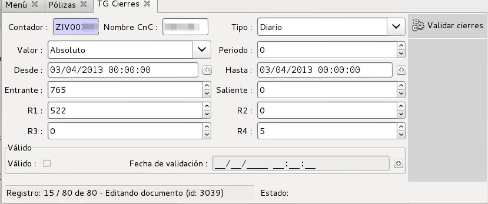

   Detall d'un tancament

En el detall hi trobem:

* **Comptador**: Nom complet del comptador tal i com ens l'envia el
  concentrador.
* **Nom CnC**: Nom del concentrador al qual estava associat el comptador en el
  moment de realitzar la lectura. Pot canviar en el temps i així tenim
  traçabilitat.
* **Tipus**: Indica si el tancament és Mensual i Diari.
* **Valor**: **Absolut** (lectura del comptador) o **Incremental** (consum des
  de la última incremental generada). Les incrementals només poden ser de tipus
  mensual
* **Període**: Període al que correspon la lectura. 0 és un totalitzador del 1
  al 6.
* **Des de i A**: Interval temporal que comprèn la lectura
* **In**: Activa entrant, o energia importada
* **Out**: Activa sortint, o energia exportada
* **R1,R2,R3 i R4**: Els 4 quadrants de reactiva
* **Max**: Valor del maxímetre i data de registre del mateix (només per les
  mensuals)
* **Vàlid**: Si està validad i quan es va validar

!!! note
    Els números de sèrie dels comptadors a GISCE-ERP són numèrics. A telegestió,
    els números de sèrie en els concentradors afegeixen un prefix segons el
    producte. p.e. per comptadors ZIV afegeixen el prefix **ZIV**. Aquest
    prefix es pot configurar en la gestió de productes omplint el camp ``Codi``
    del producte associat al comptador de telegestió. (veure la [Fitxa producte
    d'un comptador de telegestió](#fitxa-producte-dun-comptador-de-telegestio))

### Lectura des de TG (Botó)

Ens permet importar les lectures de telegestió d'un comptador si en sabem el
número de sèrie. Funciona igual que si el cridéssim des de la fitxa del
comptador.

* **Comptador**: Nº de sèrie del comptador
* **Data límit**: Data de la qual volem les lectures
* **Forçar**: Entra la lectura encara que hi hagi una lectura posterior. Si no
  **no** deixa entrar la lectura

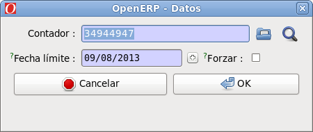

#### Formulari per introduïr data de importació de lectura

### Validar TG Tancaments

La **Validació** consisteix en:

* S'eliminen els períodes que s'utilitzaran (del 3 a 6 ambdos inclosos). Es fa
  així per facilitar el canvi entre tarifes DH i no DH
* Es comprova que la lectura sigui superior a la darrera vàlida rebuda. La
  primera lectura que es reb d'un comptador, es marca com a vàlida
  automàticament.
* Es comprova que el consum entre dues lectures no sigui superior al màxim
  teòric (potència * 24 * dies entre lectures)
* Es comprova que el comptador no estigui exportant energia (es pot haver
  connectat al revés)
* Es comprova que no es generi reactiva en els quadrants 2 i 3
* Es comprova que la lectura no estigui duplicada (es molt normal que pasi). Si
  ja tenim una lectura del mateix dia, del mateix període i del mateix tipus i
  valor, es comprova que la lectura sigui la mateixa (amb un error de +/- 1).
  Si és així, s'elimina directament, si no, es genera un avís
* Es comprova que la lectura no sigui negativa
* Un cop validades totes les lectures, es comprova que el període P0
  (*totalitzador*) sigui realment la suma de tots els altres períodes i que el
  marge d'error no sigui superior al número de períodes.
* Un cop validades totes les lectures, es comprova que les lectures mensuals
  coincidesquin amb les lectures diaries absolutes corresponents al mateix dia
  de tancament.
* Opcionalment es poden validar el valors de reactiva per fer comprovacions de
  **cosinus fi**

El procediment per validar les lectures és a través del wizard que es troba en
**Infraestructura > Validar Cierres TG**.

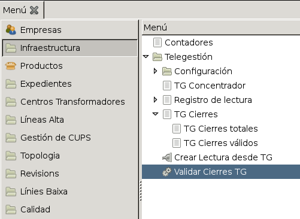

   Ubicació del wizard de validació de lectures

Podem validar les lectures amb aquest botó. Si no entrem cap número de
comptador, es validaran **totes** les lectures pendents de validar.

* **Comptador**: Nº de sèrie del comptador del qual en volem validar les
  lectures

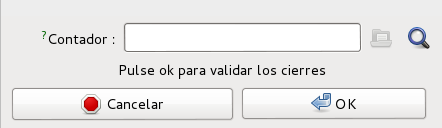

   Formulari de validar tots els tancaments d'un comptador

## Importar lectures des del Lot de Facturació

En comptes d'haver d'anar comptador per comptador per carregar les lectures,
podem fer una càrrega massiva de tots els comptadors d'un lot de facturació.
Per això hem d'anar al lot mentre està en estat **esborrany** i prèmer el botó
**Crear lectures TG**. En aquest cas no ens demana la data de la lectura, ja
que agafarà la data de l'**últim dia del període del lot** de facturació.

Es crearà un procés en background que anirà carregant les lectures dels
comptadors que siguin de telegestió.

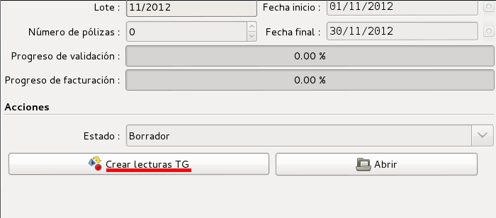

   Botó per importar les lectures des del lot de facturació

!!! note
    Quan s'importen les lectures d'un comptador de telegestió, s'agafa la
    lectura validada del dia que es demana o la de l'anterior més proper que en
    tingui. Per tant es pot donar el cas que les lectures no siguin del dia de
    final de lot. En aquesta cas, es facturarà la energia fins aquest dia i la
    resta, p.e la potència, pel període complet.

## Telegestió i CRM

Tots els errors i validacions manuals que s'hagin de fer estan integrades en el
**CRM** de forma que es pugui fer un seguiment de les passes que s'han anat
fent. D'aquesta forma evitem generar ordres de treball paral·leles en el cas
d'haver de, per exemple, arribar a realitzar un canvi de comptador per part del
departament tècnic.

El cas s'assigna automàticament a l'usuari que ha realitzat la acció que ha
provocat el cas.

Per accedir als casos que s'han generat deguts a telegestió podem accedir al
menú del CRM com qualsevol altre cas i seleccionar la secció **Telegestió (TG)**
: **CRM & SRM > All Cases > Casos per secció**

També hi podem accedir des del menú de telegestió, on a l'apartat
corresponent ja tenim els casos filtrats per la secció de telegestió:
**Infraestructura > Telegestió > Casos Telegestió**

Els casos de telegestió tenen tots dues referències per donar un accés ràpid a
les dades. Aquestes referències les trobem a solapa **Informació extra**

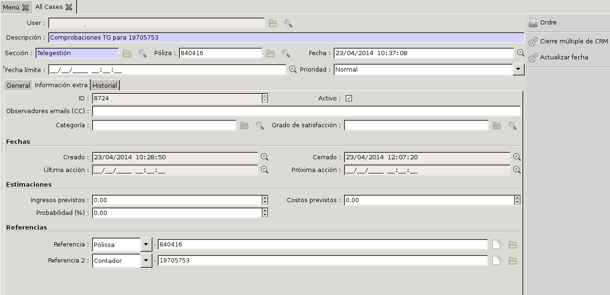

La primera referència es per accedir a la pòlissa i la referència 2 per accedir
al contador associat al cas. Si cliquem sobre la carpeta ens obrirà la
referència pertinent.

Per posar un exemple d'ús de les referències, el següent punt explica [com anar
a les lectures d'un comptador des d'un cas](telegestion.md#lectures-dun-comptador-des-dun-cas)

### Lectures d'un comptador des d'un cas

Per anar a les lectures d'un contador a partir d'un cas en concret, primer hem
d'escollir el cas , obrir-lo i anar a la pestanya de **Informació extra**.
Després cliquem sobre la carpeta de la referència 2.

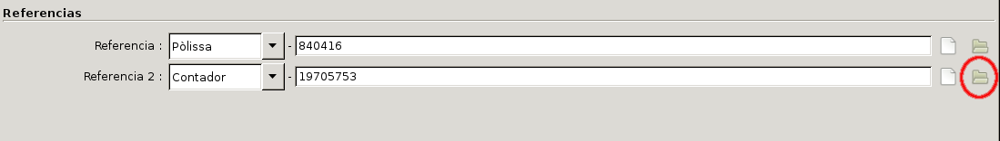

Ens apareix una nova finestra amb les dades del comptador.

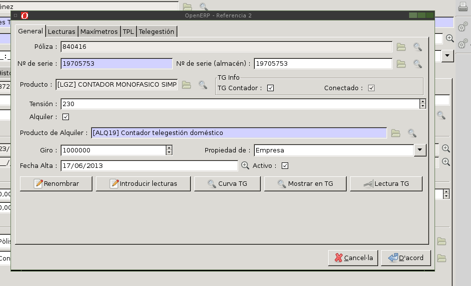

Ara cliquem sobre **Mostrar en TG**

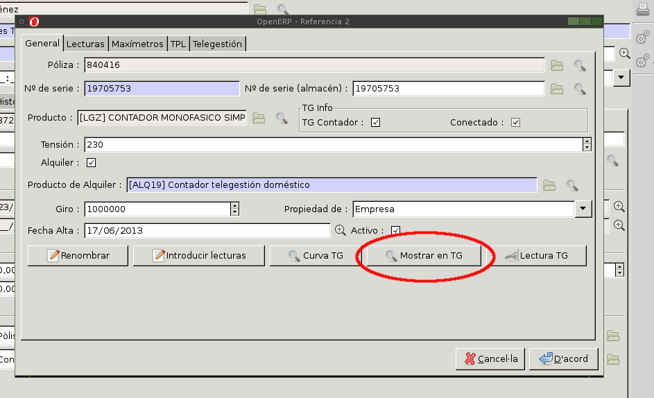

Preguntarà de quin comptador volem visualitzar les lectures.

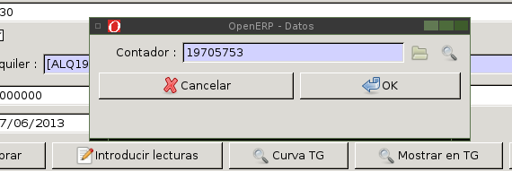

Ens obrirà una nova pestanya al ERP amb les lectures de fons i ja podem
tancar la finestra actual del contador.

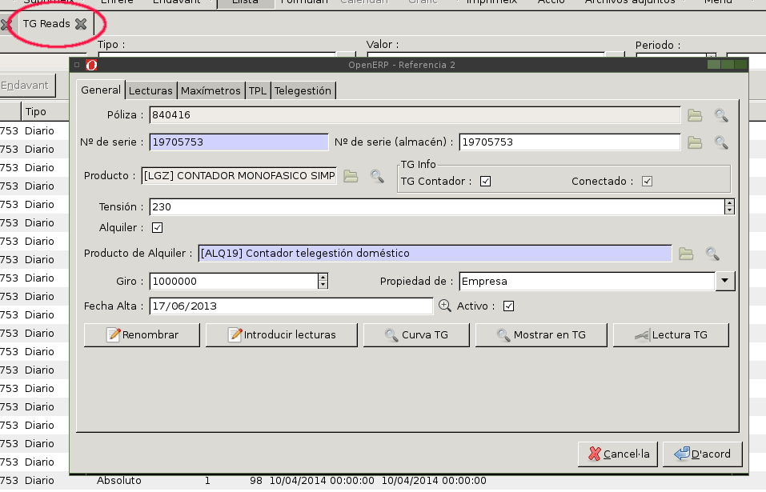

## Automatització de tasques

S'han creat dues tasques planificades (**Administració > Configuració
>Planificació > Accions planificades**) per ajudar a la telegestió.
### TG Reader scheduler

Aquesta planificació importa cada dia les lectures de l'FTP.

### TG Validate scheduler

Permet programar la validació automàtica de totes les lectures.

## Corbes de Carrega Horaries (CCH)

Les corbes de càrrega horàries cal entregar-les a l'operador del sistema i a la
comercialitzadora o client directe a mercat.

### Fitxers P5D

Les corbes de càrrega horàries validades (CCH_VAL) cal entregar-les com a
màxim **setmanalment** amb els fitxers P5D.

#### Generació dels fitxers P5D de forma manual

L'assistent per generar els fitxers P5D de forma manual es troba al menú
`Infraestructura/Telegestión/Exportar CCH_VAL (P5D)`

### Fitxers F5D

Les corbes de càrrega horàries facturades (CCH_FACT) cal entregar-les com a
màxim el dia **7 del mes següent** amb els fitxers F5D.

!!! note
    Es poden configurar servidors SFTP per tal de pujar-hi automàticament els fitxers
    F5D i P5D.
