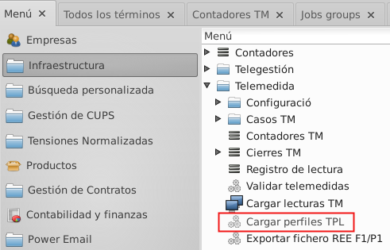
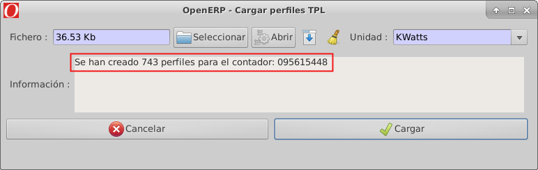
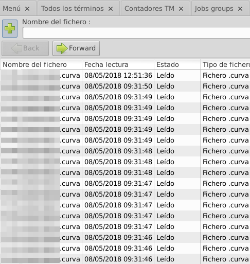
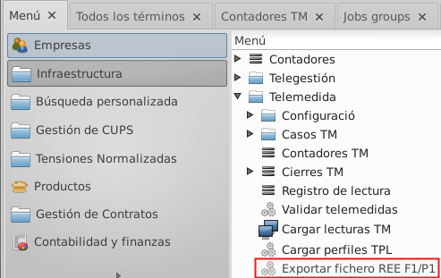
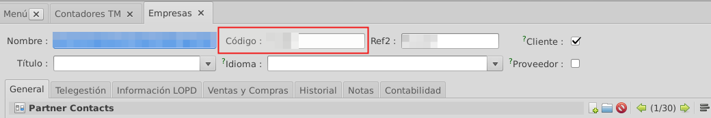

# Documentació del mòdul de telemesura

## Comptadors de telemesura i electrònics
Aquest mòdul gestiona dos tipus de comptadors diferents, els comptadors
electrònics i els electrònics tele-mesurats. En el cas dels comptadors
electrònics el mòdul s'utilitzarà per importar les corbes obtingudes a
través dels dispositius TPL.
Per els comptadors tele-mesurats, permet fer la importació dels
tancaments i corbes dels comptadors a través de la connexió que es
configuri a l'ERP.

Amb els tancaments importats, podrem portar a terme la seva validació
i crear les lectures corresponents.
Els perfils que s'importin també podran ser validats i a més a més es
podrà fer l'ajustament i estimació de la corba de consum del comptador
a l'hora d'obrir la factura. Sempre i quan la tarifa sigui estimable.
El mòdul també ens permetrà crear els fitxers F1 i P1 amb els perfils.

## Configuració dels Comptadors
Per tal de poder utilitzar aquest mòdul correctament s'hauran de configurar
els comptadors que l'hagin de fer servir.

### Configuració de la tecnologia
Primer de tot s'haurà de configurar el comptador per tal que l'ERP el reconegui
com a electrònic o electrònic tele-mesurat. Per fer-ho hem de modificar el camp
**Tecnologia** de la fitxa del comptador i assignar-l'hi el valor **Electrònic**
o **Telemesura**.

### Configuració del comptador electrònic
Per tal de configurar el comptador purament electrònic ens hem de dirigir a la
pestanya de la fitxa del comptador **Electrònic**.

1.  **Dates de validació**: La data **Última tancament validat** ens indica de
    quin dia són els últims tancaments que s'han validat d'aquest comptador.
    La data **Últim perfil validat** indica de quin dia és l'última corba que
    s'ha validat per aquest comptador.

2.  **Dates de importació**: La data **Última tancament carregat** ens indica de
    quin dia són els últims tancaments que s'han importat d'aquest comptador.
    La data **Últim perfil carregat** indica de quin dia i hora és l'última corba
    que s'ha carregat per aquest comptador.

3.  **Contracte per importar**: Aquest seleccionable ens permet decidir quin dels tres
    contractes disponibles en un comptador 1, 2 o 3 volem utilitzar per crear les lectures.

    - _Contracte 1:_ Al perfilar corbes horàries de comptadors amb aquest contracte
    s'utilitzarà una tarifa amb discriminació de dies festius.

    - _Contracte 2:_ Al perfilar corbes horàries de comptadors amb aquest contracte
    s'utilitzarà una tarifa sense discriminació de dies festius.

### Configuració del comptador tele-mesurat
Per tal de configurar el comptador tele-mesurat ens hem de dirigir a la
pestanya de la fitxa del comptador **Electrònic**.
En aquesta pestanya trobem diferents camps configurables i informatius.

1.  **Dates de validació**: La data **Última tancament validat** ens indica de
    quin dia són els últims tancaments que s'han validat d'aquest comptador.
    La data **Últim perfil validat** indica de quin dia és l'última corba que
    s'ha validat per aquest comptador.

2.  **Dates de importació**: La data **Última tancament carregat** ens indica de
    quin dia són els últims tancaments que s'han importat d'aquest comptador.
    La data **Últim perfil carregat** indica de quin dia i hora és l'última corba
    que s'ha carregat per aquest comptador.

3.  **Contracte per importar**: Aquest seleccionable ens permet decidir quin dels tres
    contractes disponibles en un comptador volem utilitzar per crear les lectures.

    - _Contracte 1:_ Al perfilar corbes horàries de comptadors amb aquest contracte
    s'utilitzarà una tarifa amb discriminació de dies festius.

    - _Contracte 2:_ Al perfilar corbes horàries de comptadors amb aquest contracte
    s'utilitzarà una tarifa sense discriminació de dies festius.

4.  **Protocol de connexió**: Tenim tres camps als quals hem d'assignar el valor correcte
    per establir la connexió amb el comptador.

5.  **Paràmetres de connexió**: Caldrà configurar e dos paràmetres. El número de port del
    comptador al camp **Port** i seguidament un camp d'adreça que dependrà del tipus de
    connexió del comptador. Si el comptador és amb mòdem haurem d'introduir el número de
    telèfon del comptador, altrament caldrà entrar l'adreça IP.

6.  **Contractes per demanar**: Aquí podem seleccionar quins dels tres contractes existents
    a la configuració d'un comptador volem que es demanin a l'hora de carregar tancaments.
    El programa demanarà tots els que tinguem seleccionats i si algun d'ells no està configurat
    simplement no crearà els tancaments d'aquest.

7. **Accions de càrrega**: Aquests dos botons són els assistents per importar els tancaments
    i els perfils del comptador.

## Càrrega de corbes de telemesura mitjançant fitxers
Per tal de carregar els perfils horaris de telemesura s'utilitza l'assistent següent:
**Infraestructura > Telemesura > Càrrega perfils TPL**

Aquest assistent suporta dos tipus de fitxers diferents:

* Format **.curva** que s'extreu dels comptadors mitjançant els dispositius TPL.

* Format [P1D](_/static/telemedida/P1D.pdf) definit per la REE.

A més a més es poden introduir un o altre d'aquests dos formats de fitxers massivament
comprimits en un fitxer ".zip".

Dins l'assistent ens caldrà seleccionar el fitxer que volem carregar **1** i el tipus de
fitxer del que es tracta **2**. Per últim haurem d'indicar la unitat d'energia que
s'utilitza en el fitxer introduït **3**.

Si hem introduït un sol fitxer i no un ".zip", un cop hagi acabat el procés veurem el mateix
missatge que es mostra a la següent imatge. A la finestra de l'assistent indica la quantitat
de perfils que s'han creat.

Si el fitxer que hem introduït per importar és un ".zip" la tasca d'importació es portarà a
terme en segon pla.

Una vegada importats els fitxers, es crearà un registre de lectura per cada fitxer llegit, tan
si l'hem introduït sol o comprimit en un ".zip". Per analitzar si tots els fitxers s'han llegit
correctament o hi ha hagut algun error podem consultar el llistat de registres **Infraestructura >
Telemesura > Registre de lectura**. Cada registre ens informarà del nom del fitxer al que fa
referència, la data de lectura, l'estat de la lectura, bàsicament si s'ha llegit correctament
o si hi ha hagut error i el tipus de fitxer que és.

Si els fitxer s'han llegit correctament, ens podem dirigir a la fitxa del comptador per
visualitzar-los i revisar que tot sigui correcte. Podem trobar el comptador a **Infraestructura >
Telemesura > Contadors TM** on se'ns mostren únicament els comptadors que tinguem configurats
com electrònics o telemesurats. Dins la fitxa del comptador, amb el botó **Mostrar tancaments
TM** accedirem a la llista de perfils del comptador on hauríem de poder veure tots els que hem
importat en estat **No vàlid**.

## Validació de perfils de telemesura
El procés de validació dels perfils s'inicia mitjançant un assistent que podem trobar o bé dins
la mateixa fitxa del comptador del qual ens interessa validar-ne els perfils o al menú general de
telemesura.

En el primer dels casos, utilitzant l'assistent des del comptador, únicament es validaran els
perfils del comptador en qüestió.

En el segon cas, executant l'assistent des del menú, podem utilitzar-lo per validar els perfils
d'un comptador concret seleccionant aquest o executar la validació sense cap comptador, la qual
cosa iniciarà una validació per tots els comptadors de telemesura.

### Validacions realitzades sobre els Perfils
Documentació de quines comprovacions es passen per els diferents perfils per tal de
decidir si són o no vàlids.

1. **Neteja de duplicats**: El primer pas de la validació busca tots els perfils que
tinguin duplicats i els elimina deixant només un dels registres.

2. **Diferents mesures**: Es comprova que no existeixin registres per la mateixa hora
i que tinguin valors de mesura diferents.

3. **Mesures impossibles**: Comprova que un perfil no tingui un valor de mesura massa
   elevat i que es consideri fora dels límits.

    !!! Info "Variable"
        Existeix una variable de configuració anomenada **tm_profile_impossible** que
        ens permetrà configurar quest límit.

4. **Mesures negatives**: Assegura que no hi hagi cap perfil que contingui una valor de
mesura negatiu.

5. **Bits de control**: Comprova que els registres no tinguin un valor al camp de bits
de control que indiqui algun tipus d'error.

6. **Reactiva alta**: Comprova que no hi hagi cap perfil que tingui una reactiva al
quadrant 1 amb un valor superior a l'activa entrant.

    !!! Info "Variable"
        Existeix una variable de configuració anomenada **tm_reactive_check** que ens
        permetrà activar i desactivar aquesta validació.

7. **Superior a la potència**: Comprova que cap perfil tingui un valor d'activa
entrant superior al màxim permès segons la potència contractada al període en que es
troba el perfil. Aquesta validació té un paràmetre de tolerància que serveix per
configurar fins a quin percentatge de la potència màxima es considera vàlid el consum
del perfil.

    !!! Info "Variable"
        Existeix una variable de configuració anomenada **tm_profile_power_tolerance** que
        ens permetrà configurar aquesta tolerància . Al mateix temps, si el valor d'aquesta
        variable es configura a 0, la validació es desactiva.

    !!! Note "Exemple"
        Si tenim una tolerància del 120%, es permetran com a vàlides mesures d'activa
        entrant un 20% superiors a la potència total.

### Resultat de les Validacions
Amb les validacions finalitzades, els perfils processats correctament estaran en estat
vàlid i els que presentin algun problema seguiran en estat no vàlid. La millor manera
de comprovar si s'han validat tots correctament o hi ha hagut algun problema és revisar
si s'han creat nous casos de Telemesures que indiquin validacions incorrectes. Per fer-ho
ens dirigim al menú **Infraestructura > Telemesura > Casos TM > Casos oberts** on podrem
veure si hi ha casos recents que facin referència a la validació de perfils.

## Generació de fitxers de perfils F1
Els fitxers F1 de perfils són diaris per tant cada un conté les 24 corbes horàries
que corresponen. La generació d'aquests fitxers la porta a terme l'assistent
**Infraestructura > Exportar REE F1**.

L'assistent necessita que li indiquem per quin comptador i quin període volem
generar els F1s. Per posar un nom correcte als fitxer generats, és necessari indicar
el codi R1 de la nostra distribuïdora.

També disposem del camp **Versió** el qual ens servirà per enumerar els fitxers
generats, és a dir, si generem més d'un F1 per el mateix comptador i dates, la
versió ens servirà per diferenciar-los i saber quin és el més nou.

Respecte els camps de dates inici i final s'ha de tenir en compte que la data inici
és inclosa dins el període del F1 i la data final no.

!!! Note "Exemple F1 mensual"
    Per crear el fitxer F1 del mes de Març sencer hem de posar com a data inicial
    el 01/03/2018 i com a data final el 01/04/2018.
    

!!! Note "Exemple F1 diari"
    Per generar el fitxer F1 del primer dia de Març hem d'introduir com a data
    inicial el 01/03/2018 i com a data final el 02/03/2018.

!!! Tip "Codi R1"
    Si tenim el codi ben configurat al ERP l'assistent l'agafarà automàticament.
    El codi es troba a la fitxa de la nostra empresa distribuïdora.

    
