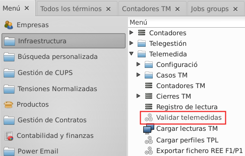
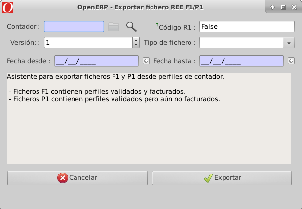

# Documentació del mòdul de telemesura

## Comptadors de telemesura i electrònics
Aquest mòdul gestiona dos tipus de comptadors diferents, els comptadors
electrònics i els electrònics tele-mesurats. En el cas dels comptadors
electrònics el mòdul s'utilitzarà per crear les lectures des dels tancaments
que s'hagin introduït a l'ERP. Per els comptadors tele-mesurats en canvi,
el mòdul disposa de més funcionalitats. Pot fer la importació dels tancaments
i corbes dels comptadors a través de la connexió que es configuri a l'ERP,
un cop importades aquestes dades, es podran validar i crear les lectures
corresponents i per últim, es podrà fer l'ajustament i estimació de la corba
de consum del comptador a l'hora d'obrir la factura sempre i quan la tarifa
sigui estimable.

## Configuració dels Comptadors
Per tal de poder utilitzar aquest mòdul correctament s'hauran de configurar
els comptadors que l'hagin de fer servir.

### Configuració de la tecnologia
Primer de tot s'haurà de configurar el comptador per tal que l'ERP el reconegui
com a electrònic o electrònic tele-mesurat. Per fer-ho hem de modificar el camp
**Tecnologia** de la fitxa del comptador i assignar-l'hi el valor **Electrònic**
o **Telemesura**.

### Configuració del comptador electrònic
Per tal de configurar el comptador purament electrònic ens hem de dirigir a la
pestanya de la fitxa del comptador **Electrònic**.

1.  **Dates de validació**: La data **última lectura** ens indica de quin dia són els
    últims tancaments que s'han validat d'aquest comptador. La data **últim perfil**
    indica de quin dia és l'última corba que s'ha validat per aquest comptador.

2.  **Contracte per importar**: Aquest seleccionable ens permet decidir quin dels tres
    contractes disponibles en un comptador volem utilitzar per crear les lectures.

### Configuració del comptador tele-mesurat
Per tal de configurar el comptador tele-mesurat ens hem de dirigir a la
pestanya de la fitxa del comptador **Electrònic**.
En aquesta pestanya trobem diferents camps configurables i informatius.

1.  **Dates de validació**: La data **última lectura** ens indica de quin dia són els
    últims tancaments que s'han validat d'aquest comptador. La data **últim perfil**
    indica de quin dia és l'última corba que s'ha validat per aquest comptador.

2.  **Contracte per importar**: Aquest seleccionable ens permet decidir quin dels tres
    contractes disponibles en un comptador volem utilitzar per crear les lectures.

3.  **Protocol de connexió**: Tenim tres camps als quals hem d'assignar el valor correcte
    per establir la connexió amb el comptador.

4.  **Paràmetres de connexió**: Caldrà configurar e dos paràmetres. El número de port del
    comptador al camp **Port** i seguidament un camp d'adreça que dependrà del tipus de
    connexió del comptador. Si el comptador és amb mòdem haurem d'introduir el número de
    telèfon del comptador, altrament caldrà entrar l'adreça IP.

5.  **Contractes per demanar**: Aquí podem seleccionar quins dels tres contractes existents
    a la configuració d'un comptador volem que es demanin a l'hora de carregar tancaments.
    El programa demanarà tots els que tinguem seleccionats i si algun d'ells no està configurat
    simplement no crearà els tancaments d'aquest.

## Càrrega de fitxers .curva de TPL
Per tal de carregar els perfils horaris que s'extreuen dels comptadors mitjançant els
dispositius TPL, s'utilitza l'assistent següent:
**Infraestructura > Telemesura > Carrega perfils TPL**

Seleccionant el fitxer **.curva** dins l'assistent i indicant la unitat d'energia que s'utilitza
en el fitxer especificat ja està llest per polsar el botó **Carregar**.
El primer pas que executa el procés de càrrega és el de comprovar si el comptador referenciat
dins el fitxer té o no perfils existents per el període entre les dates d'inici i final del
fitxer. Si es troben perfils els eliminarà. El següent pas és crear tets els perfils nous.

Un cop hagi acabat el procés veurem el següent missatge a la finestra de l'assistent indicant
la quantitat de perfils que s'han creat.

Una vegada importats, ens podem dirigir a la fitxa del comptador per visualitzar-los i revisar
que tot sigui correcte. Podem buscar-lo a **Infraestructura > Telemesura > Contadors TM**
on se'ns mostren únicament els comptadors que tinguin configurada la tecnologia **Telemesura**
o **Electronic**. Dins la fitxa del comptador, amb el botó **Mostrar tancaments TM** accedirem
a la llista de perfils del comptador on hauríem de poder veure tots els que hem importat en estat
**No vàlid**.

## Validació de perfils de telemesura
El procés de validació dels perfils s'inicia mitjançant un assistent que podem trobar o bé dins
la mateixa fitxa del comptador del qual ens interessa validar-ne els perfils o al menú general de
telemesura.

En el primer dels casos, utilitzant l'assistent des del comptador, únicament es validaran els
perfils del comptador en qüestió.

En el segon cas, executant l'assistent des del menú, podem utilitzar-lo per validar els perfils
d'un comptador concret seleccionant aquest o executar la validació sense cap comptador, la qual cosa
iniciarà una validació per tots els comptadors de telemesura.

### Validacions realitzades sobre els Perfils
Documentació de quines comprovacions es passen per els diferents perfiles per tal de
decidir si són o no vàlids.

1.  **Neteja de duplicats**: El primer pas de la validació busca tots els perfils que
tinguin duplicats i els elimina deixant només un dels registres.

2.  **Diferents mesures**: Es comprova que no existeixin registres per la mateixa hora
i que tinguin valors de mesura diferents.

3.  **Mesures impossibles**: Comprova que un perfil no tingui un valor de mesura massa
elevat i que es consideri fora dels límits. Aquests límit es pot configurar a la variable
**tm_profile_impossible**.

4.  **Mesures negatives**: Assegura que no hi hagi cap perfil que contingui una valor de
mesura negatiu.

5.  **Bits de control**: Comprova que els registres no tinguin un valor al camp de bits
de control que indiqui error.

6.  **Reactiva alta**: Comprova que no hi hagi cap perfil que tingui una reactiva al
quadrant 1 amb un valor superior a l'activa entrant. Aquesta validació es pot activar
i desactivar amb la variable de configuració **tm_reactive_check**.

7.  **Superior a la potència**: Comprova que cap perfil tingui un valor d'activa
entrant superior al màxim permès segons la potència contractada al període en que es
troba el perfil. Aquesta validació té un paràmetre de tolerància que serveix per
configurar fins a quin percentatge de la potència màxima es considera vàlid el consum
del perfil. Per exemple si tenim una tolerància del 120%, es permetran com a vàlids
mesures d'activa entrant un 20% superiors a la potència total. Per configurar aquesta
tolerància s'utilitza la variable de configuració **tm_profile_power_tolerance**. Al mateix
temps, si el valor d'aquesta variable es configura a 0, la validació es desactiva.

### Resultat de les Validacions
Amb les validacions finalitzades, els perfils processats correctament estaran en estat
vàlid i els que presentin algun problema seguiran en estat no vàlid. La millor manera
de comprovar si s'han validat tots correctament o hi ha hagut algun problema és revisar
si s'han creat nous casos de Telemesures que indiquin validacions incorrectes. Per fer-ho
ens dirigim al menú **Infraestructura > Telemesura > Casos TM > Casos oberts** on podrem
veure si hi ha casos recents que facin referència a la validació de perfils.

## Generació de fitxers de perfils F1
Els fitxers F1 de perfils són diaris per tant cada un conté les 24 corbes horàries
que corresponen. La generació d'aquests fitxers la porta a terme l'assistent **Infraestructura
> Exportar REE F1**.

L'assistent necessita que li indiquem per quin comptador i quin període volem
generar els F1s. Per posar un nom correcte als fitxer generats, és necessari indicar
el codi R1 de la nostra distribuïdora. Si el tenim ben configurat al ERP l'assistent
l'agafarà automàticament. També disposem del camp **Versió** el qual ens servirà per
enumerar els fitxers generats, és a dir, si generem més d'un F1 per el mateix comptador
i dates, la versió ens servirà per diferenciar-los i saber quin és el més nou.
Per crear els fitxers F1 de tot un mes sencer, podem posar com a data inicial el primer
dia del mes i com a final el primer dia del mes següent. A la imatge podem veure les
dates necessàries per crear tots els F1 del mes de Març.

