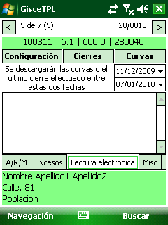
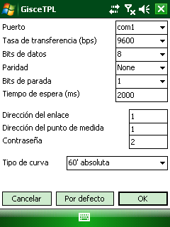
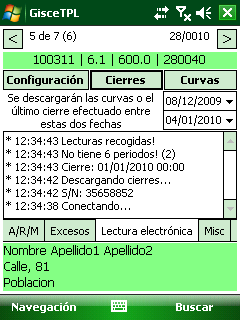
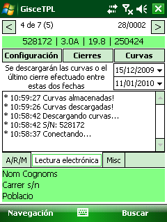

# Descàrrega electrònica de Tancaments i Curves

La pestanya "_**Lectura electrónica**_" es mostra per a les tarifes _3.0A,
3.1A i 6.1_, i permet recollir electrònicament les lectures dels tancaments i/o
les corbes en els comptadors que compleien l'estàndard **IEC870REE**. Els
comptadors que implementen aquest estàndard disposen d'una interfície _RS232_
("_sèrie_"), generalment a través d'un _port òptic_ i en alguns casos un connector
_DB9_.

El terminal de lectura ha de disposar d'un port _sèrie_, i necessitem un cable
_null modem_ per connectar-lo al _DB9_ del comptador, o una _sonda òptica_ per
connectar-lo al _port òptic_.

## Descàrrega automàtica pel Port Òptic

**Lectura electrònica**

Quan la persona que realitza les lectures arriba a un punt de mesura en el que
ha de realitzar la lectura dels tancaments de forma automàtica i/o decarregar
les corbes de càrrega es situarpa en la pestanya "_Lectura Electrónica_".

Una vegada situat en la pestanya apareixen diverses opcions: _Configuración,
Cierres i Curvas_.

En aquesta pantalla s'hi especifiquen dos dates, que s'utilitzen de la següent
manera:

- Polsant el botó "_Cierres_" es descarreguen les lectures del últim tancament
  registrat entre les dos dates.
- Mitjançant el botó "_Curvas_" es descarreguen tots els valors registrats de
  les corbes entre les dos dates.

### Configuració de la descàrrega

La Configuració requereix que les dos parts (el _Comptador_ i el _terminal_)
estiguin d'acord amb una sèrie de paràmetres (_configuració_) que consta de:

1. El protocol **RS232**, amb els seus propis paràmetres:
    - Tasa de transferència (_baud rate_)
    - Bits de dades (_data bits_)
    - Paritat (_parity_)
    - Bits de parada (_stop bits_)
    - Temps d'espera (_timeout_)
2. El protocol **IEC870REE**, amb tres paràmetres específics:
    - Direcció del enllaç
    - Direcció del punt de mesura
    - Contrasenya
3. Especificar el **tipus de corba** que es vol descarregar.    
  Hi ha quatre tipus disponibles, que són:

    1. Dades agregades cada 60 minuts, amb valors absoluts
    2. Dades agregades cada 60 minuts, amb valors incrementals.
    3. Dades agregades cada 15 minuts, amb valors absoluts.
    4. Dades agregades cada 15 minuts, amb valors incrementals.

### Descàrrega de Tancaments

Si els paràmetres de configuració de la comunicació són correctes, polsant el
botó "_Cierres_", es descarreguen les _lectures_ del últim tancament registrat
entre les dos dates que s'indiquen a la pantalla.

Una vegada descarregats els tancaments i les corbes del equip actiu, s'efectua
una verificació de les dades dels tancaments. Si són correctes en la pestanya
_A/R/M_, podrem premer el botó "_ENTER_" i es passarà al següent comptador de
la ruta.

Si per algun motiu no es poden descarregar els tancaments, sempre es poden
entrar manualment els valors registrats en l'equip de mesura des de la pestanya
_A/R/M_.
En la part inferior de la pantalla de presa de mesures d'Activa i Reactiva,
apareix el valor de la suma de tots els períodes perquè es contrasti amb el
valor del totalitzador del equip de mesura. (Veure apartat
[5.5.2](proceso_de_trabajo.md#tarifes-de-3-i-6-periodes))

### Descàrrega de Corbes

Si els paràmetres de configuració de la comunicació són correctes, polsant el
botó "_Curvas_", es descarrega la corba de càrrega entre les dos dates, que
s'indiquen en la pantalla.

Per seleccionar el tipus de corba que es desitja decarregar en l'apartat
"_Configuración_" es pot sel·leccionar la corba a descarregar:

1. Dades agregades cada 60 minuts, amb valors absoluts
2. Dades agregades cada 60 minuts, amb valors incrementals.
3. Dades agregades cada 15 minuts, amb valors absoluts.
4. Dades agregades cada 15 minuts, amb valors incrementals.
