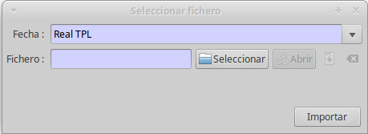

## Fitxers d'intercanvi entre GISCE-TPL i GISCE-ERP

Per als usuaris de GISCE-ERP, mòdul de facturació d'accessos, la generació del
fitxer de ruta i la importació del fitxer de lectures es inmediata i es realitza
a partir de les opcions de menú del apartat TPL.

### Exportació del fitxer de Rutes

Per generar el fitxer de rutes s'utilitzarà la opció _TPL/ Exportació fitxer de
rutes_.

**Zona:**    
En el desplegable de zona es sel·leccionarà la zona per la que es desitja generar
el fitxer de ruta.

**Dia de lectura:**    
Aquesta data s'utilitza per que, en el cas que hi hagues més d'un comptador
vigent per la facturació, s'esculli el que està vigent per aquesta data.

Aquesta data es posarà com a data per defecte de la realització de la lectura.

Polsant el botó "_Generar_" es pot guardar el fitxer de ruta en el directori
que es desitgi.

En aquest quadre s'indica el nombre que ha de tenir el fitxer (p.e. _1.ruta_),
polsant el botó "_Anomena i desa_" permet guardar-lo en el directori que es
desitgi, per posteriorment copiar-lo en el TPL.

Si es desitja exportar diverses zones, una vegada guardada la que acaba de
generar, es pot polsar el botó "_Otra zona_" i sel·leccionar en el desplegable
de zona.

### Importació del fitxer de Lectures

Per importar un fitxer de lectures es procedirà sel·leccionant en el menú
_TPL/ Importació de lectures_

Apareix el quadre de diàleg per sel·leccionar el fitxer a importar.

Es podrà escollir el fitxer _.lectura_ a importar i la data que s'utilitzarà al
crear les lectures

* **Fitxer**: Polsant sobre el botó "_Seleccionar_" es pot navegar per
  localitzar el fitxer de lectures que prèviament s'haurà copiat del TPL.
* **Data**: La data amb la qual es crearà la lectura des del fitxer TPL. Es
  pot triar la data real de la lectura (**Real TPL**) o el dia de lectura que
  es va omplir al generar el fitxer de _.ruta_ (**Planificada (fitxer ruta)**).

!!! tip

    * Es genera un fitxer _.ruta_ amb _dia de lectura_ 31/03/2017
    * Es llegeix el comptador el dia 16/04/2017 a les 13:46

    Durant la càrrega, en funció de la _Data_ seleccionada:

    * **Real TPL**: La lectura es crearà amb data 16/04/2017
    * **Planificada (fitxer ruta)**: La lectura es crearà amb data 31//03/2017

#### Selecció de orígen "Sense lectura"

Per defecte, totes les lectures carregades des de TPL tindran com a origen
**TPL**. En els casos en els quals no es pot obtenir la lectura per alguna
raó, com la impossibilitat d'accés al comptador, es pot carregar la lectura amb
orígen **Sense Lectura**. Quan es desitgi aquesta funcionalitat (i si GISCE-ERP
està correctament configurat) caldrà escollir una incidència adequada en la
lectura i copiar la lectura anterior en el TPL.

La configuració d'aquesta funcionalitat ens permet escollir com comença el codi
d'incidència que selecciona l'orígen **Sense Lectura**. Alguns exemples:

* Codis que comencen per _I_. En aquest cas les incidències _I910_ ,_I912_, ...
* Codi _I910_. En aquest cas només la incidència _I910_.

!!! tip
    La configuració de la selecció de origen sense lectura es realitza
    mitjançant la variable de configuració `pda_no_lect_origin_incidence_prefix`

    * **''**: (Buit) Sempre amb orígen **TPL**
    * **I**: Només les incidències on el codi comença per *I*

Una vegada importats tots els fitxers les lectures dels comptadors quedaran
actualitzats en GISCE-ERP i ja es pot donar començar al procés de facturació.
