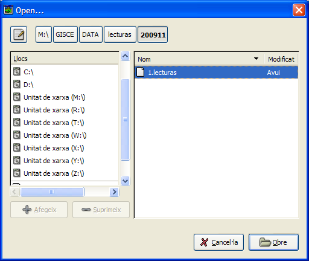

## Fitxers d'intercanvi entre GISCE-TPL i GISCE-ERP

Per als usuaris de GISCE-ERP, mòdul de facturació d'accessos, la generació del
fitxer de ruta i la importació del fitxer de lectures es inmediata i es realitza
a partir de les opcions de menú del apartat TPL.

### Exportació del fitxer de Rutes

Per generar el fitxer de rutes s'utilitzarà la opció _TPL/ Exportació fitxer de
rutes_.

**Zona:**    
En el desplegable de zona es sel·leccionarà la zona per la que es desitja generar
el fitxer de ruta.

**Dia de lectura:**    
Aquesta data s'utilitza per que, en el cas que hi hagues més d'un comptador
vigent per la facturació, s'esculli el que està vigent per aquesta data.

Aquesta data es posarà com a data per defecte de la realització de la lectura.

Polsant el botó "_Generar_" es pot guardar el fitxer de ruta en el directori
que es desitgi.

En aquest quadre s'indica el nombre que ha de tenir el fitxer (p.e. _1.ruta_),
polsant el botó "_Anomena i desa_" permet guardar-lo en el directori que es
desitgi, per posteriorment copiar-lo en el TPL.

Si es desitja exportar diverses zones, una vegada guardada la que acaba de
generar, es pot polsar el botó "_Otra zona_" i sel·leccionar en el desplegable
de zona.

### Exportació del fitxer de Lectures

Per importar un fitxer de lectures es procedirà sel·leccionant en el menú
_TPL/ Importació de lectures_

Apareix el quadre de diàleg per sel·leccionar el fitxer a importar.

Polsant sobre el botó "_Obre_" es pot navegar per localitzar el fitxer de
lectures que prèviament s'haurà copiat del TPL.

Una vegada importats tots els fitxers les lectures dels comptadors quedaran
actualitzats en GISCE-ERP i ja es pot donar començ al procés de facturació.
