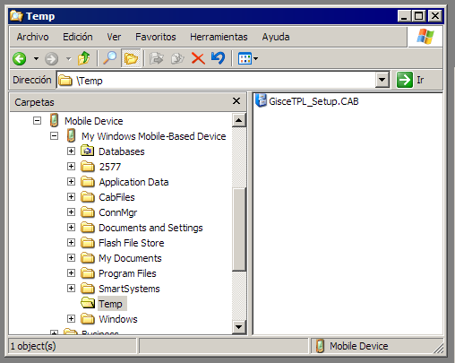
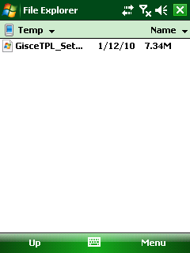
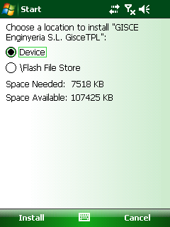
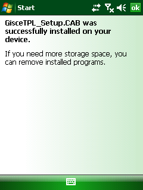
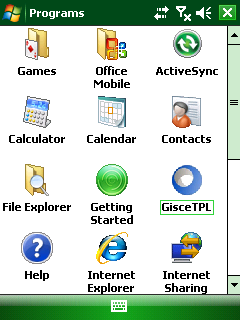

# Requeriments del sistema

GISCE-TPL funciona en qualsevol _PDA_ amb _Pocket PC 2003_
o superior (_incloent Windows Mobile_).

La instal·lació i càrrega de rutes i descàrrega de lectures pot realitzar-se
connectant la _PDA_ amb _l'ordinador personal_, normalment per _USB_,
o amb una tarjeta extraible de memòria.

Per recollir _lectures electròniques_ el terminal ha de tenir accés als
**accessoris necessaris per conectar-lo al comptador**:

- **Adaptador a port sèrie**, per connectar amb un cable sèrie, amb DB9 en els
  dos extrems, o amb DB9 en el costat del TPL i capsal òptic en el
  costat del comptador.
- **Adaptador a port USB**, per a connectar una sonda òptica USB

# Instal·lació

S'ha de copiar l'arxiu **GisceTPL_Setup.CAB** en alguna carpeta del TPL
(veure per exemple la següent figura, en \Temp).

**GisceTPL_Setup.CAB:**    
Localitzar i "executar" des del TPL el fitxer que s'acaba de copiar;
començarà la instal·lació.

**Instal·lació:**    
S'ha d'indicar que es desitja instal·lar el programa en la memòria principal
del dispositiu, i no en tarjetes extraibles

**Instal·lació:**
Quan la instal·lació finalitzi, el TPL ens informarà de que s'ha
realitzat correctament.

**Inici de la aplicació GISCE-TPL:**    
En l'apartat **Inici / Programes** aparaixerà l'icona de GISCE-TPL.
Per poder iniciar el programa cal tocar executar-lo.

