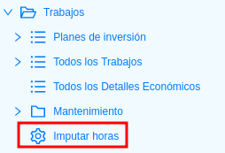
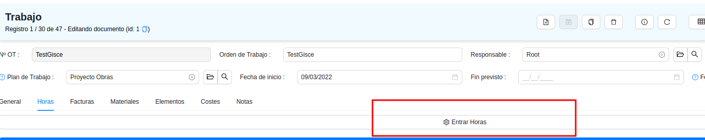
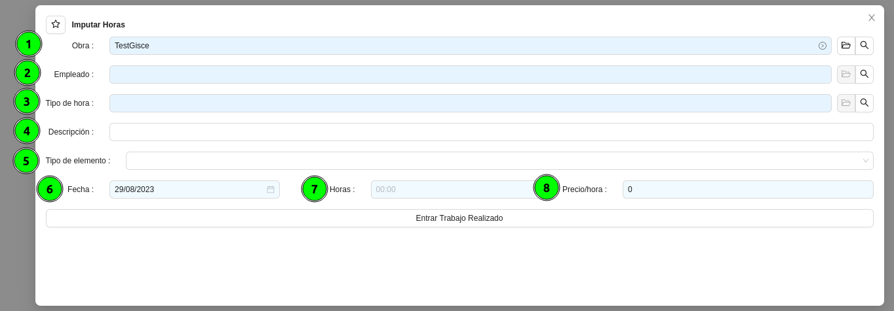

# Introducció
Per imputar hores a un treball comptem amb un assistent que es pot accedir des de
dos llocs.

* Des del menú principal del mòdul de Treballs:

* Des d'un botó dins una obra concreta:

## Requisits per poder entrar hores
Per poder imputar hores a una obra es necessita el següent:

* [Tenir una obra creada](crear_obra.md)
* [Tenir un treballador a qui es vulgui entrar hores](crear_trabajador.md)
* [Tenir un tipus d'hora per assignar al treballador](crear_tipo_hora.md)
* Que l'estat de l'obra sigui oberta

## Imputar una hora a un treballador
Per afegir hores a un treballador necessitarem proporcionar les següents dades
a l'assistent:

1. Obra **obligatori**, si s'ha entrat a l'assistent des del menú de Treballs
s'ha de seleccionar l'obra on es volen entrar hores, en cas que s'entri des del
botó de l'obra aquest camp no es mostrarà i s'agafa l'obra des d'on s'ha obert
l'assistent.

2. Empleat **obligatori**, desplegable on es pot seleccionar qualsevol dels
treballadors presents al sistema.

3. Tipus d'hora **obligatori**, en aquest camp s'escull el tipus d'hora que es
vol tenir en compte pel treballador. Per exemple: _"Hora Festiva Joan"_

4. Descripció **opcional**, per defecte agafa la descripció del tipus d'hora
anteriorment seleccionat, però la idea és que en aquest camp s'hi posi un breu
descripció de la feina que ha fet el treballador.

5. Tipus d'element **opcional**, desplegable on apareixeran els elements en
funció del tipus d'obra:
   
    * Obra de Manteniment:
         * Element
         * Agregació CINI
         * Elements disponibles
    * Obra d'Inversió:
         * Tipus d'instal·lació
    
    Un cop escollit el tipus d'element es mostrarà un altre desplegable
    **obligatori** que ensdeixarà triar un regsitre de l'element seleccionat 
    que tinguem al sistema. 

6. Data **obligatori**, per defecte s'agafa la data en què s'ha obert
l'assistent, però en cas que es vulgui es pot modificar

7. Hores **obligatori**, aquí s'entra el nombre d'hores que s'hagi treballat en
l'element seleccionat anteriorment.

8. Preu/hora **obligatori**, aquest camp només és visible pels usuaris que formin
part del grup _Human Resources / Obres_, per defecte aquest camp agafa el
valor de preu hora que s'hagi entrat al tipus d'hora anteriorment esmentat, però
si es vol es pot modificar.

