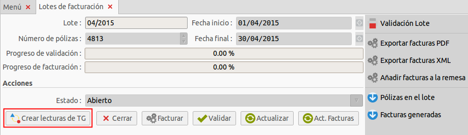

# Documentació del mòdul de CSEC

## Menú de CSEC

En el menú de **Concentrador secundari** es troba l'apartat indicat a la imatge
inferior. Dins de l'apartat **Enllaç concentrador secundari** s'envia informació
a la base de dades remota: el concentrador secundari.

**_Menú de CSEC_**

## Enllaç amb el concentrador secundari

Aquesta opció envia informació a la base de dades remota: el concentrador secundari.
Al seleccionar-la des del menú de CSEC s'obre l'assistent de l'enllaç amb el
concentrador secundari:

**_Assistent CSEC_**

Els camps que el formen són els següents:

**Càrrega d'abonats**

* **Data:** data del dia que es llisten i envien les modificacions contractuals
 dels abonats al concentrador secundari. Es llistaran tots els abonats que hi
 havia el dia especificat.

**Tancaments bruts**

* **Data inicial:** data a partir de la qual es llisten les factures dels
 tancaments bruts.
* **Data final:** data límit en que es llisten les factures dels tancaments
 bruts.

**Saldo ATR**

* **Data:** data del dia a partir del qual es descarregarà el saldo ATR des del
 concentrador remot fins la data actual.

**Corba de càrrega horària ferma a efectes de facturació al consumidor (CCHF)**

* **Data:** data del dia a partir del qual es descarregarà la corba facturada
 des del concentrador remot fins la data actual.

**Corba de càrrega horària ferma validada (CCHV)**

* **Data:** data del dia a partir del qual es descarregarà la corba validada
 des del concentrador remot fins la data actual.

**Informació:** mostra constantment informació sobre l'estat de les transaccions
 de l'assistent.

## Saldo ATR

Amb aquesta opció és possible consultar les dades descarregades des del
concentrador secundari. Per fer-ho, es fa click a la opció **Saldo ATR** del
menú del **Concentrador secundari**. Llavors, apareix la següent pantalla:

Aquesta pantalla mostra tota la informació disponible dels **Saldos ATR**. Al
fer doble click a un registre apareix informació extesa sobre aquest:

## Corba de càrrega horaria validada (CCHV)

Amb aquesta opció és possible consultar les dades descarregades des del
concentrador secundari relatives a les **corbes de càrrega horària validades**.
Per fer-ho s'ha de fer click a la opció **Corba de càrrega horària validada (CCHV)**
i llavors apareix la següent pantalla:

Al fer doble click en un registre es mostrarà informació extesa sobre aquest:

## Corba de càrrega horaria facturada (CCHF)

Amb aquesta opció és possible consultar les dades descarregades des del
concentrador secundari relatives a les **corbes de càrrega horària facturades**.
Per fer-ho s'ha de fer click a la opció **Corba de càrrega horària facturada (CCHF)**
i llavors apareix la següent pantalla:

Al fer doble click en un registre es mostrarà informació extesa sobre aquest:

## Crear lectures de TG

### Crear lectura des de TG

Aquesta opció permet crear lectures de telegestió per els comptadors desitjats
**a partir de les dades obtingudes del concentrador secundari**. Els comptadors
s'han d'entrar manualment. Per crear una lectura s'ha de fer click a la opció
**Crear lectura des de TG** des del menú del concentrador secundari i llavors
apareix la següent pantalla:

Els passos a seguir per generar una lectura són els següents:

1. Selecció del comptador desitjat des del selector de comptadors.
2. Selecció de la data desitjada des del selector de dates.
3. Fer click a la opció "forçar" en cas de voler generar la lectura encara que
   ja n'existeixi una de posterior. (opcional)
4. Click al botó .

### Crear múltiples lectures de TG a partir d'un lot

Es poden crear lectures de TG a partir d'un lot de facturació. Per crear-les
s'ha de fer click al menú **Facturació** --> **General** -->
**Lots de facturació** i fer click a la opció **Lots de facturació**.
Apareixerà una pantalla com la següent:

A continuació es fa click sobre el lot des del qual es desitja generar les
lectures de telegestió i, llavors, es fa click al botó :

!!! note
    Es generaran **lectures de les pòlisses del lot** que estiguin marcades com
    **operatives amb o sense CCH**. Les lectures sempre es generen buscant els
    tancaments bruts (descarregats des del concentrador secundari) que estan més
    pròxims a la **data final** del lot, però mai posterior a aquesta.

## Obtenció de dades

### Saldo ATR

Per obtenir el **Saldo ATR** des del concentrador secundari s'ha de seguir el
següent procediment:

1. Selecció de la data desitjada des del selector de dates a partir de la qual
   es descarregaran els saldos ATR fins el dia actual.
2. Click al botó  de l'apartat **Saldo ATR**.

Seguits aquests passos es mostra la següent informació:

### Corba de càrrega horària ferma validada (CCHV)

Per obtenir la **corba de càrrega horària validada CCHV** des del concentrador
secundari s'ha de seguir el següent procediment:

1. Selecció de la data desitjada des del selector de dades a partir de la qual
   es descarregaran les corbes fins el dia actual.
2. Click al botó  de l'apartat **Corba de càrrega horària ferma validada (CCHV)**.

Seguits aquests passos es mostra la següent informació:

### Corba de càrrega horària ferma a efectes de facturació al consumidor (CCHF)

Per obtenir la **corba de càrrega horària facturada** des del concentrador
secundari s'ha de seguir el següent procediment:

1. Selecció de la data desitjada des del selector de dades a partir de la qual
   es descarregaran les corbes fins el dia actual.
2. Click al botó  de l'apartat **Corba de càrrega horària ferma a efectes de facturació al consumidor (CCHF)**.

Seguits aquests passos es mostra la següent informació:

## Enviament de dades

### Càrrega d'abonats

La càrrega d'abonats és incremental i consisteix en volcar, per tots els clients
de facturació i independentment del tipus que siguin, tots aquells canvis que
s'hagin produït en l'inventari d'abonats.

* Canvis estructurals en l'inventari
>   * Altes de nous subministraments
>   * Baixes de subministraments existents
* Canvis d'agregació
>   * Canvi de potència
>   * Canvi de tarifa
>   * Canvi de comercialitzadora
* Canvis de contingut
>   * Canvi de comptador
>   * Canvi de nom del titular del contracte

Si en la mateixa data es produeixen dos o més canvis (siguin del tipus que
siguin) s'afegeix una línia per cada canvi produït.

!!! note
    No és necessari fer la càrrega d'abonats més d'un cop, doncs s'encarrega
    d'inicialitzar la base de dades del concentrador remot i les modificacions
    contractuals s'envien periòdicament de forma automàtica.

Per enviar els abonats d'un dia concret al concentrador secundari es realitza
el següent procediment:

1. Selecció de la data desitjada des del selector de dates.
2. Click al botó  de l'apartat **càrrega d'abonats**.

Seguits aquests passos l'assistent mostra la següent informació:

La informació a incloure és la següent:

* **INV_FechaHoraRegistro:** s'obté a través del camp **write_date** de la
 modificació contractual activa.

* **INV_EstadoRegistro:** té un valor fixe 0 (registre nou no processat).

* **INV_TipoOperacion:** conté els següents valors:

* **INV_CUPS:** s'obté a través del camp **CUPS** de la pòlissa.

* **INV_Distribuidor:** camp de 4 dígits, completat amb zeros a l'esquerra (si
 cal). S'obté a través del camp **Distribuidora** de la pòlissa.

* **INV_FechaVigorCambio:** s'obté a través del camp **data_inici** de la
 modificació contractual activa.

* **INV_FechaAltaDistribucion:** s'obté a través del camp **data_alta** de la
 pòlissa.

* **INV_FechaBajaDistribucion:** s'obté a través del camp **data_baixa** de la
 pòlissa.

* **FechaAltaComercializador:** s'obté a través de la data d'alta més recent de
 la pòlissa.

* **INV_Comercializador:** camp de 4 dígits, completat amb zeros a l'esquerra (
 si cal). S'obté a través del camp **Comercialitzadora** de la pòlissa.

* **INV_NivelTension:** s'obté del camp **agree_tensio** de la modificació
 contractual activa.

* **INV_TarifaAcceso:** s'obté del camp **agree_tarifa** de la modificació
 contractual activa.

* **INV_DiscriminacionHoraria:** s'obté del camp **agree_dh** de la modificació
 contractual activa.

* **INV_PotenciaContractada:** s'obté del camp **potencia** de la modificació
 contractual activa.

* **INV_Provincia:** s'obté a partir de l'adreça del titular de la modificació
 contractual activa.

* **INV_NombreAbonado:** s'obté a partir del titular de la modificació
 contractual activa.

* **INV_NumeroCliente:** s'obté a partir de l'ID del titular de la modificació
 contractual activa.

* **INV_NumeroContador:** Si es tracta d'una baixa, busca el comptador que
 estava actiu a la data de baixa de la pòlissa. En cas contrari es busca a
 partir de la data d'inici.

* **INV_NumeroContadorReactiva:** té un valor fixe buit.

* **INV_NumeroPoliza:** s'obté a partir de l'ID de la pòlissa.

* **INV_CodigoMunicipio:** s'obté a partir del camp **ine** del municipi de
 l'adreça del titular de la pòlissa.

* **INV_Municipio:** s'obté a partir del camp **name** del municipi de
 l'adreça del titular de la pòlissa.

* **INV_Calle:** s'obté a partir del camp **street** de l'adreça del titular
 de la pòlissa.

* **INV_Numero:** té un valor fixe buit.

* **INV_Escalera:** té un valor fixe buit.

* **INV_Planta:** té un valor fixe buit.

* **INV_Piso:** té un valor fixe buit.

* **INV_Telefono:** s'obté a partir del camp **phone** de l'adreça del titular
 de la pòlissa.

* **INV_TipoTarifa:** s'obté a partir del camp **tipo_pago** de la modificació
 contractual activa.

* **INV_Zona:** té un valor fixe, 0 (zona peninsular).

* **INV_PotenciaContratadaP1:** té un valor fixe buit.

* **INV_PotenciaContratadaP2:** té un valor fixe buit.

* **INV_PotenciaContratadaP3:** té un valor fixe buit.

* **INV_PotenciaContratadaP4:** té un valor fixe buit.

* **INV_PotenciaContratadaP5:** té un valor fixe buit.

* **INV_PotenciaContratadaP6:** té un valor fixe buit.

* **INV_DireccionAclarador:** té un valor fixe buit.

### Tancaments bruts

Es carrega al sistema concentrador secundari la informació relacionada als
consums d'un període determinat per aquells abonats que s'hagin facturat (
refacturacions incloses) en un interval de temps.

Per enviar els tancaments bruts dins d'un interval de temps es realitza el
següent procediment:

1. Selecció de la data inicial desitjada des del selector de dates inicials.
2. Selecció de la data final desitjada des del selector de dates finals.
3. Click al botó  de l'apartat **tancaments bruts**.

Seguits aquests passos l'assistent mostra la següent informació:

Si s'intenten carregar tancaments ja enviats l'assistent ho informarà al camp
d'informació indicant el numero de registres repetits que s'anaven a enviar:

La informació a incloure és la següent:

* **CON_FechaHoraRegistro:** s'obté a través del camp **write_date** de la
 factura.

* **CON_EstadoRegistro:** té un valor fixe, 0 (registre nou no processat).

* **CON_CUPS:** s'obté a través del camp **CUPS** de la pòlissa.

* **CON_NumeroContador:** s'obté a través del comptador de la pòlissa.

* **CON_NumFactura:** s'obté a partir del camp **id** de la factura.

* **CON_InicioDelPeriodo:** s'obté a partir del camp **data_anterior** de les
 lectures d'energia de la factura.

* **CON_FinDelPeriodo:** s'obté a partir del camp **data_actual** de les
 lectures d'energia de la factura.

* **CON_ConsumoPeriodo1:** s'obté a partir del camp **consum** de les lectures
 d'energia de la factura on el període sigui "P1".

* **CON_ConsumoPeriodo2:** s'obté a partir del camp **consum** de les lectures
 d'energia de la factura on el període sigui "P2".

* **CON_ConsumoPeriodo3:** s'obté a partir del camp **consum** de les lectures
 d'energia de la factura on el període sigui "P3".

* **CON_ConsumoPeriodo4:** s'obté a partir del camp **consum** de les lectures
 d'energia de la factura on el període sigui "P4".

* **CON_ConsumoPeriodo5:** s'obté a partir del camp **consum** de les lectures
 d'energia de la factura on el període sigui "P5".

* **CON_ConsumoPeriodo6:** s'obté a partir del camp **consum** de les lectures
 d'energia de la factura on el període sigui "P6".

###Enviament de modificacions contractuals

Aquest mòdul envia periòdicament dades al concentrador secundari de manera
automàtica. Envia informació sobre les modificacions contractuals efectuades i
també altes i baixes de pòlisses. Les dades que envia són les següents:

1. **Alta d'un nou subminstrament en la distribuidora:** s'activa al donar
   d'alta una nova pòlissa.
2. **Baixa d'un subministrament en la distribuidora:** s'activa al donar de
   baixa una pòlissa.
3. **Canvi de potència:** s'activa quan s'efectua una modificació contractual
   on la potència és modificada.
4. **Canvi de tarifa:** s'activa quan s'efectua una modificació contractual on
   la tarifa és modificada.
5. **Canvi de comercialitzadora:** s'activa quan s'efectua una modificació
   contractual on la comercialitzadora és modificada.
6. **Canvi de comptador:** s'activa quan s'efectua una modificació contractual
    on el comptador és modificat.
7. **Canvi de nom:** s'activa quan s'efectua una modificació contractual on el
    titular és modificat.

### Alta d'un nou subministrament en la distribuidora

S'activa durant el workflow **wkf_activa**. Si la pòlissa no té cap modificació
contractual anterior o bé és una reactivació d'una pòlissa donada de baixa
anteriorment, es considera una alta.

### Baixa d'un subministrament en la distribuidora

S'activa durant el workflow **wkf_baixa**.

### Canvi de potència

Es pot activar des de dos workflows:

1. **wkf_activa:** es compara la potència de la modificació contractual amb la
   de la modificació contractual anterior.
2. **wkf_overwrite_modcontractual:** es compara la potència que s'ha sobreescrit

### Canvi de tarifa

Es pot activar des de dos workflows:

1. **wkf_activa:** es compara la tarifa de la modificació contractual amb la de
   la modificació contractual anterior.
2. **wkf_overwrite_modcontractual:** es compara la tarifa que s'ha sobreescrit
   a la modificació contractual actual amb el valor que hi havia anteriorment.

### Canvi de comercialitzadora

Es pot activar des de dos workflows:

1. **wkf_activa:** es compara la comercialitzadora de la modificació contractual
   amb la de la modificació contractual anterior.
2. **wkf_overwrite_modcontractual:** es compara la comercialitzadora que s'ha
   sobreescrit a la modificació contractual actual amb el valor que hi havia
   anteriorment.

###Canvi de comptador

Es pot activar des de dos workflows:

1. **create:** es genera el comptador al crear-ne un de nou.
2. **write:** es genera el comptador al fer click al botó de **desar**.

# Canvi de nom

Es pot activar des de dos workflows:

1. **wkf_activa:** es compara el titular de la modificació contractual
   amb el de la modificació contractual anterior.
2. **wkf_overwrite_modcontractual:** es compara el titular que s'ha
   sobreescrit a la modificació contractual actual amb el valor que hi havia
   anteriorment.
