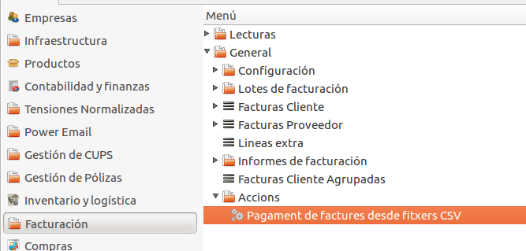
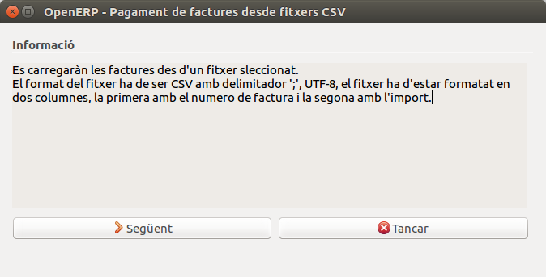
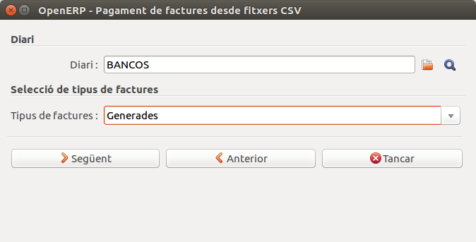
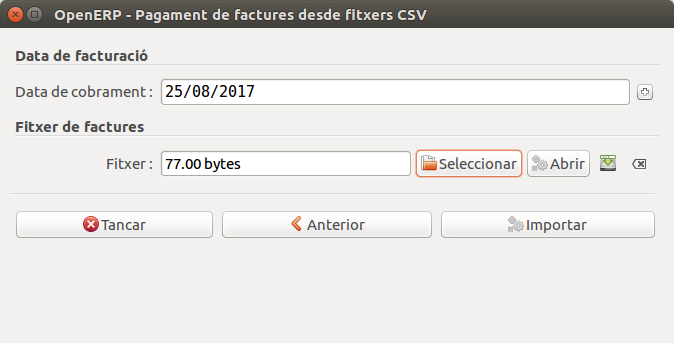
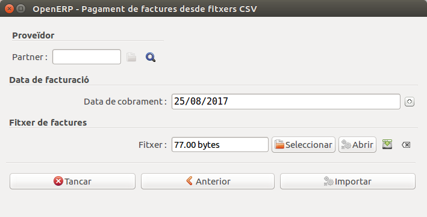
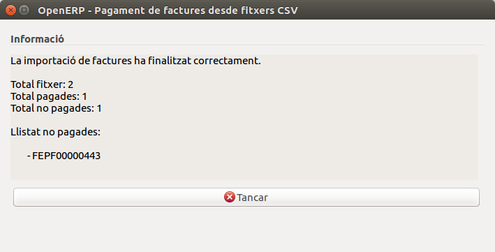

# Menu d'accions de facturació genèriques

## Assistent per pagar factures desde fitxers CSV

### Descripció
Aquest assistent permet el pagament automatitzat de diverses factures a través
d'un fitxer en format CSV.

### Localització
L'assistent el podem localitzar dins l'apartat de `Facturació/General/Accions`.

### Format del fitxer
El format del fitxer ha de ser amb extensió `.CSV`, aquest ha de contenir dos
columnes, la primera amb els numeros de les factures a pagar i la segona amb
la quantitat total a pagar. Els dos camps han d'estar separats amb el delimitador
`;` com en el següent exemple:

`numero_factura_0001;quantitat_factura_0001`

`numero_factura_0002;quantitat_factura_0002`

!!! nota
    Pots generar fitxer CSV desde l'editor d'excel mitjançant l'opció `desar com a...`
    i seleccionant l'opcio CSV o simplament crea un fitxer de text i reanomenen
    l'extensió per `.CSV`.

### Instruccions d'ús
* Pas 1: iniciem l'assistent desde el directori d'accions -> `Pagament de factures...`
Un cop obert ens apareixerà un requadre d'informació, amb les instruccións de
l'assistent, per continuar haurem de prémer el botó `Següent`.

* Pas 2: en aquest segon pas ens apareixeran dos camps a emplanar, el `diari` i
el `tipus de factures` que volem pagar. Un cop omplerts els camps haurem de prémer
el botó `següent`.

!!! nota
    En el segon camp si seleccionem que volem pagar factures rebudes, a diferència de
    les factures generades s'ens demanarà el partner en el següent pas.

* Pas 3: en el tercer pas, segons la opció seleccionada en el pas anterior s'ens
demanarà que omplim el camp `partner` o no, per altre banda els camps que sempre
ens demanarà sera el de la `data de pagament` i el `fitxer csv` que volem llegir.
Finalment un cop omplerts els camps premem el botó `Importar`.

* Pas 4: finalment en aquest últim pas s'ens mostrara el nombre de factures que
s'han pagat correctament i el nom de les que per algun error no s'han pogut pagar.

