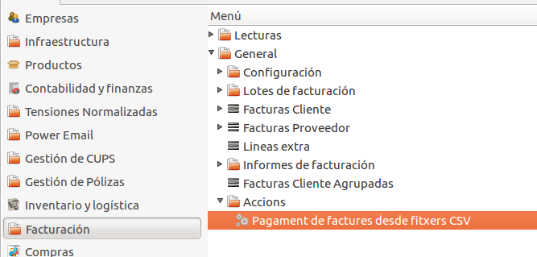
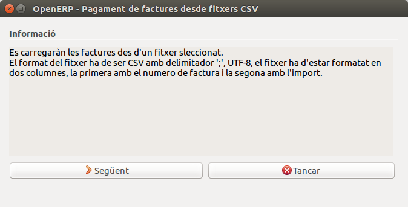
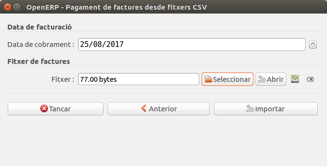
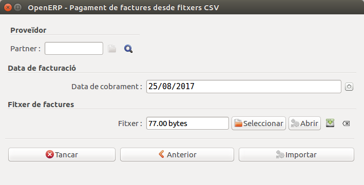
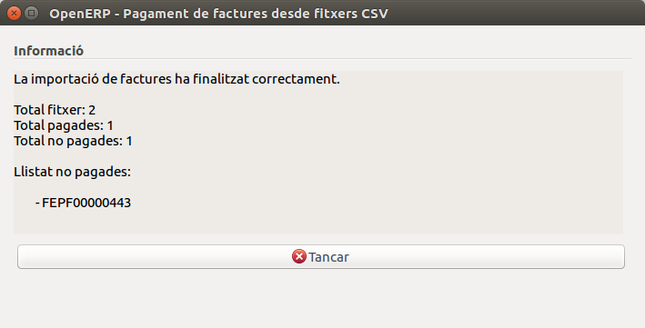

# Menu d'accions de facturació genèriques

## Assistent per pagar factures desde fitxers CSV

Aquest assistent permet el pagament automatitzat de diverses factures a través
d'un fitxer en format CSV.

L'assistent el podem localitzar dins l'apartat de
***Facturació/General/Accions***.

### Format del fitxer
El format del fitxer ha de ser amb extensió `.CSV`, aquest ha de contenir dos
columnes, la primera amb els numeros de les factures a pagar i la segona amb
la quantitat total a pagar. Els dos camps han d'estar separats amb el delimitador
`;` com en el següent exemple:

`numero_factura_0001;quantitat_factura_0001`

`numero_factura_0002;quantitat_factura_0002`

!!! hint "Consell: com generar fitxers CSV"
    Pots generar fitxer CSV desde l'editor d'excel mitjançant
    l'opció **_desar com a..._** i seleccionant l'opcio CSV o simplament crea un
    fitxer de text i reanomenen l'extensió per **.CSV**.

### Instruccions d'ús
Iniciem l'assistent des del directori d'accions
-> **_Pagament de factures..._**
Un cop obert ens apareixerà un requadre d'informació, amb les instruccións de
l'assistent, per continuar haurem de prémer el botó **Següent**.

En aquest segona finestra apareixeran dos camps a emplanar, el **diari**
i el **_tipus de factures_** que volem pagar. Un cop omplerts els camps haurem
de prémer el botó **següent**.

!!! Info "Nota"
    En el segon camp si seleccionem que volem pagar factures rebudes, a
    diferència de les factures generades s'ens demanarà el partner en el següent
    pas.

En la tercera pestanya, segons la opció seleccionada en el pas anterior se'ns
demanarà que omplim el camp **partner** o no, per altre banda els camps que
sempre ens demanarà sera el de la **data de pagament** i el **fitxer csv** que
volem llegir.
Finalment un cop omplerts els camps premem el botó **Importar**.

Finalment s'ens mostrara el nombre de factures que s'han pagat correctament i el
nom de les que per algun error no s'han pogut pagar.

