# Documentació del mòdul de facturació

## Introducció

Facturació base per empreses del sector elèctric. Distribuidores i
comercialitzadores

## Realització del tancament i obertura d'any

Aquest procés es duu a terme cap a final d'any i es tracta de preparar el següent
període de facturació anual.

1. Crear el següent any fiscal
2. Configuració de la numeració de les diferents sèries de facturació

Aquestes accions es poden realitzar a través d'un assistent que el podreu trobar
a **Menu > Facturació > General / Mercat Lliure > Configuració > Tancament d'any**

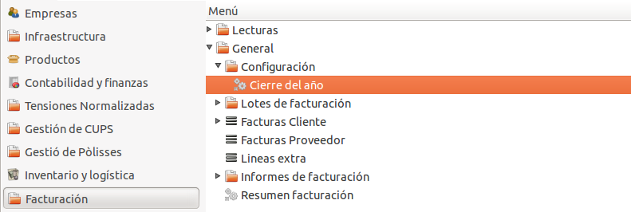

### Configuració

La primera pantalla de l'assistent ens permet configurar què volem fer.

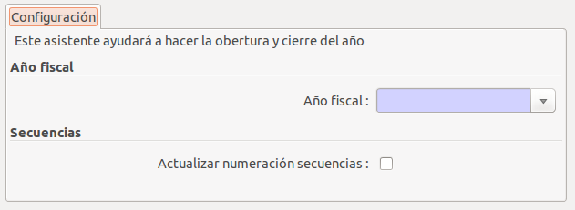

* **Any fiscal**: Ens permet seleccionar si volem crear un any fiscal nou o bé
  utilitzar-ne un d'existent.
    * Utilizar un existent
    * Crear un nou any fiscal

  En el cas que utilitzem un que ja existeix l'haurem de seleccionar a través
  del camp que mostra a sota.

  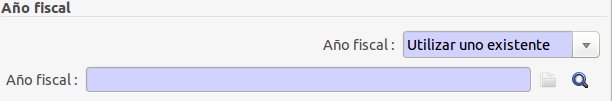

  En el cas de crear un any fiscal nou (el més habitual) haurem d'escriure
  l'any a la casella inferior i apretar el botó **Crear any fiscal**.

  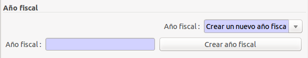

Un cop creat l'any fiscal nou ja ens apareixarà seleccionat.

* **Actualitzar numeració de seqüències**: Ens permet actualitzar la numeració de
  les seqüencies de diferents diaris. En activar aquesta opció ens apareixerà
  un nou camp que li haurem de dir quines seqüencies volem actualitzar.

  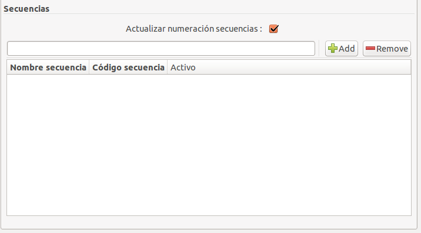

S'ha de filtrar les seqüències per **ener** tal i com es mostra a la següent
captura de pantalla i apretar el botó **Afegir**.

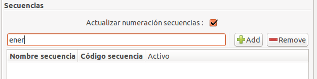

i després seleccionar les següents seqüències:
  * Seqüència F.Energia
  * Seqüència F. Energia (Abono)
  * Seqüència F. Energia (Rectificadores)

tal i com es mostra a la següent captura.

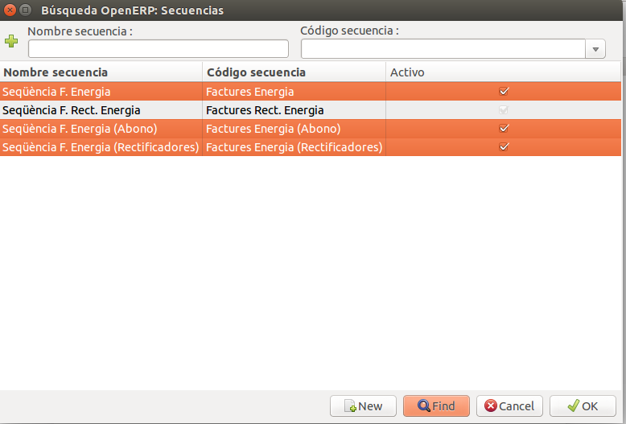

Quedant la pestanya de configuració com la següent imatge:

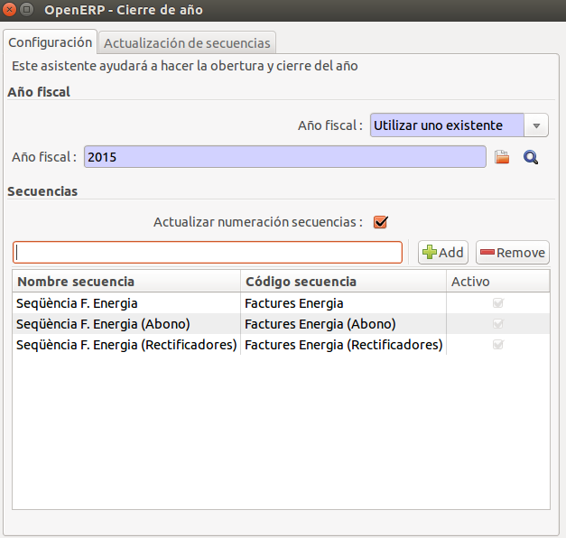

### Actualització de les seqüències

Ara podem posicionar-nos a la pestanya **Actualizació de seqüències** i apretar
el botó **Començar**.

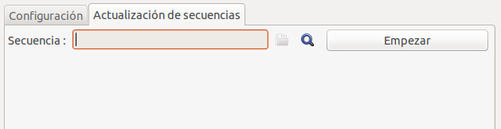

Aquest assistent anirà passant per les seqüències que hem marcat a la pestanya
de configuració i ens permetrà configurar-les.

#### Diferents casos d'ús

##### Reiniciar la numeració

Per tal de reiniciar la numeració hem de d'actualitzar el camp **Numero següent**
a **1**.

##### Canviar el prefix de la factura

Podem canviar el prefix de la seqüència modificant el camp **Prefix**.

##### Mantenir una numeració independent

Aquesta situació ens permet continuar numerant factures de l'any fiscal anterior
a partir de la numeració que hi havia i reiniciar i tenir un altre comptador per
l'any actual. Això farà que quan fem una factura de l'any anterior i fem que la data
de la factura sigui de l'any anterior o bé forcem el període comptable a l'any anterior
ens utilitzarà la seqüència de l'any anterior i no ens avançarà la de l'any en curs.

En el cas que ho decidim ens demanarà quin any és l'anterior.

##### Exemple

En aquest cas farem un reinici de comptador i mantindrem el comptador per l'any
anterior.

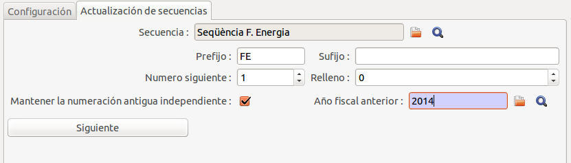

## Creació dels lots de facturació del següent any

Abans de poder validar les factures de finals d'any s'ha de tenir en compte que
s'han de crear els lots del nou any. Ja que quan es valida una factura la pòlissa/
contracte d'aquesta es mou al següent lot de facturació. I si aquest no ha estat
creat abans donarà un error.

Per tal de crear els lots de facturació s'ha d'anar a **Menú > Facturació >
General/Mercal Lliure > Lots de facturació > Creació de lots de facturació**

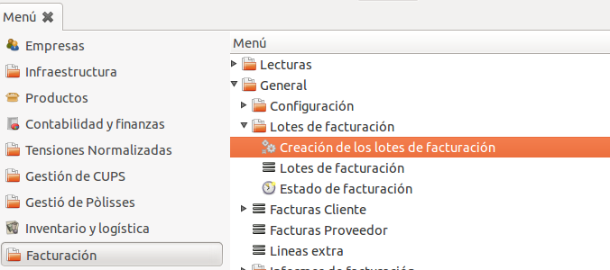

Ens apareixerà per quin any volem crear els lots i apretem el botó **Crear**

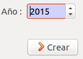

I un cop s'hagin creat es mostrarà la següent finestra.

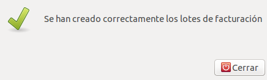

