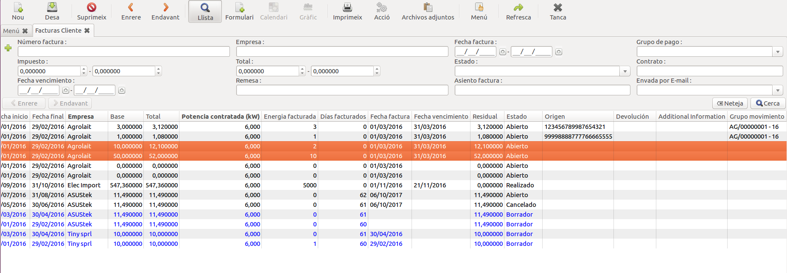
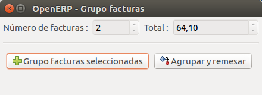
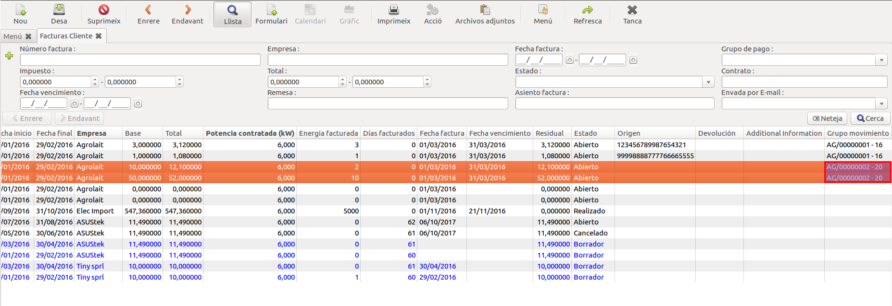
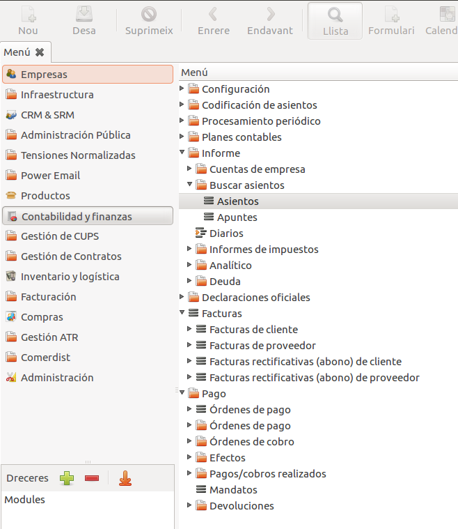
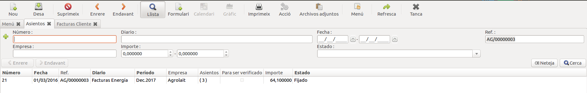
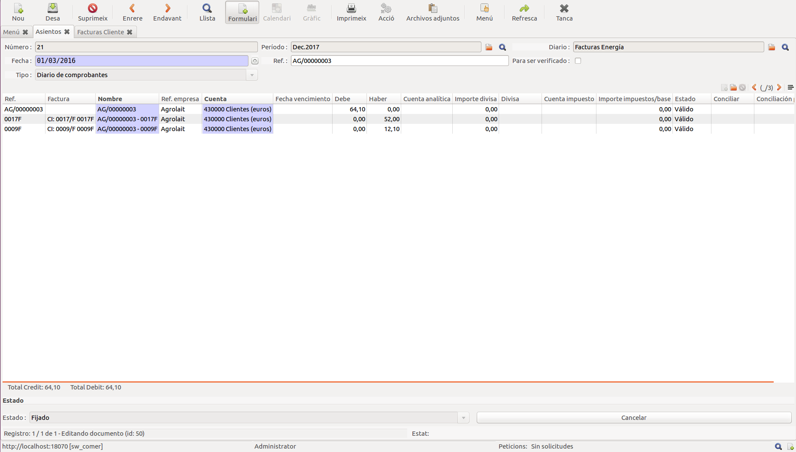
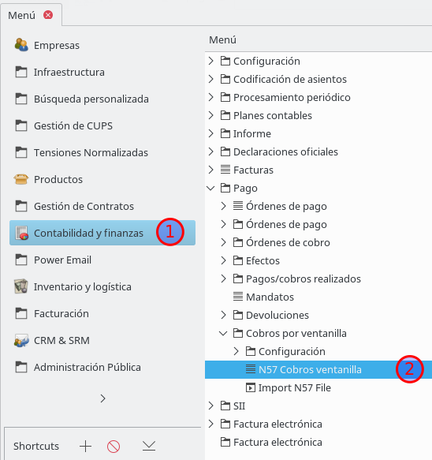
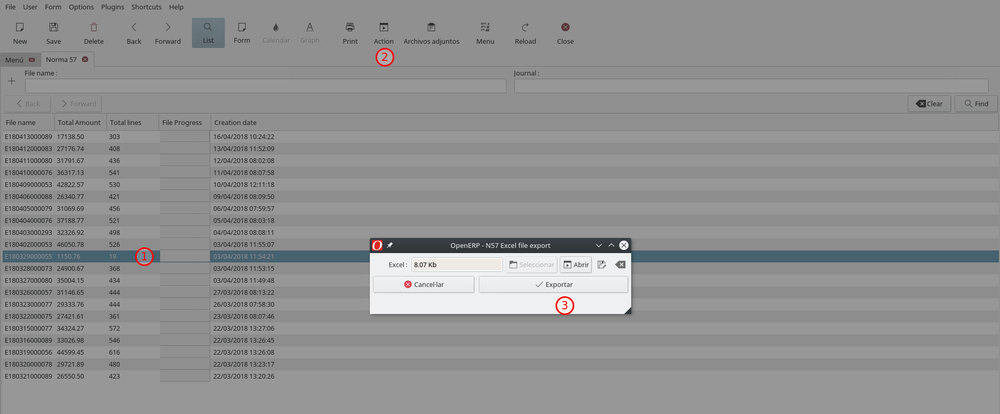

# Creació de remesa

El primer pas per crear una remesa és crear el que OpenERP anomena "Órdenes de
cobro". Pre crear-la, accedim al menú "Contabilidad y finanzas / Pago / Órdenes
de cobro / Nueva orden de cobro" com es veu a la següent figura.

Nova "Orden de cobro":

Un cop creada, cal omplir-ne els camps de la fitxa.

Emplenem els camps obligatoris, entre ells el "Modo de pago", que a l'hora
d'afegir factures actuarà de filtre. Llavors guardem.

Si hem seleccionat "Fecha fija" a la "Fecha preferida", cal omplir també a
quina data es programarà el cobrament (camp "Scheduled date if fixed").

Dades obligatòries:

**Descripció dels camps de la fitxa de remesa**

 * *Referència* Camp seqüencial que s'emplena automàticament
 * *Modo de pago* En aquesta casella cal seleccionar el "modo de pago" de les
   factures que es volen incloure a la remesa. Aquest camp actuarà de filtre a
   l'hora d'afegir factures. Només es poden afegirf actures a aquesta remesa
   que tinguin el camp "modo de pago" igual a l'indicat a la remesa.
 * *Fecha preferida* Normalment es seleccionarà "Fecha fija". Indica a quina
   data s'ha de passar el cobrament de la factura.
 * *Scheduled date if fixed* És la data en què el banc passarà el rebut als
   clients, obligatori si a "Fecha preferida" hem seleccionat "Fecha fija".
 * *Usuario* Camp fix en què hi apareix l'usuari de l'ERP que fa la remesa.
 * *Plantilla* Se seleccionarà sempre "Simple"
 * *Tipo* Sempre fix amb valor "A cobrar".
 * *Crear asientos contables* Sempre es deixarà a "Por extracto bancario"

Una vegada omplerts els camps correctament es guarda la remesa i es procedeix a
afegir-hi les factures a remesar.

## Afegir factures a la remesa

Existeixen dues maneres d'afegir factures a una remesa.

## De forma massiva a partir del lot de facturació

Primer cal accedir al lot de facturació que es vol remesar pel menú "Facturació ->
Mercat lliure -> Lots de facturació -> Lots de facturació".

A continucació cal obrir el lot de facturació que es vulgui remesar i cal fer
 click el botó "Afegir
factures a remesar". Amb aquest assistent només cal buscar la remesa creada a
l'apartat anterior i després polsar el botó "Afegir factures".

Aquesta operació afegirà a la remesa totes les factures del lot de facturació
que tinguin el "Modo de pago" igual al de la remesa seleccionada. Si es volen
afegir factures que no estaven al lot, es pot fer tal i com s'indica al següent
punt.

Afegir factures a remesa:

Seleccionar remesa:

Un cop seleccionada la remesa, al polsar el botó **Afegir factures**
s'intentaràn afegir les factures seleccionades a la remesa escollida.
Es poden donar les següents situacions:

### 1. Existència de factures ja remesades

És possible que alguna de les factures a remesar ja estigui en una remesa.
En aquest cas l'assistent mostra una pantalla com aquesta:

La remesa de les factures que apareixen en el llistat serà **sobre-escrita**. 
Si es vol evitar, les factures que no es vulguin modificar hauràn de ser eliminades
del llistat. Per fer-ho han de ser seleccionades i s'ha de fer click al botó **suprimir**.

Si es vol tornar a afegir una factura eliminada del llistat, s'ha de fer click al
botó **afegir**.

Per continuar, s'ha de fer click al botó **Sobre-escriure remesa** i 
tot seguit apareix la pantalla del següent apartat.

### 2. Factures afegides a la remesa

Quan l'assistent afegeix les factures a la remesa especificada, apareix
la següent pantalla indicant la finalització del procés:

## De forma manual des de la remesa

Amb el botó "Seleccionar facturas a cobrar" es poden afegir factures que
compleixin els filtres indicats.

Si per error s'afegeix alguna factura a la remesa que no es vol remesar, es pot
eliminar de la remesa polsant el botó d'esborrar petit que hi ha sobre el
llistat de factures a remesar.

## Confirmar remesa

Després de comprovar que hi ha les factures que toca a la remesa, hem d'apretar
el botó "Confirmar pagos".

## Generar fitxer de remesa pel banc

Un cop confirmada la remesa, el següent pas és generar el fitxer per enviar al
banc. Per generar-ho farem clic al botó "Crear fichero de pagos".

## Donar la remesa per pagada

Una vegada generat el fitxer per enviar al banc es donaran per pagades totes
les factures incloses a la remesa polsant el botó "Pagar Remesa".

Totes les factures passaran llavors a estat "Realizado" i el valor residual a
zero amb els corresponents assentaments creats.

## Agrupació del pagament de Factures

L'agrupació del pagament de factures serveix per a gestionar més fàcilment
un conjunt de factures de manera que les accions que es realitzen a una del grup es
realitzen a la resta.

Quan s'agrupen vàries factures es crea un moviment comptable amb la suma dels
imports de les factures. Aquest moviment queda lligat a les factures en el
camp "**Grupo Moviment**".

Un cop agrupades unes factures hi ha una sèrie d'accions que es realitzen sobre
tot el conjunt. Això implica que realitzar una d'aquestes accions a una
factura agrupada afecta a totes les factures del grup. Aquestes
accions són:

  * Pagar factura
  * Desfer pagament
  * Devolució de pagament
  * Afegir factures a la remesa

### Assistent per agrupar pagaments de factures
El procés per agrupar el pagament de factures és el següent:

  * Des del llistat de factures del menú "**Facturació**" es seleccionen les
  factures que es vulguin agrupar.
  

  * Es crida l'assistent "**Agrupar pago facturas**".
  

  * Es mostrarà un resum amb l'import resultant i dues opcions:
      * **Grupo facturas seleccionadas**: Es farà l'agrupació de les factures
      seleccionades. Un cop pitjat el botó d'agrupar el wizard no es tancarà,
      s'ha de tancar manualment.
      * **Agrupar y remesar**: Es farà l'agrupació de les factures
      seleccionades i després s'obrirà automàticament l'assistent per remesar
      ja explicat anteriorment. S'afegiran totes les factures del grup a la
      remesa.
  

  * Un cop finalitzat es pot veure com ja tenen ple el camp "**Grupo Moviment**".
  

L'assistent d'agrupar realitza una sèrie de validacions sobre les factures que
mostraran un missatge d'error si:

  * Alguna de les factures ja està agrupada.
  * Alguna de les factures no està oberta.
  * Hi ha factures amb diferents IBANs.

### Desfer agrupació de pagament de factures
El procés per desfer l'agrupació de pagament de factures consisteix bàsicament en eliminar
el moviment comptable que les agrupar.

Els passos són els següents:

  * Es va al menú  "**Contabilidad y finanzas -> Informe -> Buscar Asientos**".
  

  * Es selecciona l'assentament corresponent a l'agrupació de factures
  

!!! tip "Consell"
    Per trobar l'assentament de l'agrupació de factures es pot introduir el
    codi de l'agrupació al camp **Referència**.

  * Es cancel·la l'assentament mitjançant el botó **Cancelar** i després es
  suprimeix l'assentament.
  

!!! warning "Atenció"
    Només es pot desfer l'agrupació de factures que no hagin estat pagades.

### Generar fitxer Excel (_.xlsx_) d'un informe N57

Per poder generar el fitxer, haurem d'anar als informes N57:

Un cop s'obri la vista dels informes, podrem generar l'informe seguint les següents passes:

1. Seleccionem l'informe que volem. També es pot obtenir l'Excel des de la vista de formulari ja que les passes 2 i 3 seran les mateixes.

    !!! danger "Perill"
        Si estem a la vista d'arbre, és molt important que abans de fer la passa dos, assegurar-se de que tenim un registre seleccionat.

2. Obrirem l'assisten clicant el boto `Action`

3. Generarem l'Excel clicant al botó `Exportar`. Si el volem desar farem clicarem el botó amb l'ícona de desar i si només el volem obrir clicarem el botó `Obrir`.

    !!! note "Nota"
        Si es desa l'arxiu, es farà amb el nom _n57_NOM_FITXER.xlsx_
