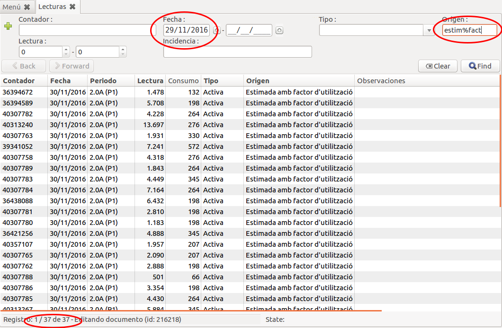

# Procesos habituals

## Canvi de comptador a mig període de facturació

Suposem que el dia 13/10/2011 es canvia el comptador amb el ``nº de sèrie``
1000 per el comptador amb ``nº de sèrie`` 1001. Si i no hi ha cap més canvi de
tarifa ni de potència contractada no tindrem modificació contractual del dia
13/10/2011.

* **Al comptador antic** (1000) se li afegiran les lectures del dia anterior
  (12/10/2011) i es donarà de baixa (``Data de baixa``) el mateix dia
* **Al comptador nou** (1001) se li afegiran les lectures inicials del mateix
  dia (13/10/2011) de alta (``Data Alta``)

## Listat de lectures

Totes les lectures es poden veure des del menú: **Facturació/Lectures/Lectures**.
Des d'aquest llistat podem filtrar totes les lectures que volguem, un exemple és
filtrar totes les lectures que s'han generat amb factor d'utilització amb data més
gran que el 29/11/2016

