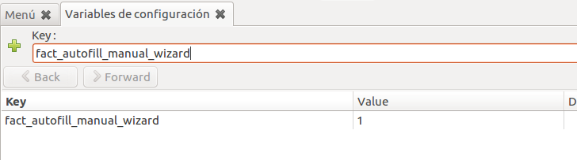
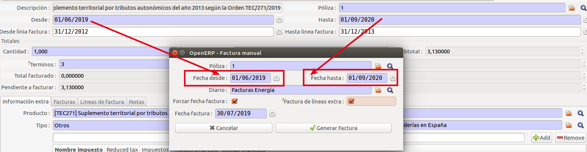
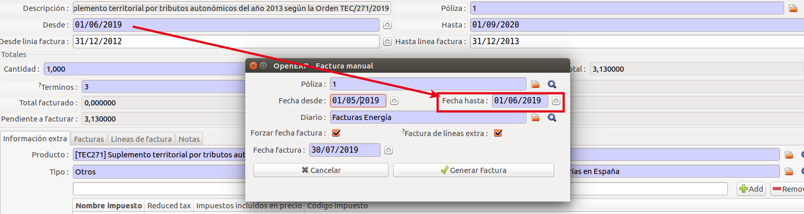
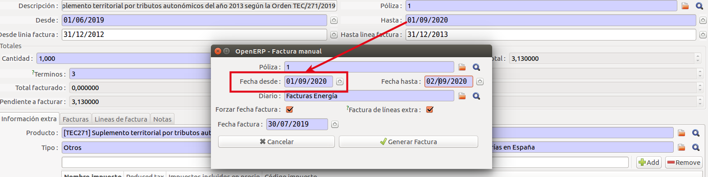
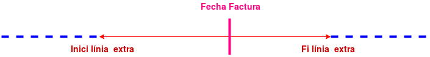
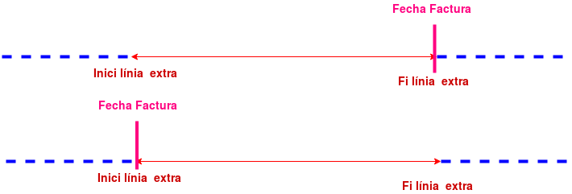
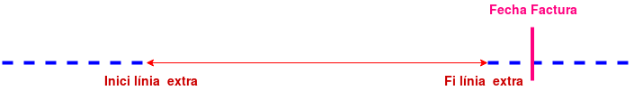
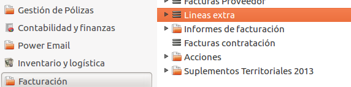
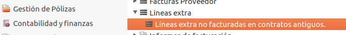
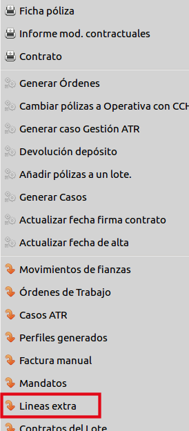

# Linies extra

## Concepte
Les línies extra, serveixen per afegir conceptes externs a la facturació regular
a les factures. Aquestes també permeten repartir el cost en diverses factures
per tal de realitzar una regularització periòdica per termes.

## Facturació de línies extra
Tenint en compte que la facturació es pot fer de manera manual o automàtica,
la facturació de línies extra divergeix en aquestes dues maneres.

## Factura manual

En realitzar una factura manual a través de l'assistent de factura manual, s'ha
de seleccionar que es vol incloure les línies extra, un cop seleccionada
l'opció, si tenim la variable de configuració ***fact_autofill_manual_wizard***
activada, es posaran automàticament les dates per incloure les línies extra
pendents.

En cas de posar les dates manualment, es facturaran les línies extra que
tinguin la **data d'inici** (***date_from***) o la **data final**
(***date_to***) dins el període que es vol facturar.

!!! warning "Atenció"
    Cal tenir en compte que les dates inclouran totes les línies extra, però a l'hora de generar la facturà es farà una segona validació i només facturarà
    les que compleixin les condicions estipulades a l'apartat de
    **Condicions de facturació**.

## Facturació automàtica

Referent als processos de facturació automàtica, la facturació de línies extra
seguirà les condicions de facturació definides en el següent apartat.

### Condicións de facturació

Quan es genera una factura de manera **automàtica** o **manual**, l'**ERP**,
fa una cerca de les línies extra relacionades amb el contracte amb les següents condicions:

- Línies extra on la **data de la factura**(***date_invoice***) està **entre**
la **data desde**(***date_from***) i la **data fins**(***date_to***), es
a dir amb data de factura entre els períodes de les línies extra.

- Línies extra amb **data fins**(***date_to***) anterior a
la **data de la factura**(***date_invoice***) amb **pendent a
facturar**(***total_amount_pending***) **diferent** de **0**, és a dir
totes aquelles línies extra que no s'han acabat de facturar i fora de termini.

Un cop obtingudes les **línies extra** corresponents a les cerques
anteriors, es fa un segon filtre segons les dades de la factura on anaven
a ser incloses i s'afegiran a la factura si compleixen les següents condicions:

- En cas que sigui una **factura normal** (***tipo_rectificadora = N***), el
**diari** (***journal_id***) de la **factura**, ha de coincidir amb algun dels
**diaris** (***journal_ids***) de **línia extra**.

- En cas de que sigui una factura **rectificadora**
(***tipo_rectificadora = R***), el **diari** (***journal_id***) de
la **factura referenciada** (***factura.ref***),
ha de coincidir amb algun dels **diaris** (***journal_ids***)
de **línia extra**.

**Mètodes**: ***fact_via_lectures()*** &rarr; ***compute_extra_lines()***

!!! warning "Atenció"
    Només es facturaran les línies extra on el total pendent
    arrodonit a 2 decimals sigui diferent de 0.

## Generació de línies de la factura i facturació per termes

En referència a l'apartat anterior, un cop filtrades les línies extra a
facturar, es generen les línies de la factura en funció de la informació
especificada en la línia extra i el que tocaria facturar.

El preu de la línia de la factura, es calcularà en funció de la quantitat, el
pendent a facturar i el preu per terme:

- Si el pendent a facturar és inferior al preu per terme o unitat, s'afegirà
a la línia de la factura tot el que queda per facturar.

- Si la **data de la factura** (***date_invoice***) és **posterior o igual**
    a la **data de finalització de la línia extra** (***date_to***), s'afegira
    també a la factura tot el pendent a facturar.

- En la resta de casos, afegeix a la factura una línia amb el preu per
    terme.

!!! warning "Atenció"
    Els impostos de la línia de la factura, es calcularan en funció
    dels impostos definits a la línia extra.

## Menús i llistats

### Veure totes les línies extra

***Menú &rarr; Facturació &rarr; General &rarr; Línies Extra***

### Veure línies extres no facturades de contractes antics

***Menú &rarr; Facturació &rarr; General &rarr; Línies Extra &rarr; Línies extra no facturades en contractes antics***

### Veure línies extra asociades a un contracte

Des de la vista ***Formulari*** d'un contracte, podem accedir a les línies
extra del contracte a través del menú d'accions de la dreta ***Línies Extra***.

