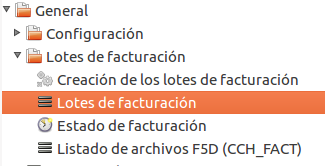
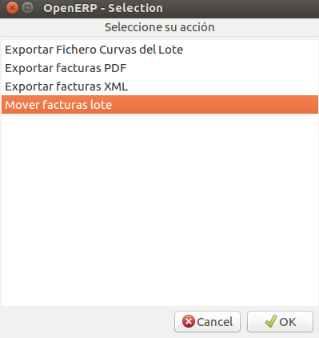
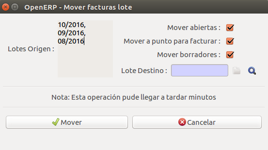
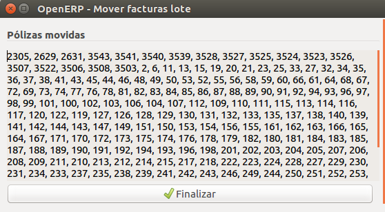
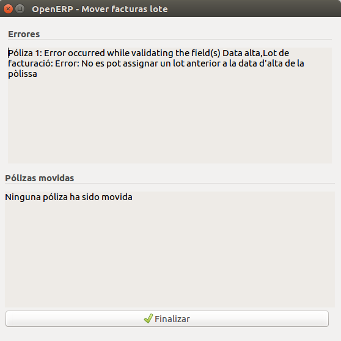

# Lots de facturació

Els lots de facturació són grups de polisses que s'han de facturar per un cert periode.

## Moure factures de lot

### Introducció

En alguns casos es pot desitjar moure les pòlisses d'un lot de facturació a l'altre.
Aquest wizard permet fer-ho de forma automàtica per totes les pòlisses en estat
obert, esborrany i/o a punt de facturar d'un o més lots de facturació.

Totes les pòlisses mogudes passaran a tenir l'estat d'esborrany, independentment
de l'estat que tinguessin en començar.

### Utilització

Per tal d'utilitzar aquest wizard haurem d'anar a *Facturació > General > Lots de facturació*.

Aquí, haurem de seleccionar el lot o lots dels quals desitgem moure les pòlisses i
tot seguit haurem de prémer el botó de la barra superior que diu *Accions*. Això
farà que aparegui la següent finestra:

Ara haurem de prémer el botó de *Moure factures lot*, que finalment ens mostrarà
la finestra per realitzar el canvi:

En aquesta finestra podem decidir quines pòlisses volem moure segons l'estat en
el qual estan. També hem d'indicar a quin lot les volem moure. Un cop fet això simplement
hem de prémer el botó de **Moure** i el canvi de lot de les pòlisses començarà automàticament.

**NOTA: Si el nombre de pòlisses seleccionades és molt gran aquesta acció pot arribar
a tardar uns quants minuts, durant els quals no es veurà cap canvi a la pantalla a
banda d'un possible enfosquiment del fons.**

Si tot ha anat bé, al final veurem una pantalla amb una llista de totes les pòlisses
que s'han mogut de lot com la que es veu a continuació. En aquest cas simplement
podem prémer **Finalitzar** i ja haurem acabat.

Per altra banda, si hi ha hagut alguna pòlissa que no s'ha pogut moure al lot desitjat
es mostrarà la següent finestra, on s'indicarà quines són les pòlisses que no s'han
pogut moure i la raó. Si hi havia altres pòlisses al lot que sí que s'han pogut
moure s'indicarà igual que a dalt. Altrament, apareixerà aquest missatge indicant que
no s'ha mogut cap pòlissa. (Per defecte la pantalla serà més petita i no ho deixarà
veure tot, però es pot ampliar situant el ratolí en una cantonada, prement el botó
esquerra i movent el ratolí)

