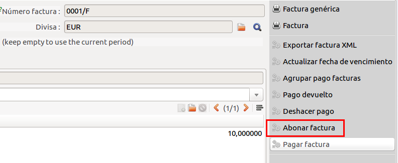
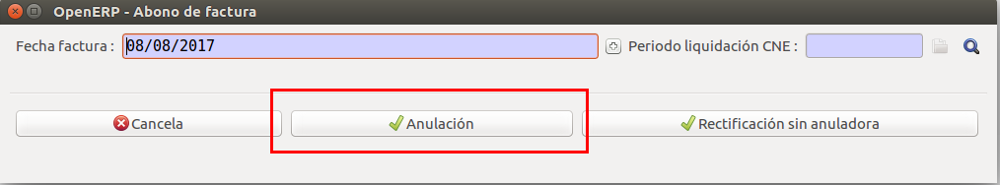
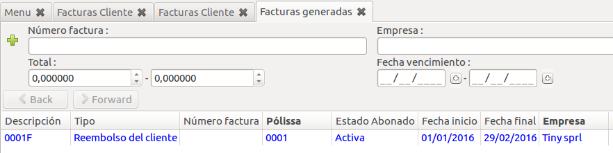
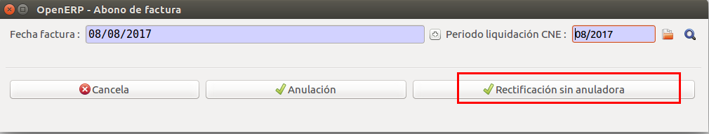
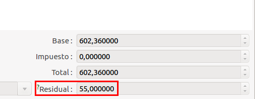
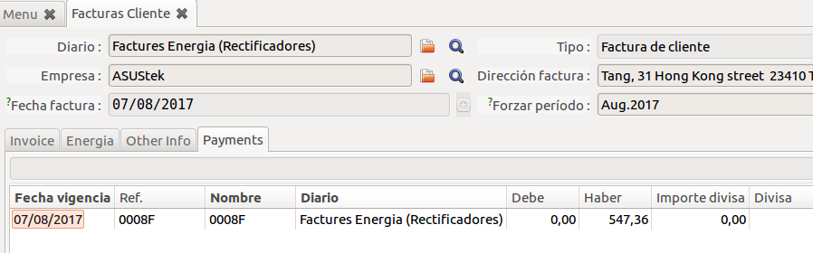

# Refacturació

Quan hem emès una factura que no és correcte s'ha de refacturar. Bàsicament poden
passar dues coses:

  * S'ha emès una factura que **no** s'havia d'emetre.
  * S'ha emès una factura amb errors administratius o de càlcul.

!!! info
    Per més informació sobre els tipus de factures rectificadores que hi ha
    veure l'apartat [Tipus de factures](tipos_facturas)

Per totes les accions primer haurem de començar amb l'assistent de refacturació:

## Factura anul·ladora

Més informació sobre el tipus de factura [anul·ladora (A)](tipos_facturas.md#anulladora-a)

En el primer cas (una factura que **no** s'havia d'emetre) sempre haurem de fer
una factura **anul·ladora**·

Aquest procés el que fa és crear una factura igual a la emesa però d'abonament i
així compençar la original.

Quan acaba el procés ens obrirà una nova pestanya amb la factura anul·ladora en
estat **esborrany**.

Si l'anul·ladora és correcte, només ens quedarà **validar** la factura per tal
d'assignar número de factura i enviar-la al client.

## Factura rectificadora (sense anul·ladora)

Més informació sobre el tipus de factura [rectificadora sense anul·ladora (RA)](tipos_facturas.md#rectificadora-sense-anulladora-ra)

!!! important
    Abans de generar la factura rectificadora s'han d'**arreglar** totes les dades
    que hagin produït l'error.

També ens gnenerarà una factura rectificadora en esborrany i podrem comprovar que
fa la **compensasió** amb la factura original i ens queda en el camp **residual**
el pendent.

Si tot és correcte podem **validar** la factura i ens hi assignarà número. Un
cop validada també podrem veure com s'ha fet un pagament a aquesta factura per
fer la compensasió.

