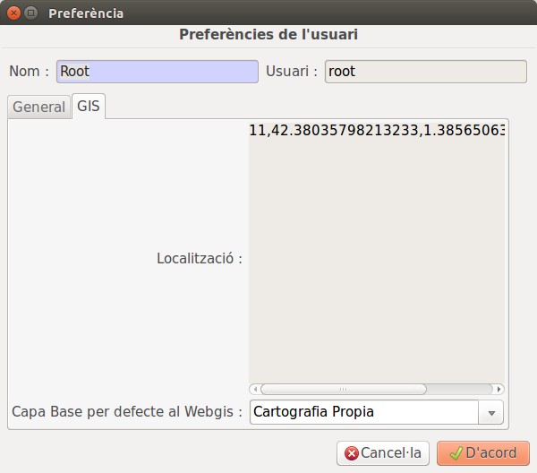

# Cambiar la capa base del visor web

- A les preferencies d'usuari del ERP es poden escollir les capes per defecte del webgis. Per fer-ho s'ha de:

1. Anar al menu superior a Usuari>Preferencies
2. En la pestanya de GIS canviar al Capa Base per defecte al webgis

Al tornar a entrar al webgis ens apareixera la capa base selecionada

# Consultar data de l'últim bolcat

El ERP permet consultar la data en què es va fer l'últim bolcat a GIS/Últim bolcat
 
 * Un cop fet això, s'obrirà un assistent
 * Prémer Consultar 

