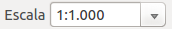
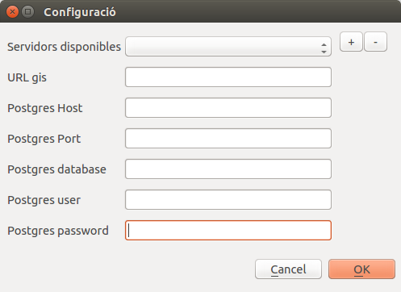
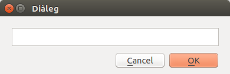
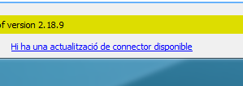
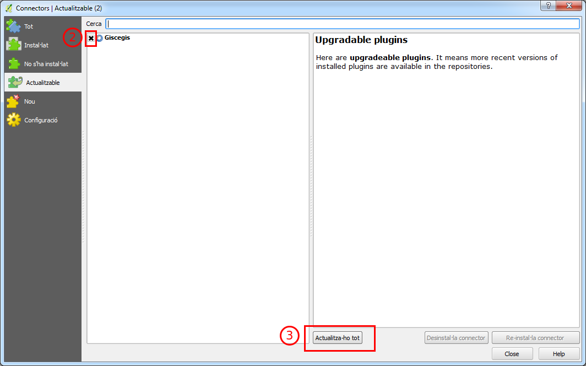
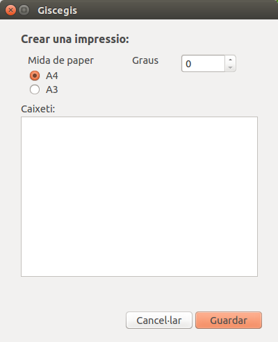

# Introduccio 
Qgis es un programa per el la gestió, consulta i anàlisis de dades GIS.
El seu funcionament pot ser estès mitjançant plugins.

Es pot consultar el manual d'usuari de QGIS a la següent adreça:
[http://www.qgis.org/es/docs/index.html](http://www.qgis.org/es/docs/index.html)

# Instal·lació
Per instal·lar el plugin de Qgis per accedir al Giscegis s'ha d'anar a:

1. Connectors
2. Gestiona i instal·la connectors

3. Anar a la secció de Configuracio
4. Activar la opció "Comprova si hi ha actualitzacions al arrancar"
5. Afegir un nou repositori de connectors amb les següents dades:
    * Nom:Gisce
    * URL: https://qgis-plugins.gisce.net/plugins/plugins.xml
    * Activar la casella d'activat
6. Tornar a carregar tots els rositoris mitjançant el boto
7. Anar a la secció de "Tot" i buscar el plugin "TileLayer Plugin" i instal·lar-lo
8. Buscar i instal·lar el plugin de "Giscegis"

# Canviar escala
El QGIS ens permet canviar l'escala del visor. Aixo ho podem fer mitjançant següent el cuadre de text de la part inferior

En aquest cuadre de text podem posar una escala concreta o be podem escollir una escala del desplegable

# Configuració d'accés a Giscegis
Per configurar l'accés al servidor de Giscegis s'han de fer els següents passos:

1. Connectors
2. Giscegis
3. Configuració
4. Omplir el camp URL gis, Postgres Host, Postgres Port, Postgres databse, Postgres user i Postgres password amb les dades facilitades
    
5. Prémer el boto de + per afegir un nou servidor
6. Posar el nom del nou servidor i premer ok
    

    !!! note
        El mapa s'exportara a la mateixa escala que hi ha al visor, per canviar la escala del visor veure el seguent [enllaç](#canviar-escala)

# Actualitzar el plugin de Giscegis

Quan hi hagi una actualitzacio del plugin del Qgis aquest ens informara.
    
    

Per actualitzar el plugin hem de:

1. Clickar sobre l'enllaç
2. Selecionar el plugin de Giscegis
3. Premer actualtizar tot
    

# Exportacio a PDF

Per exportar un planell des del Qgis ho podem fer mitjançant el icona d'impresio del plugin

Aquest ens obrira un menu que ens permet escollir:

1. El format de paper
2. La rotacio del mapa
3. El text del caixeti

Un cop escollides les opcions premem guardar i podrem escollir on guardar el planell.