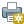

# Configuració del usuari

El plugin de Qgisce usa el mateix usuari i contrasenya que el ERP.
Per configurar-ho hem de:

1. Obrir la finestra de configuració del plugin, ja sigui prement en al logo de la cantonada inferior dreta o be mitjança el menu a `Connectors>Qgisce>Configuració`
2. Anar a ĺa primera pestanya de la finestra(Configuració de la conexió amb l'ERP)
3. Canviar les dades
4. Premer el botó de `Connectar` per comprovar que les dades son correctes
5. Premer el botó de `Desa` per guardar les dades

# Canviar escala
El QGIS ens permet canviar l'escala del visor. Aixo ho podem fer mitjançant següent el cuadre de text de la part inferior

En aquest cuadre de text podem posar una escala concreta o be podem escollir una escala del desplegable

# Configuració d'accés a Giscegis
Per configurar l'accés al servidor de Giscegis s'han de fer els següents passos:

1. Connectors
2. Giscegis
3. Configuració
4. Omplir el camp URL gis, Postgres Host, Postgres Port, Postgres databse, Postgres user i Postgres password amb les dades facilitades
    
5. Prémer el boto de + per afegir un nou servidor
6. Posar el nom del nou servidor i premer ok
    

    !!! Info "Nota"
        El mapa s'exportara a la mateixa escala que hi ha al visor, per canviar la escala del visor veure el seguent [enllaç](#canviar-escala)

# Exportacio a PDF

Per exportar un planell des del Qgis ho podem fer mitjançant el icona d'impresio del plugin

Aquest ens obrira un menu que ens permet escollir:

1. El format de paper
2. La rotacio del mapa
3. El text del caixeti

Un cop escollides les opcions premem guardar i podrem escollir on guardar el planell.