# Autentificació

 El primer que ens trobem al entrar es la pantalla d'autentificació
 
 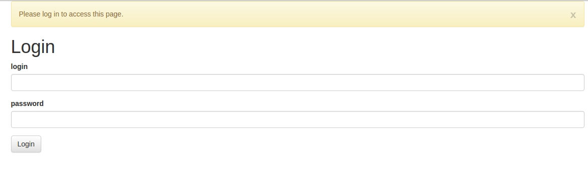

 Per accedir s'ha d'introduir el nostre usuari i contrasenya i prémer retorn o el boto de login. El usuari i la contrasenya es el mateix que per al ERP.

# Interfície

 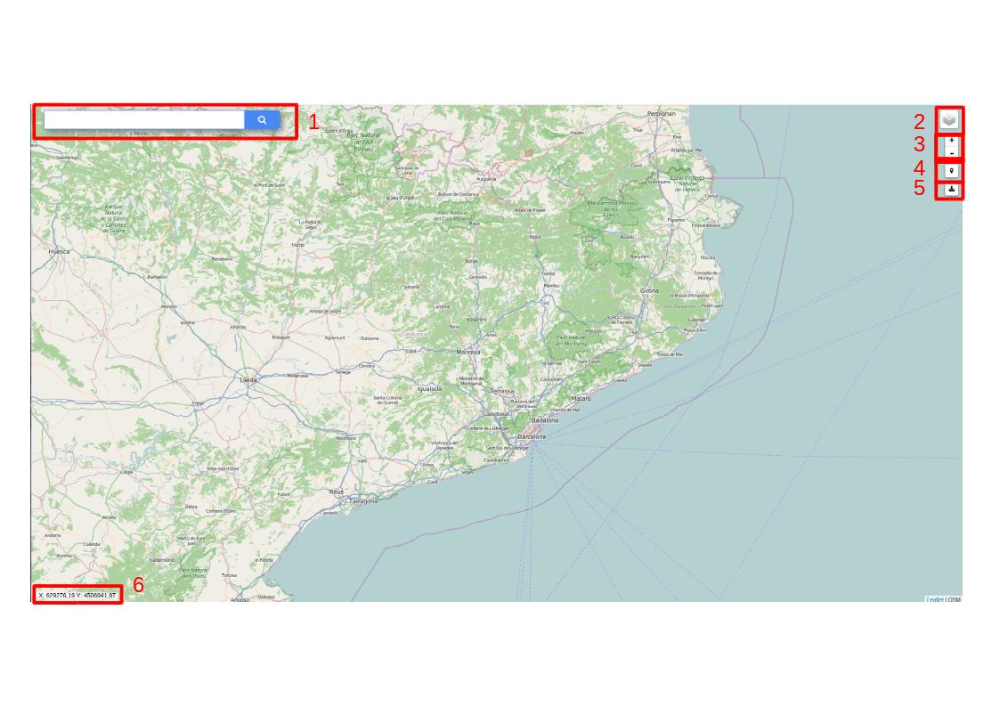
 
 La interfície es composa dels següents elements:

 1. Control de cerca
 2. Selector de capes
 3. Control de zoom
 4. Control d'ubicació
 5. Exportació
 6. Quadre de coordenades
 
## Control de cerca
 
 Esta situat a la parte superior esquerra i ens permet cercar elements al GIS. 

## Selector de capes
 
 El selector de capes es l'eina que ens permet selecionar quines capes volem veure, al passar el per sobre el control o clicar sobre d'ell es mostrara un llistat de les capes disponibles.
 
 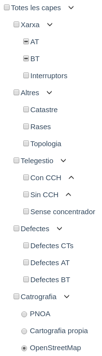
 
 En aquest control es poden diferenciar en dos tipus, capes de base (part superior del contol) i capes sobreposades(part inferior del control)
 
 - Capes base:
    -  Només podem seelcionar una capa base a l'hora i aquest sera el fons per el nostre GIS, per exemple un mapa cartografic o ortofotografies.

 - Capes sobreposades:
    - Aquestes capes son les que podem sobreposar a la nostra capa base i en poem selecionar múltiples a l'hora.

## Control de zoom
 
 Aquest control ens permet escollir el zoom del GIS , aquest va des de nivell 0 (tot el mon)  25 (màxim detall).
 
 També podem canviar el nivel de zoom mitjançant el ratolí o en el cas d'usar dispositius tàctils amb el gest d'apmpliar/reduir.

## Control d'ubicació
 
 Aquest control permet situar el mapa a la nostra ubicació.
 
 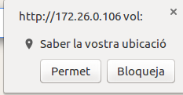
 
 Un cop premem el boto el navegador ens demanara si volem permetre el GIS coneixer la nostra ubicació
 
 Seguidament podem veure la nostra ubicació. L'indicador mostrara el centre de la zona aproximada de l'ubicació i el cercle la zona aproximada.
 
 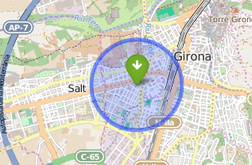

## Exportació
  
  Control que permet exportar dades del GIS a diferents formats 
 
## Quadre de coordenades

 Aquest control esta situat a la cantonada inferior esquerra i ens permt verue les coordenades del punt on tenim el ratolí. També permet buscar una coordenada concreta, clicant sobre el control apareixerà un formulari per indicar la coordenada a bucar. Un Cop introduïda la coordenada prement retorn apereixerà un indicador de la situacio de la coordenada.
  
 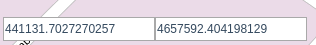

# Simulacions

## Simulacions AT

1. Seleccionar un tram de AT. Això farà aparèixer en pantalla una targeta amb la informació del tram i del botó "Simula".
    
 
2. Prémer "Simula". Això obrirà el llistat d'interruptors maniobrables **oberts** i en el mapa mostrara els interruptors oberts (vermell) i tancats (verd).
    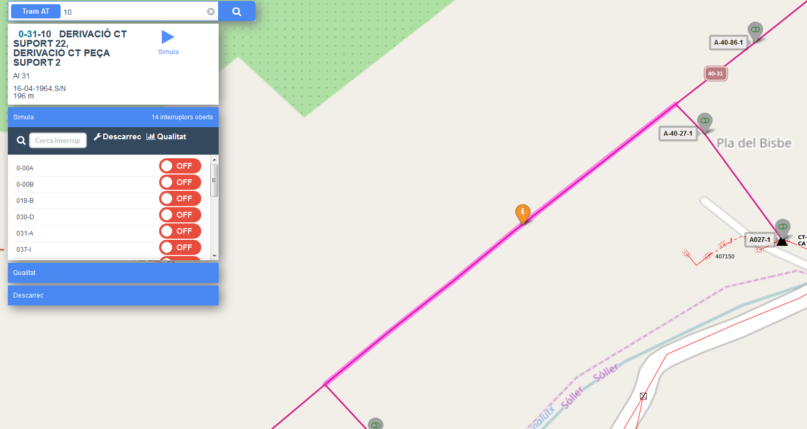
    
    !!! note
        Si apareix el missatge "No hi ha nodes oberts" significa que no hi ha interruptors de AT oberts.
 
3. Si volem canviar l'estat d'un interruptor ho podem fer prement l'interruptor al mapa(1). També el podem modificar l'estat del interruptor en el llistat d'interruptors(2), en el cas que no estigui tancat el podem buscar(3).
    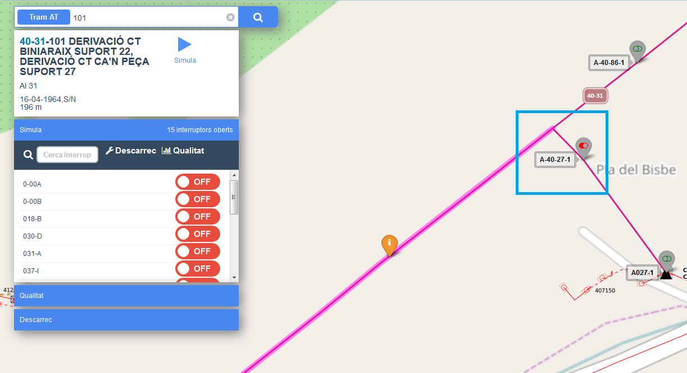
    
    !!! note
        A la capçalera del llistat d'interruptors podem veure el nombre d'interruptors oberts

 
4. Prémer el botó de "Simula" que haurà canviat a un simbol de "Play".
    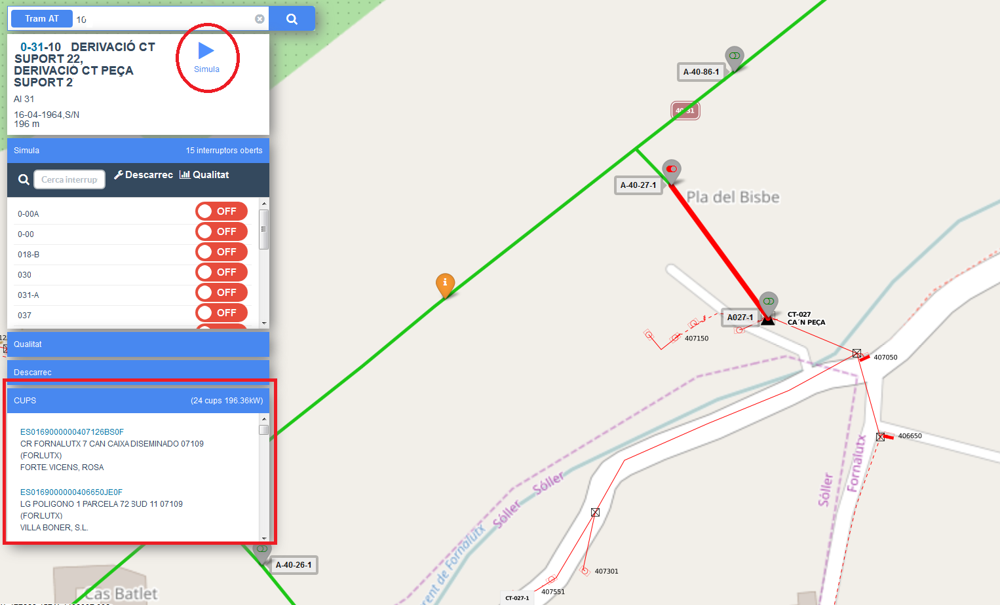
    
    !!! note
        - Es dibuixaran els trams desconnectats en vermell i els connectats en verd.
        - En la part inferior de la targeta apareix el llistat de clients afectats.
 
5. Per sortir de la simulació podem tancar o prémer "ESC".
    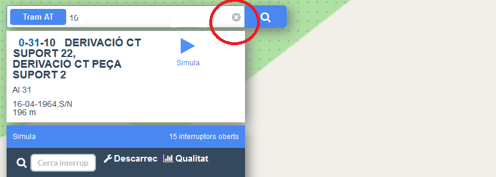

## Simulacions BT

1. Seleccionar el CT que volem simular.
    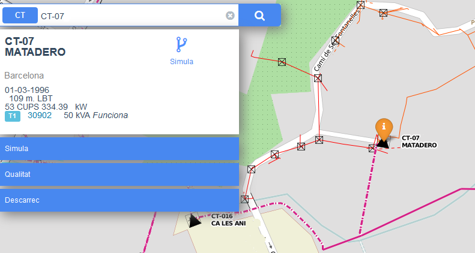

2. Prémer "Simula". Aixo obrirà el llistat d'interruptors maniobrables, també apareixeran els interruptors oberts(vermell) i tancats(verd) al mapa.
    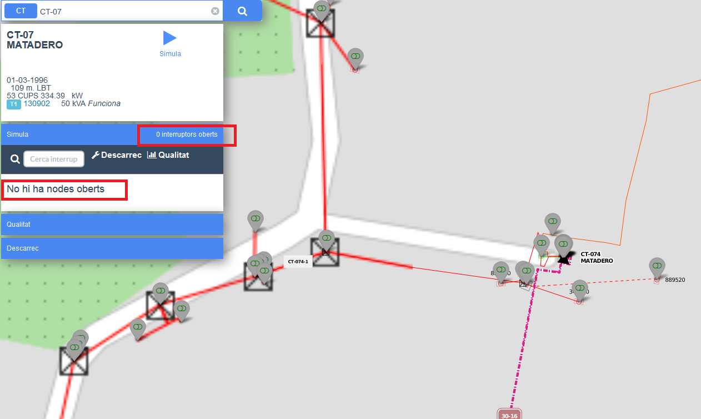
    
    !!! note
        Si apareix el missatge "No hi ha nodes oberts" significa que en aquest CT no hi ha interruptors oberts.
 
3. Si volem canviar l'estat d'un interruptor ho podem fer prement l'interruptor al mapa. També el podem modificar l'estat del interruptor en el llistat d'interruptors, en el cas que no estigui tancat el podem buscar. 
    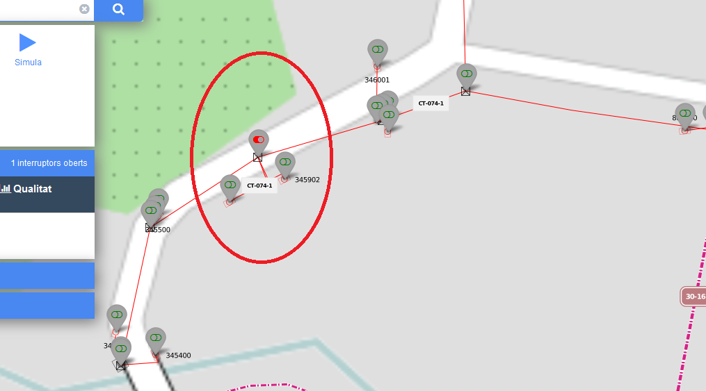
 
4. Premer el botó de "Simula" que haura canviat a un simbol de "Play".
    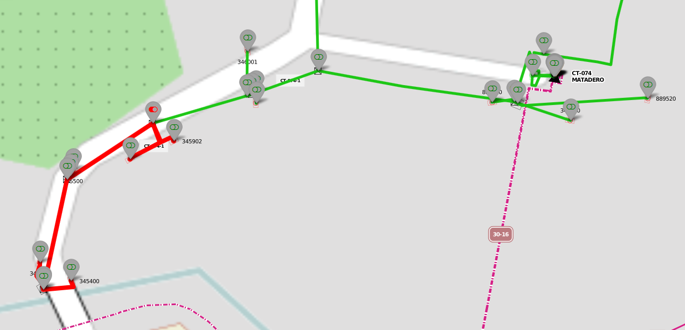
    
    !!! note
        - Es dibuixaran en vermell els trams desconnectats i els connectats en verd.
        - En la part interior de la targeta apareix el llistat de clients afectats.

5. Per sortir de la simulació podem tancar o prémer "ESC".
    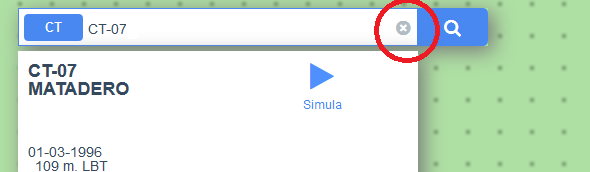
    
# Qualitat

## Qualitat AT

1. Fer una simulacio AT i en lloc de tancar-la convertir-la en una inicidencia de qualitat.

2. Seleccionar l'opció de qualitat en el llitat d'interruptors
    
    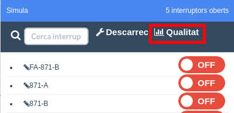
    
3. Si es vol crear una incidència escollim "Crear incidència" en el llistat d'incidencies(1) i posem el nom de la incidència(2), en el cas que volguem afegir un interval a una incidència la selecionem en el llistat de incidències(1).

    

4. Seleccionar el origen de la incidència.
    
    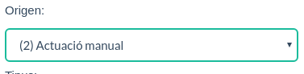

5. Seleccionar el tipus d'incidència.
    
    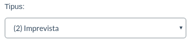

6. Seleccionar la causa de la incidència
    
    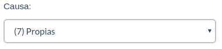

7. Assignar la data d'inici de la incidència (en format dia/mes/any hora:minuts:segons)
    
    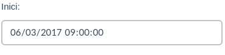

8. Assignar la data de fi de la incidència (en format dia/mes/any hora:minuts:segons)
    
    

9. Crear la la incidència. Un cop creada l'icona canviará a un "tick".
    
    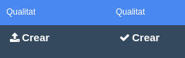

!!! note
    Un cop creada la incidència la podem consultar al ERP a Qualitat/Traçabilitat/Incidències

## Qualitat BT 

1. Fer una simulacio BT i en lloc de tancar-la convertir-la en una inicidencia de qualitat.

2. Seleccionar l'opcio de qualitat en el llitat d'interruptors
    
    
    
3. Si es vol crear una incidència escollim "Crear incidencia" en el llistat d'incidències(1) i posem el nom de la incidència(2), en el cas que volguem afegir un interval a una inicidencia la seleccionem en el llistat de incidències(1).
    
    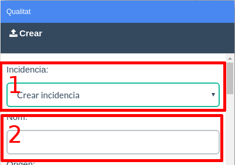
    
4. Seleccionar el origen de la incidència.
    
    

5. Seleccionar el tipus d'incidència.
    
    

6. Seleccionar la causa de la incidencia
    
    

7. Assignar la data d'inici de la incidència (en format dia/mes/any hora:minuts:segons)
    
    

8. Assignar la data de fi de la incidència (en format dia/mes/any hora:minuts:segons)
    
    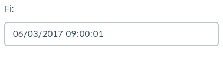

9. Crear la la incidència
    
    

!!! note
    Un cop creada la incidència la podem consultar al ERP a Qualitat/Traçabilitat/Incidències