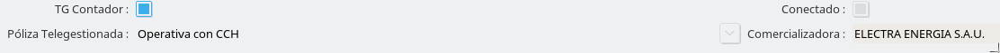
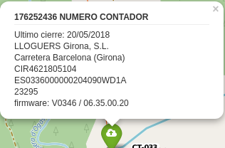
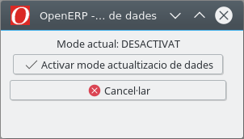

# Visor web
## Autentificació

 El primer que ens trobem al entrar es la pantalla d'autentificació

 

 Per accedir s'ha d'introduir el nostre usuari i contrasenya i prémer retorn o el boto de login. El usuari i la contrasenya es el mateix que per al ERP.

## Interfície

 

 La interfície es composa dels següents elements:

 1. Control de cerca
 2. Selector de capes
 3. Control de zoom
 4. Control d'ubicació
 5. Exportació
 6. Quadre de coordenades

### Control de cerca

 Esta situat a la parte superior esquerra i ens permet cercar elements al GIS.

### Selector de capes

 El selector de capes es l'eina que ens permet selecionar quines capes volem veure, al passar el per sobre el control o clicar sobre d'ell es mostrara un llistat de les capes disponibles.

 

 En aquest control es poden diferenciar en dos tipus:

 - Cartografia:
    -  Només podem seelcionar una capa base a l'hora i aquest sera el fons per el nostre GIS, per exemple un mapa cartografic o ortofotografies.

 - Capes sobreposades:
    - Aquestes capes son les que podem sobreposar a la nostra capa base i en poem selecionar múltiples a l'hora.
#### Capes de telegestio

  Aquest grup de capes ens permet veure informacio sobre la telelgesio.

  - Amb CCH: Apareixen els comptadors amb el camp “TG Contador” actiu ,  “Conectado” actiu i “Póliza Telegestionada” “Operativa con CCH”
    - Envia lectures: Mostra tots els comptadors que la ultima lectura valida es de fa menys de tres dies
    - No comunica:Mostra tots els comptadors que la ultima lectura valida es de tres dies o més

  

  - Sin CCH: Apareixen el comptadors amb el camp “TG Contador” actiu ,  “Conectado” actiu i “Póliza Telegestionada” “No operativa” o “Sin CCH”
    - Envia lectures: Mostra tots els comptadors que la ultima lectura valida es de fa menys de tres dies.
    - No comunica: Mostra tots els comptadors que la ultima lectura valida es de tres dies o més

  

  - Sense concentrador: Apareixen els comptadors amb el camp “TG Contador” actiu i “Conectado” desactivat

  

  Camps de la bombolla:

  

  - **Titol**: Numero de serie , marca i model
  - Ultima data de tancament valida
  - Nom del titular
  - Adreça del CUPS
  - Concentrador

### Control de zoom

 Aquest control ens permet escollir el zoom del GIS , aquest va des de nivell 0 (tot el mon)  25 (màxim detall).

 També podem canviar el nivel de zoom mitjançant el ratolí o en el cas d'usar dispositius tàctils amb el gest d'apmpliar/reduir.

### Control d'ubicació

 Aquest control permet situar el mapa a la nostra ubicació.

 

 Un cop premem el boto el navegador ens demanara si volem permetre el GIS coneixer la nostra ubicació

 Seguidament podem veure la nostra ubicació. L'indicador mostrara el centre de la zona aproximada de l'ubicació i el cercle la zona aproximada.

 

### Exportació

  Control que permet exportar les dades del visor tot seleccionant el format del fitxer de sortida i les capes que s'hi han de representar.
  En l'assistent hi trobem les següents opcions de configuració:
  
  * Capes: S'utilitza per escollir les capes que es representaran en l'exportació.
  

  * Text: Amb aquest opció escollim si volem que es mostri o no text en l'exportació.
  

  * Format del fitxer: Permet seleccionar el format del fitxer exportat.
  

  * Format de la pàgina: Permet escollir el format de la pàgina, que pot ser vertical (Retrat) o horitzontal (Apaisat).

  

  * Nota: S'utilitza per afegir una nota al peu del document.
  

  

  * Àrea: Ens permet seleccionar l'area exportada del visor. Per defecte és el centre de la vista actual del mapa, pero podem definir manualment l'àrea d'impresió amb un asistent. Per a la selecció manual s'ha de clicar "Seleccionar manualment".
  

  

### Quadre de coordenades

 Aquest control esta situat a la cantonada inferior esquerra i ens permt verue les coordenades del punt on tenim el ratolí. També permet buscar una coordenada concreta, clicant sobre el control apareixerà un formulari per indicar la coordenada a bucar. Un Cop introduïda la coordenada prement retorn apereixerà un indicador de la situacio de la coordenada.

 

## Simulacions

### Simulacions AT

1. Seleccionar un tram de AT. Això farà aparèixer en pantalla una targeta amb la informació del tram i del botó "Simula".
    

2. Prémer "Simula". Això obrirà el llistat d'interruptors maniobrables **oberts** i en el mapa mostrara els interruptors oberts (vermell) i tancats (verd).
    

    !!! Info "Nota"
        Si apareix el missatge "No hi ha nodes oberts" significa que no hi ha interruptors de AT oberts.

3. Si volem canviar l'estat d'un interruptor ho podem fer prement l'interruptor al mapa(1). També el podem modificar l'estat del interruptor en el llistat d'interruptors(2), en el cas que no estigui tancat el podem buscar(3).
    

    !!! Info "Nota"
        A la capçalera del llistat d'interruptors podem veure el nombre d'interruptors oberts

4. Prémer el botó de "Simula" que haurà canviat a un simbol de "Play".
    

    !!! Info "Nota"
        - Es dibuixaran els trams desconnectats en vermell i els connectats en verd.
        - En la part inferior de la targeta apareix el llistat de clients afectats.

5. Per sortir de la simulació podem tancar o prémer "ESC".
    

### Simulacions BT

1. Seleccionar el CT que volem simular.
    

2. Prémer "Simula". Aixo obrirà el llistat d'interruptors maniobrables, també apareixeran els interruptors oberts(vermell) i tancats(verd) al mapa.
    

    !!! Info "Nota"
        Si apareix el missatge "No hi ha nodes oberts" significa que en aquest CT no hi ha interruptors oberts.

3. Si volem canviar l'estat d'un interruptor ho podem fer prement l'interruptor al mapa. També el podem modificar l'estat del interruptor en el llistat d'interruptors, en el cas que no estigui tancat el podem buscar.
    

4. Premer el botó de "Simula" que haura canviat a un simbol de "Play".
    

    !!! Info "Nota"
        - Es dibuixaran en vermell els trams desconnectats i els connectats en verd.
        - En la part interior de la targeta apareix el llistat de clients afectats.

5. Per sortir de la simulació podem tancar o prémer "ESC".
    

## Qualitat

### Qualitat AT

1. Fer una simulacio AT i en lloc de tancar-la convertir-la en una inicidencia de qualitat.

2. Seleccionar l'opció de qualitat en el llitat d'interruptors

    

3. Si es vol crear una incidència escollim "Crear incidència" en el llistat d'incidencies(1) i posem el nom de la incidència(2), en el cas que volguem afegir un interval a una incidència la selecionem en el llistat de incidències(1).

    

4. Seleccionar el origen de la incidència.

    

5. Seleccionar el tipus d'incidència.

    

6. Seleccionar la causa de la incidència

    

7. Assignar la data d'inici de la incidència (en format dia/mes/any hora:minuts:segons)

    

8. Assignar la data de fi de la incidència (en format dia/mes/any hora:minuts:segons)

    

9. Crear la la incidència. Un cop creada l'icona canviará a un "tick".

    

!!! Info "Nota"
    Un cop creada la incidència la podem consultar al ERP a Qualitat/Traçabilitat/Incidències

### Qualitat BT

1. Fer una simulacio BT i en lloc de tancar-la convertir-la en una inicidencia de qualitat.

2. Seleccionar l'opcio de qualitat en el llitat d'interruptors

    

3. Si es vol crear una incidència escollim "Crear incidencia" en el llistat d'incidències(1) i posem el nom de la incidència(2), en el cas que volguem afegir un interval a una inicidencia la seleccionem en el llistat de incidències(1).

    

4. Seleccionar el origen de la incidència.

    

5. Seleccionar el tipus d'incidència.

    

6. Seleccionar la causa de la incidencia

    

7. Assignar la data d'inici de la incidència (en format dia/mes/any hora:minuts:segons)

    

8. Assignar la data de fi de la incidència (en format dia/mes/any hora:minuts:segons)

    

9. Crear la la incidència

    

!!! Info "Nota"
    Un cop creada la incidència la podem consultar al ERP a Qualitat/Traçabilitat/Incidències

## Actualització de les dades

### Introducció

Per tal d'actualitzar les dades del visor web s'ha de seguir el següent procés:

### Procediment

1. Activar el mode actualització:

    Per activar el mode actualització hem d'anar a "GIS>Mode actualització de dades"

    

    Un cop activat el mode actualització apareixerà un missatge al entrar al visor web avisant de que s'està realitzant una actualització de dades.

2. Preparar actualització:

    Aquest pas es opcional ja que la seva funció es fer que la carrega de les dades des del Autocad sigui mes rapida.
    L'assistent per preparar l'actualització es pot trobar a "GIS>Preparar actualització de dades".

    

3. Fer actualitzacio de dades amb el Autocad:

    Realitzar la actualització de dades mitjançant les eines de l'Autocad

4. Carregar shapes:

    La carrega de shapes dependrà de les capes que usem o que vulguem actualitzar. Les disponibles son les següents:

    * LAT i LBT
    * Cartografia
    * Rases
    * Cabines
    * Fibra òptica
    * Fora de servei
    * Defectes BT

    La carrega es pot realitzar mitjançant els assistents que es troben a "GIS>Carregadors".

    

    Aquests assistents ens obriran la pagina web per a la carrega dels fitxers.

    

    !!!Note "Format dels fitxers"
        Els fitxers només es poden carregar en format WINZIP

    Un cop carregat el fitxer ens apareixerà la seguent pagina informant-nos de que s'iniciara una tasca en segon pla:

    

5. Desactivar el mode actualització:

    Per desactivar el mode actualització hem d'anar a "GIS>Mode actualització de dades"

    

    Quan es desactivi el mode actualització desapareixerà l'avís al visor web

!!!Note "En cas d'error"
    En cas d'algun error en el proces s'ha de repetir el pas
