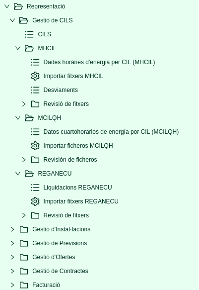
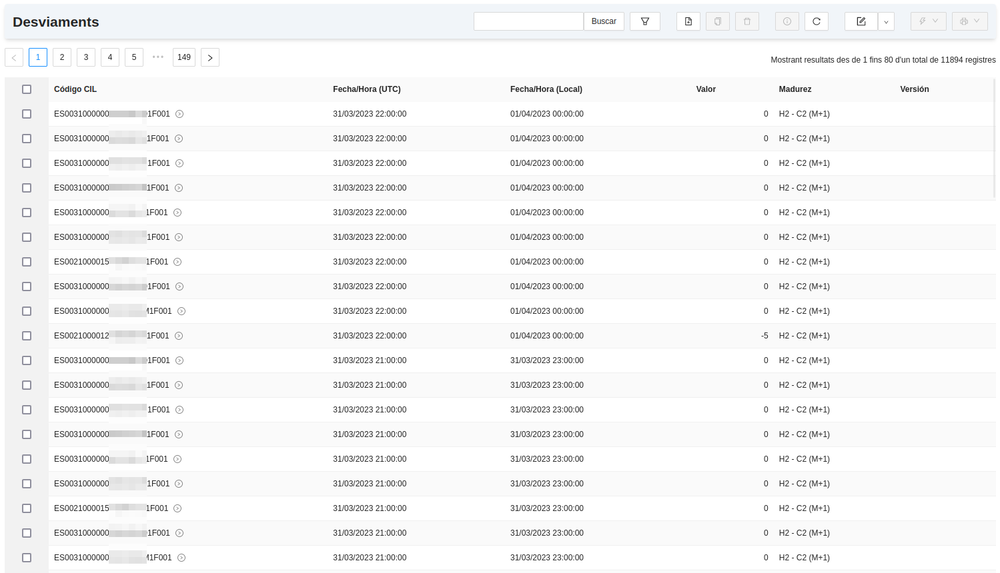
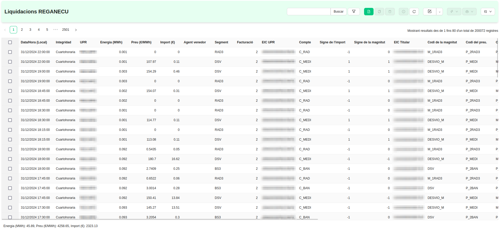
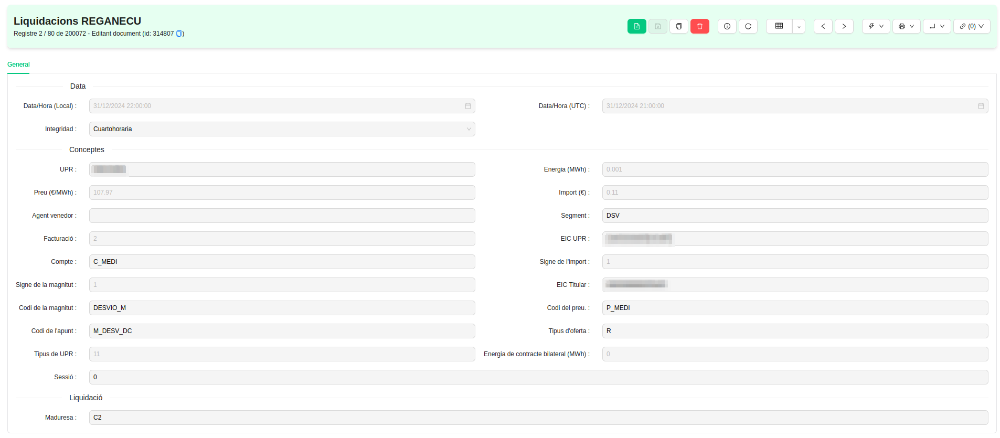

# Representació a Mercat

## Gestió dels CIL

Aquest mòdul serveix per a la creació i el manteniment dels **CIL** dins l'ERP de Representació a Mercat. Per tant, aquest mòdul 
inclou eines per a crear, modificar i eliminar els CIL quan sigui necessari.

## Menú de Gestió de CILS

En el menú de Gestió de CILS que segueix a la imatge, s'hi troben els següents apartats.

### Gestió de CILS
* **CILS:** Llistat dels CIL on es pot filtrar per diferents camps (codi CIL, municipi, adreça, unitat física, etc.) per 
a trobar el CIL que es requereixi. 

També es poden crear o eliminar CILs, així com accedir a cadascun d'ells per a visualitzar i/o modificar la seva informació.

#### MHCIL
* **Dades horàries d'energia per CIL:** Llistat per a consultar les dades de generació dels CIL, publicades per l'Operador del Sistema
mitjançant els fitxers `MHCIL`. Si s'importen fitxers `MHCIL` a l'ERP, els seus registres horaris apareixen en aquest llistat, on es
poden filtrar per dates, CIL i/o maduresa.

A cada hora del llistat s'enregistra el CIL al qual pertany la mesura, l'hora (local i UTC), la maduresa i la versió del fitxer.
Els fitxers `MHCIL` publiquen les mesures d'energia **Activa Exportada** (expressada en kWh) i d'energia **Reactiva** dels quadrants 2 i 3
(expressades en kVArh).

* **Importar fitxers MHCIL:** Assistent per a importar a l'ERP fitxers de mesures de generació `MHCIL` emesos per l'Operador del Sistema. Suporta
fitxers individuals en format de fitxer pla o bé un fitxer comprimit en ZIP amb múltiples fitxers en format fitxer pla.

* **Desviaments:** Llistat per a consultar quant s'ha desviat la previsió de generació de les instal·lacions de la seva generació real,
publicada als fitxers `MHCIL`. Per entendre bé la funció dels desviaments cal consultar els apartats [Ofertes a Mercat de generació](../ofertas) i
[Facturació](../facturacion).

#### REGANECU
* **Liquidacions:** Llistat per a consultar les liquidacions de l'Operador del Sistema, publicades mitjançant els fitxers `REGANECU`. Si
s'importen fitxers `REGANECU` a l'ERP, els seus registres apareixen en aquest llistat, on es poden filtrar per dates, Unitat de Programació,
segment i/o maduresa

A cada línia de fitxer `REGANECU` importada es poden consultar tots els camps que es recullen, per ordre d'aparició al fitxer carregat.

* **Importar fitxers REGANECU:** Assistent per a importar a l'ERP fitxers de liquidacions `REGANECU` emesos per l'Operador del Sistema. Suporta
fitxers individuals en format de fitxer pla o bé un fitxer comprimit en ZIP amb múltiples fitxers en format fitxer pla.

