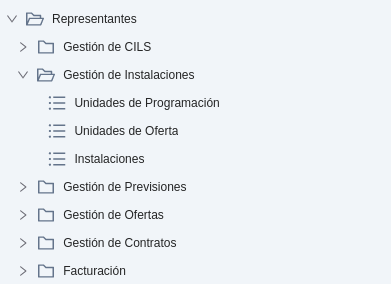
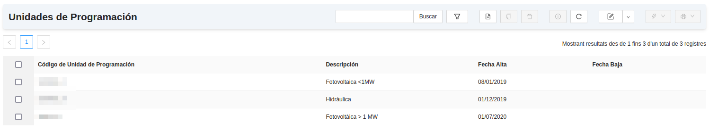
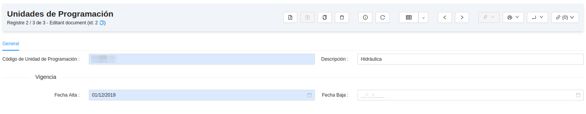
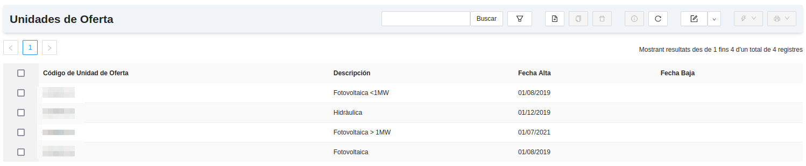
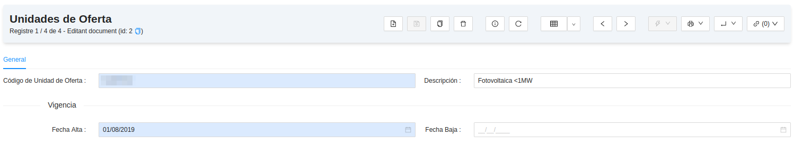
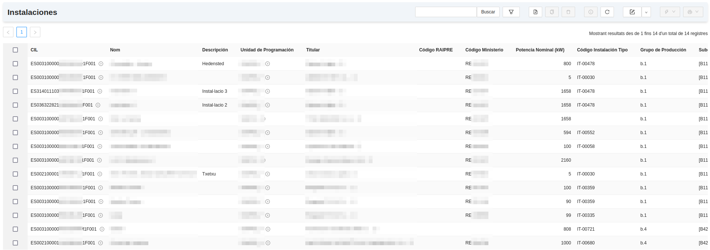
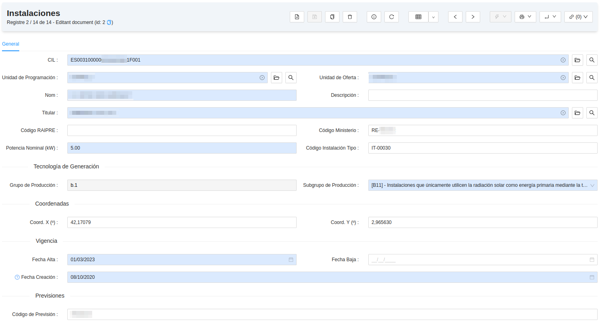

# Representació a Mercat

## Gestió d'Instal·laciones

Aquest mòdul serveix per a la creació i el manteniment d'**Unitats d'Oferta**, d'**Unitats de Programació** i d'**Instal·lacions**
de generació. Per tant, aquest mòdul  inclou eines per a crear, modificar i eliminar tots aquests elements, quan sigui necessari.

## Menú de Gestió de CILS

En el menú de Gestió d'Instal·lacions que segueix a la imatge, s'hi troben els següents apartats.

### Gestió d'Instal·lacions
* **Unitats de Programació:** Llistat de les Unitats de Programació on es pot filtrar per diferents camps (codi, data d'alta i/o data de baixa) per 
a trobar la Unitat de Programació que es requereixi. 

També es poden crear o eliminar Unitats de Programació, així com accedir a cadascuna d'elles per a visualitzar i/o modificar la seva informació.

* **Unitats d'Oferta:** Llistat de les Unitats d'Oferta on es pot filtrar per diferents camps (codi, data d'alta i/o data de baixa) per 
a trobar la Unitat d'Oferta que es requereixi. 

També es poden crear o eliminar Unitats d'Oferta, així com accedir a cadascuna d'elles per a visualitzar i/o modificar la seva informació.

* **Instal·lacions:** Llistat de les Instal·lacions de generació on es pot filtrar per diferents camps (codi CIL, unitat de programació,
unitat d'oferta, nom, titular, subgrup, data d'alta, etc.) per a trobar la Instal·lació de generació que es requereixi. 

També es poden crear o eliminar Instal·lacions, així com accedir a cadascuna d'elles per a visualitzar i/o modificar la seva informació.

!!! Info "Nota"
    Per tal de crear una Instal·lació, abans eś necessari que la seva **Unitat de Programació**, la seva **Unitat d'Oferta**
    i el seu **Titular** ja s'hagin creat prèviament a l'ERP, ja que tots tres són camps obligatoris d'una instal·lació de generació.
