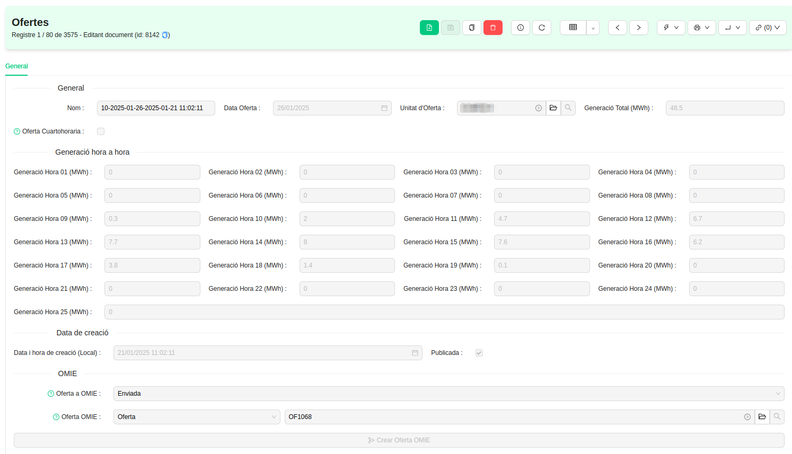
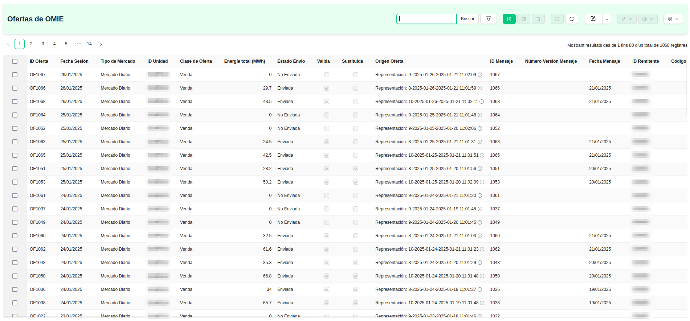
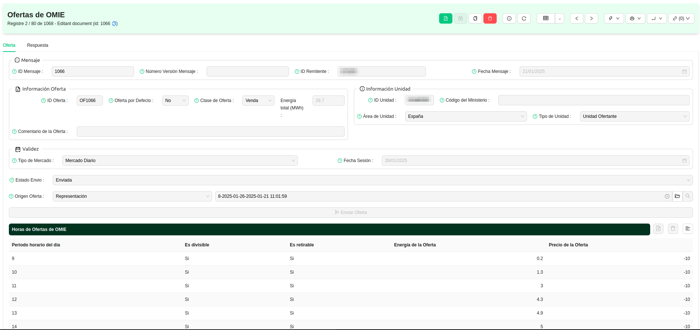
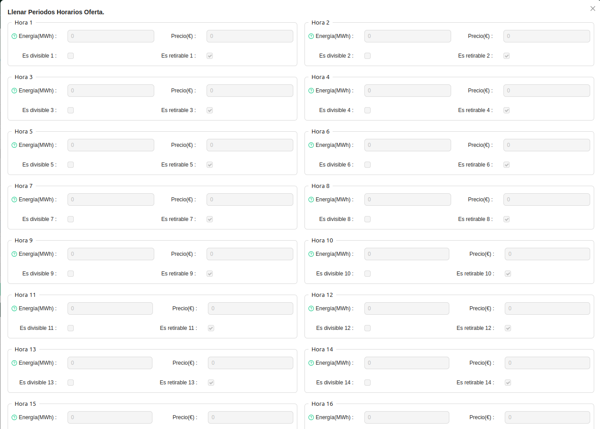
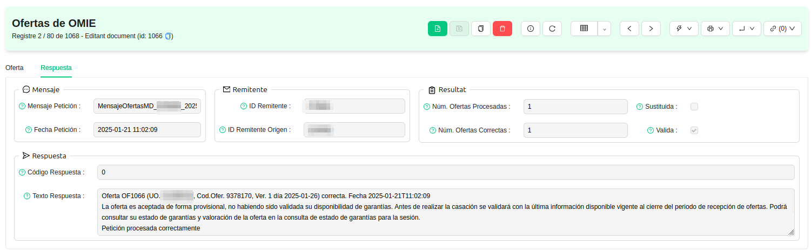

# Representació a Mercat

## Gestió de Ofertes

Aquest mòdul serveix per a generar `Ofertes de generació` per a un dia i una Unitat d'Oferta concrets, 
tenint en compte les previsions de generació més recents de cada instal·lació de generació de l'ERP.

També és possible, a partir d'una `Oferta de generació`, generar una `Oferta d'OMIE` amb l'objectiu de publicar-la
al mercat diari de l'energia un cop revisada l'energia i el preu de cada una de les hores a ofertar.

!!! Info "Nota 1"
    Una Oferta de generació i una Oferta d'OMIE no són el mateix. Una Oferta d'OMIE es genera a partir d'una Oferta de
    generació. Les ofertes de generació serveixen per a calcular quanta energia ofertarà cada Unitat d'Oferta, a partir
    de les previsions de generació que es trobin a l'ERP, mentre que les ofertes d'OMIE serveixen per a publicar realment
    al mercat de l'energia aquesta generació calculada.

## Menú de Gestió d'Ofertes

En el menú de Gestió d'Ofertes que segueix a la imatge, s'hi troben els següents apartats.

### Ofertes

Llistat d'ofertes generades per a les Unitats d'Oferta de l'ERP.

A cada oferta es pot comprovar per a quina **Unitat d'Oferta** i per a quina **data** s'ha generat, així com la **generació** ofertada
a mercat, tant en total com hora a hora. La generació sempre s'expressa en MWh i arrodonida a un únic decimal, tal com
demana l'Operador de Mercat.

Una oferta de generació indica a la secció inferior de la seva vista de formulari si s'ha generat o no una **Oferta d'OMIE**
a partir d'ella. En cas de no haver-se generat, es mostrarà el botó **Generar Oferta OMIE**. Mentre que si ja ha sigut
generada, es mostrarà un enllaç a l'oferta d'OMIE generada i també l'estat de l'enviament de la mateixa.

### Generar Oferta

Assistent per a generar una oferta de generació especificant la **Unitat d'Oferta** i la **data** desitjades. Aquest assistent.
recorrerà totes les instal·lacions de generació que pertanyin a la unitat d'oferta i en recollirà la previsió de generació que tinguin
per a la data especificada. Si una instal·lació no té `Codi de Previsiò` informat, la seva generació es considerarà de 0 kWh a totes les hores
del dia. Després de recollir totes les previsions, aquestes s'agreguen de forma horària per a tenir els totals d'energia prevista.

!!! Info "Nota 2"
    És possible generar una oferta de generació quart-horària enlloc d'horària, ja que s'ha previst que en algun moment de 2025, el
    mercat diari de l'energia passarà a tenir negociació quart-horària enlloc d'horària. Si es marca l'opció "Oferta Quart-horària",
    l'assistent realitzarà tot el procediment habitual i, en acabar, realitzarà un càlcul per a repartir la generació de cada hora
    entre els quatre quarts d'hora corresponents, obtenint així una oferta amb 100 quarts d'hora enlloc de amb 25 hores.

Com que es poden generar múltiples ofertes per una mateixa data i unitat d'oferta, es pot identificar quina és la que finalment s'ha
emprat per a comunicar l'oferta de generació a l'Operador de Mercat amb l'assistent **Publicar Oferta**. Aquest assistent fa quatre coses,
en aquest ordre:

* Deixa marcada com a "Publicada" l'oferta.
* Marca com a "Publicades" totes les hores de previsió de generació que es van utilitzar per a generar l'oferta.
* Desmarca la casella "Publicada" d'altres ofertes amb la mateixa data i unitat d'oferta, mantenint que només n'hi pot haver una simultàneament.
* Desmarca la casella "Publicada" de totes les hores de previsió de generació que es van utilitzar a ofertes desmarcades al punt anterior.

!!! Info "Nota 3"
    Recordeu que podeu consultar les hores de `Previsió Publicada` des del llistat 
    **Representants > Gestió de Previsions > Previsions de Generació Publicades**. I també es poden veure les Previsions de Generació
    utilitzades per una Oferta de Generació en concret, des de la seva vista de formulari amb l'enllaç **Previsions Utilitzades**.

És important marcar com a publicades les ofertes, ja que serà necessari saber quines previsions de generació es van fer servir per a les ofertes
d'un dia quan s'hagin de calcular els desviaments envers la generació real que finalment produeixi la instal·lació. Això s'explica amb més detall a
la secció [Facturació](../facturacion)

### Revisió d'Ofertes d'OMIE

Si es generen **Ofertes d'OMIE**, aquestes es poden llistar tant des de la secció
**Revisió d'Ofertes d'OMIE**. Aquí serà possible veure llistats d'ofertes d'OMIE i comprovar-ne l'estat.

Des de la vista de formulari de les ofertes d'OMIE, es pot revisar amb detall tota la informació sobre l'oferta. Des del camps
merament administratius, com son l'ID del missatge, l'ID del remitent o l'ID de la Unitat d'Oferta, fins la generación
ofertada hora a hora i el preu al que s'oferta.

!!! Info "Nota 4"
    Es possible configurar uns paràmetres de l'ERP per a que algunes de les dades ja s'omplin automàticament, com per exemple
    el preu de l'oferta per a les hores amb generació ofertada.

Si es desitja, es pot fer servir l'assitent **Omplir Hores** per a ajustar manualment les dades de cada hora ofertada.

Un cop revisada tota la informació, es pot fer clic al botó **Enviar Oferta** per a que aquesta es publiqui al mercat diari
d'OMIE. Això realitzarà un enviament des de l'ERP cap a OMIE mitjançant un protocol de comunicació establert per l'Operador
del Mercat, i a l'ERP s'enregistrarà el resultat que retorni  l'Operador del Mercat en rebre la nostra oferta.

A la pestanya **Resposta** es podrà veure el codi de resposta, si l'oferta era vàlida o no i si ha estat processada o no.
També s'inclou un camp amb el text de resposta literal que retorna l'Operador de Mercat en rebre la nostra oferta, així que
es podrà saber al moment si aquesta ha sigut acceptada provisionalment o no.

!!! Info "Nota 5"
    Per a poder gestionar enviaments d'Ofertes a OMIE directament des de l'ERP, cal haver configurat alguns paràmetres
    prèviament, principalment el certificat digital de participant per a operar a OMIE.

Una oferta de generació pot tenir **una o cap oferta d'OMIE**, mentre que una oferta d'OMIE sempre tindrà **una única
oferta de generació** a partir de la qual s'ha generat.

Si es generen successives ofertes de generació i ofertes d'OMIE per a una **mateixa Unitat d'Oferta i data**, la
oferta de generació que s'ha enviat més recentment és la que quedarà marcada com a publicada, i les ofertes d'OMIE anteriors
quedaran amb la casella `Substituïda` marcada per a indicar que no són l'oferta definitiva amb la que s'hauran de calcular
els desviaments al facturar.

## Automatismes

L'ERP compta amb automatismes que es poden configurar i ajustar per a que cada dia, a una hora determinada, l'ERP
s'encarregui de:

1. Generar una oferta de generació per a cada Unitat d'Oferta activa per demà.
2. Marcar com a publicades les ofertes generades en el pas anterior.
3. Generar una oferta d'OMIE a partir de cada una de les ofertes de generació marcades com a publicades.
4. Publicar a OMIE les ofertes generades en el pas anterior.
5. Actualitzar la informació de resposta a les ofertes d'OMIE que s'han intentat publicar.
6. Enviar un e-mail de resum a un responsable, informant de totes les tasques realitzades per l'automatisme i del
resultat d'aquestes.

Si l'automatisme no es configura, es poden realitzar els passos que es vulgui de forma manual amb els assistents mostrats
als apartats anteriors, però sempre en ordre successiu (per exemple, no serà possible publicar a OMIE una oferta de generació
sense haver generat i marcat com a publicada una oferta de generació i sense haver generat a continuació l'oferta d'OMIE a 
partir d'aquesta i omplint els camps obligatoris a la seva vista de formulari).
