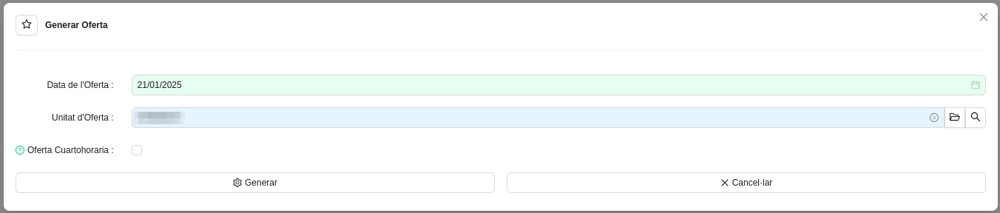

# Representació a Mercat

## Gestió de Ofertes

Aquest mòdul serveix per a la generar `Ofertes a mercat` de generació per a un dia concret, tenint en compte les previsions
de generació més recents de cada instal·lació de generació de l'ERP.

## Menú de Gestió d'Ofertes

En el menú de Gestió d'Ofertes que segueix a la imatge, s'hi troben els següents apartats.

### Gestió d'Ofertes
* **Ofertes:** Llistat d'ofertes generades per a les Unitats d'Oferta de l'ERP.

A cada oferta es pot comprovar per a quina **Unitat d'Oferta** i per a quina **data** s'ha generat, així com la **generació** ofertada
a mercat, tant en total com hora a hora. La generació sempre s'expressa en MWh i arrodonida a un únic decimal, tal com
demana l'Operador de Mercat.

* **Generar Oferta:** Assistent per a generar una oferta especificant la **Unitat d'Oferta** i la **data** desitjades. Aquest assistent.
recorrerà totes les instal·lacions de generació que pertanyin a la unitat d'oferta i en recollirà la previsió de generació que tinguin
per a la data especificada. Si una instal·lació no té `Codi de Previsiò` informat, la seva generació es considerarà de 0 kWh a totes les hores
del dia. Després de recollir totes les previsions, aquestes s'agreguen de forma horària per a tenir els totals d'energia prevista.

Com que es poden generar múltiples ofertes per una mateixa data i unitat d'oferta, es pot identificar quina és la que finalment s'ha
emprat per a comunicar l'oferta de generació a l'Operador de Mercat amb l'assistent **Publicar Oferta**. Aquest assistent fa quatre coses,
en aquest ordre:

* Deixa marcada com a "Publicada" l'oferta.
* Marca com a "Publicades" totes les hores de previsió de generació que es van utilitzar per a generar l'oferta.
* Desmarca la casella "Publicada" d'altres ofertes amb la mateixa data i unitat d'oferta, mantenint que només n'hi pot haver una simultàneament.
* Desmarca la casella "Publicada" de totes les hores de previsió de generació que es van utilitzar a ofertes desmarcades al punt anterior.

!!! Info "Nota"
    Recordeu que podeu consultar les hores de `Previsió Publicada` des del llistat **Representants > Gestió de Previsions > Previsions de Generació Publicades**.

És important marcar com a publicades les ofertes, ja que serà necessari saber quines previsions de generació es van fer servir per a les ofertes
d'un dia quan s'hagin de calcular els desviaments envers la generació real que finalment produeixi la instal·lació. Això s'explica amb més detall a
la secció [Facturació](../facturacion)