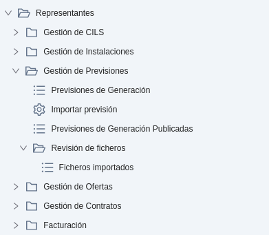
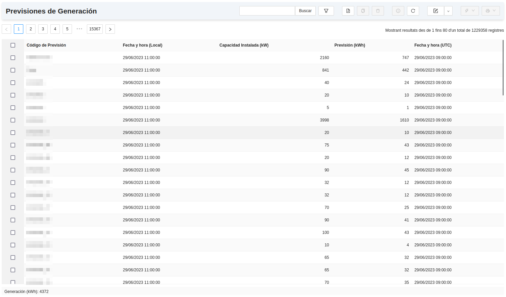
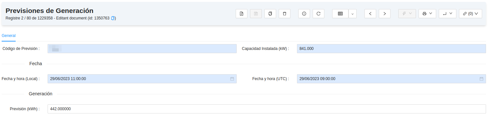
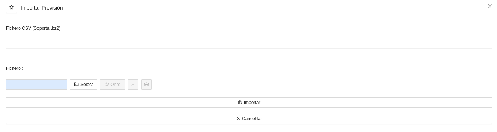
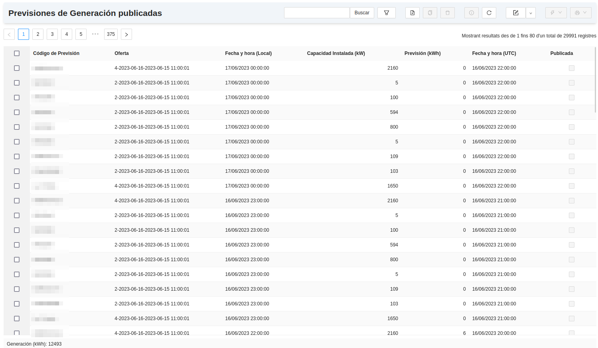
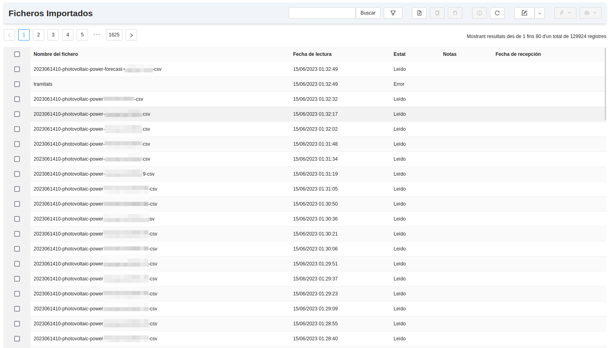

# Representació a Mercat

## Gestió de Previsions

Aquest mòdul serveix per a la importació de previsions de generació, necessàries per a publicar una oferta a l'Operador de
Mercat per tal de vendre la generació de les instal·lacions dels representats. Per tant, el mòdul disposa d'eines per a
carregar, revisar i fer el seguiment de les previsions de generació de totes les instal·lacions que tinguin `Codi de Previsió`.

## Menú de Gestió de Previsions

En el menú de Gestió de previsions que segueix a la imatge, s'hi troben els següents apartats.

### Gestió de Previsions
* **Previsions de Generació:** Llistat de previsions de generació hora a hora per instal·lació. 

A cada registre horari es pot consultar l'hora (local i UTC), la previsió de generació (expressada en kWh) i el codi de
previsió i la capacitat instal·lada de la instal·lació a la que pertany la previsió.

* **Importar previsió:** Assistent per a importar a l'ERP fitxers de previsions de generació en format `CSV`.

!!! Info "Nota 1"
    L'ERP permet configurar un servidor SFTP on es poden deixar les previsions de generació dia a dia, per tal que un
    automatisme les llegeixi i carregui sense que l'usuari ho hagi de fer manualment. Si l'automatisme no es configura, caldrà
    importar totes les previsions de generació amb aquest assistent.

!!! Info "Nota 2"
    Les instal·lacions de generació que no tinguin `Codi de previsiò` comptaran com que la seva previsió de generació
    és sempre 0 kWh a totes les hores. Per tant és important que totes les instal·lacions per a les quals s'importin previsions
    de generació, tinguin el `Codi de previsió` degudament informat a la seva fitxa dins l'ERP.

* **Previsions de Generació Publicades:** Llistat de previsions publicades de generació hora a hora per instal·lació. Quan es
genera una oferta de mercat, en aquest llistat queden enregistrades les previsions de generació utilitzades a l'hora de calcular
l'oferta, de manera que en un futur es puguin calcular els desviaments entre la previsió de generació que es va emprar per a
presentar l'oferta de generació a l'Operador de Mercat i la generació real que va acabar tenint la instal·lació en aquella data.
Això s'explica amb més detall a l'apartat [Ofertes a Mercat de generació](../ofertas)

!!! Info "Nota 3"
    Aquest llistat és idèntic al de les previsions de generació amb una diferència: cada codi de previsió només pot tenir un
    únic registre per hora amb la casella "Publicada" marcada. Per tant, si es fan múltiples ofertes per un mateix dia,
    al llistat quedaran les previsions que s'han tingut en compte a l'oferta generada més recent de cada dia.

### Revisió de fitxers

* **Fitxers importats:** Llistat dels fitxers de previsió importats a l'ERP. En aquest es poden llistar i filtrar els fitxers,
així com revisar-ne la data d'importació i l'estat final de la mateixa. Aquí s'enregistren tant els fitxers carregats de forma
automàtica com els fitxers carregats manualment amb l'assistent.

